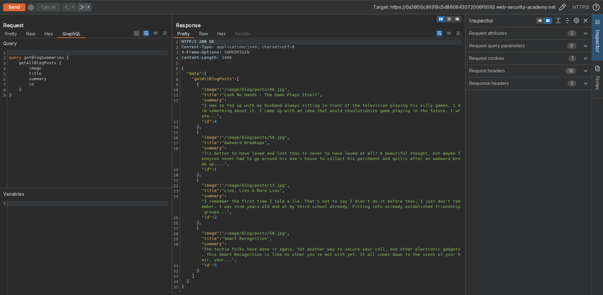
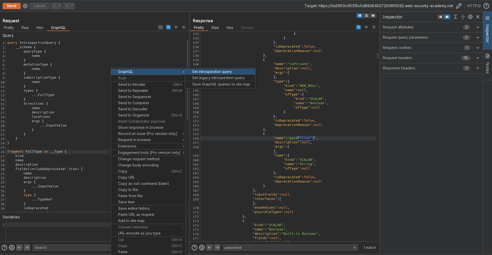
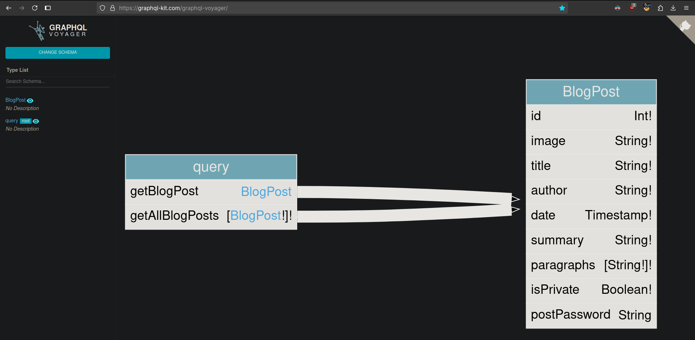
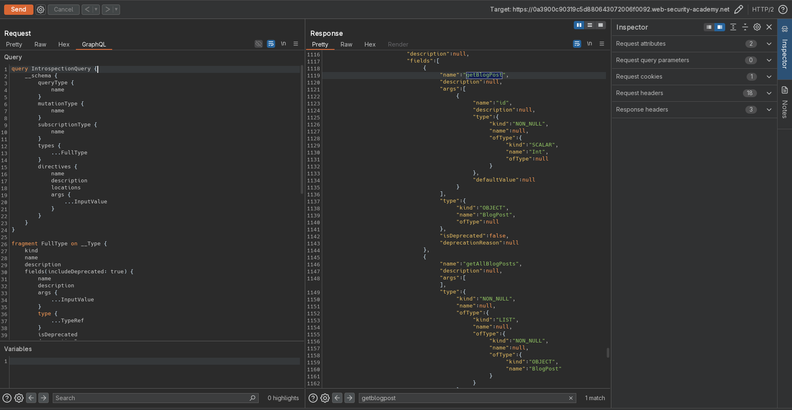
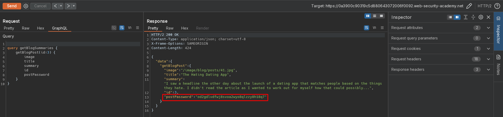

# Accessing private GraphQL posts
# Objective
The blog page for this lab contains a hidden blog post that has a secret password. 

To solve the lab, find the hidden blog post and enter the password. 

# Solution
## Analysis
Website uses GraphQL to retrieve informations about posts.

||
|:--:| 
| *Post with ID 3 is missing* |

## Exploitation
### Running introspection query
Website allows for introspection query, which discloses information about database structure as well as hidden fields and functions.

||
|:--:| 
| *Introspection query - unused query getBlogPost* |
||
| *Introspection query - unused field postPassword* |
||
| *Introspection query - Visualization of introspection results* |
||
| *Retrieaval of postPassword field from unlisted post* |
