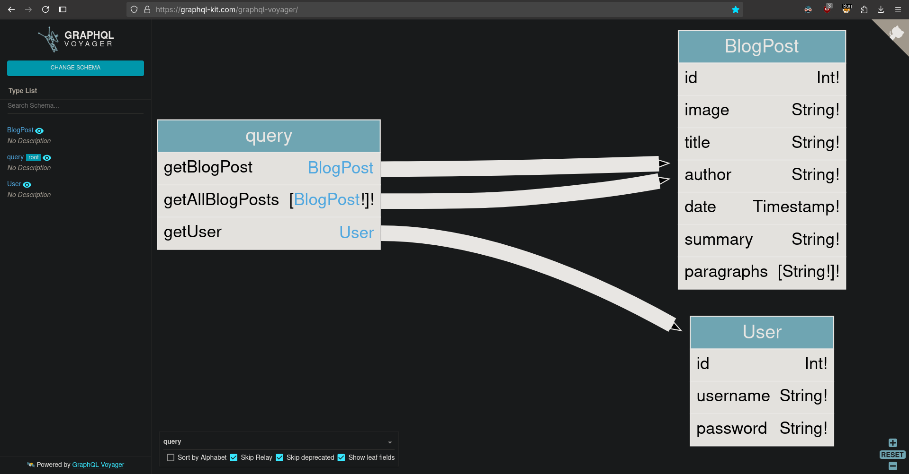

# Accidental exposure of private GraphQL fields
# Objective
The user management functions for this lab are powered by a GraphQL endpoint. The lab contains an access control vulnerability whereby you can induce the API to reveal user credential fields.

To solve the lab, sign in as the administrator and delete the username `carlos`. 

# Solution
## Analysis
Website uses GraphQL to retrieve informations about posts.

||
|:--:| 
| *GraphQL example query* |

## Exploitation
### Running introspection query
Website allows for introspection query, which discloses information about database structure as well as hidden fields and functions.

||
|:--:| 
| *Introspection query - password field* |
||
| *Introspection query - Visualization of introspection results* |
||
| *Retrieaval of password field from administrator (id:1)* |
||
| *Retrieaval of password field from administrator (id:1)* |

