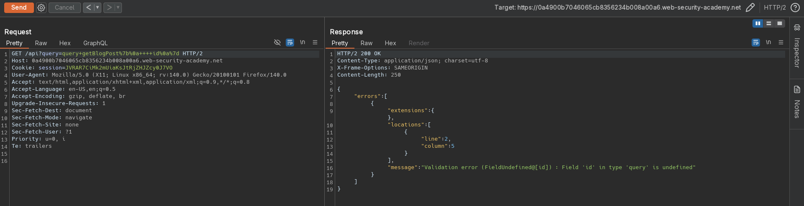
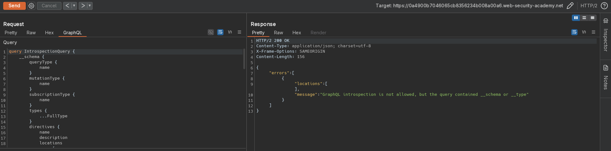
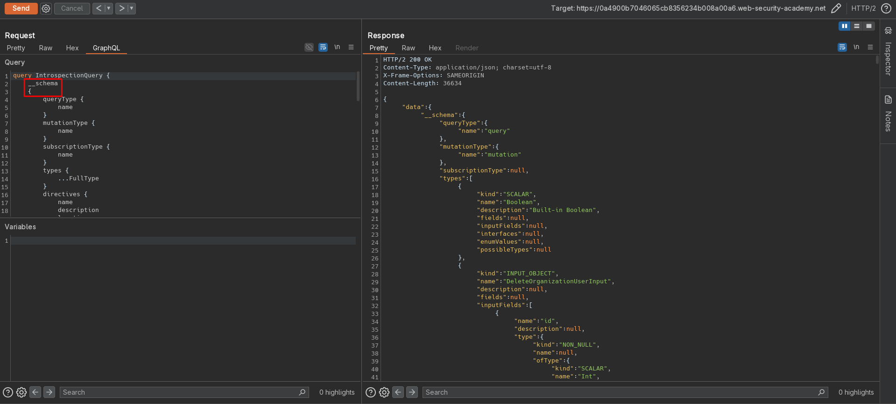
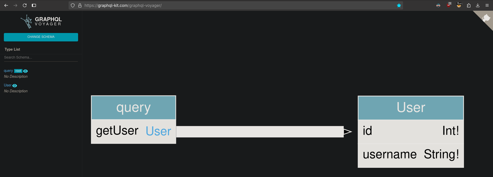
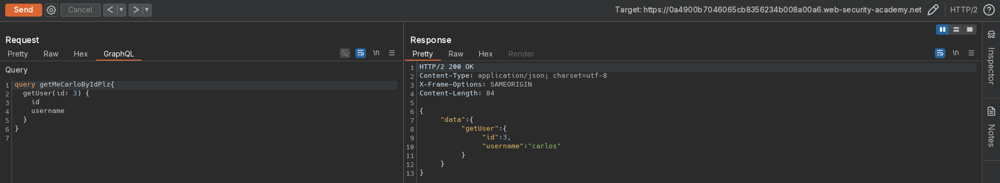
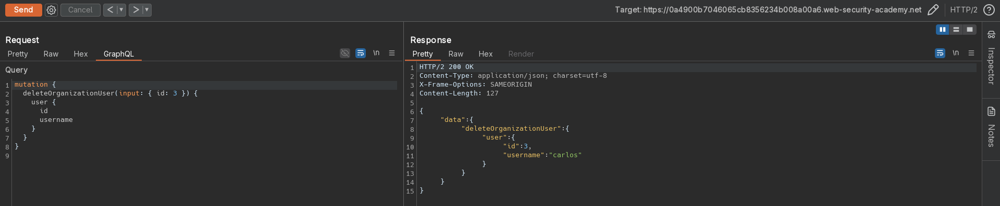

# Finding a hidden GraphQL endpoint
# Objective
The user management functions for this lab are powered by a hidden GraphQL endpoint. You won't be able to find this endpoint by simply clicking pages in the site. The endpoint also has some defenses against introspection.

To solve the lab, find the hidden endpoint and delete `carlos`. 

# Solution
## Analysis
Website uses GraphQL to manage informations about posts and users.

||
|:--:| 
| *Hidden GraphQL endpoint* |

## Exploitation
### Running introspection query
After adding `\n` after `__schema` website allows for introspection query, which discloses information about database structure as well as hidden fields and functions. Not every available function from introspection query result was visible in visualization below.

||
|:--:| 
| *Introspection query - Introspection is not allowed* |
||
| *Introspection query - Filter Bypass - Modification of default instrospcetion query* |
||
| *Introspection query - Visualization of introspection results* |
||
| *ID of user Carlos - ID 3* |
||
| *Deletion of user Carlos by ID* |

