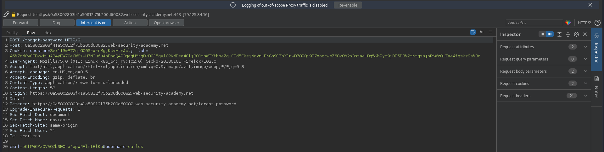
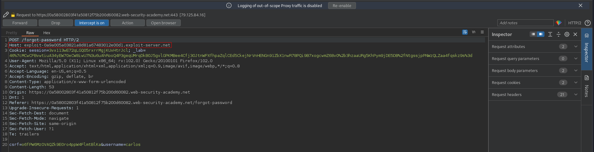

# Basic password reset poisoning
# Objective
This lab is vulnerable to password reset poisoning. The user carlos will carelessly click on any links in emails that he receives. To solve the lab, log in to Carlos's account.

You can log in to your own account using the following credentials: `wiener:peter`. Any emails sent to this account can be read via the email client on the exploit server.

# Solution
## Analysis
||
|:--:| 
| *Password reset request* |

## Exploitation
This web application sends password reset link (token) based on the provided value in `Host` header. Attacker can modify `Host` header by providing his own domain. If victim opens the reset password link, the request will be send to attacker server - attacker will know the token. 

```
Host: exploit-0a9a005a03821a8d81a67483012e00d1.exploit-server.net
```
||
|:--:| 
| *Host header modification* |
||
| *Request from victim with password reset token* |
||
| *Resetting victim password* |
