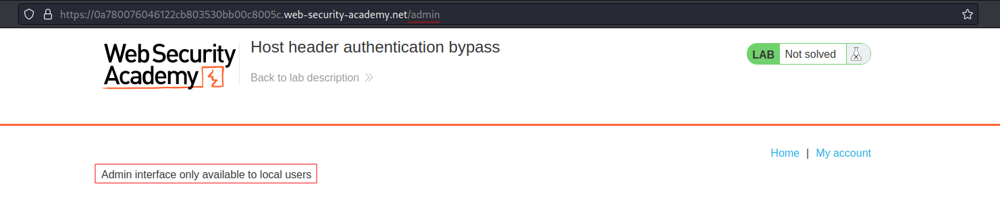
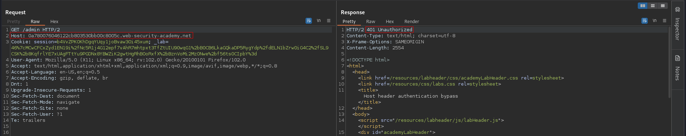
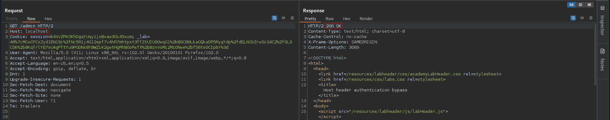
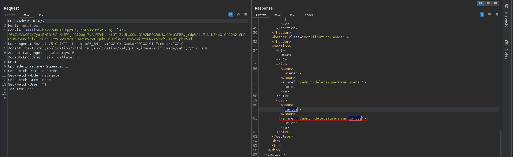
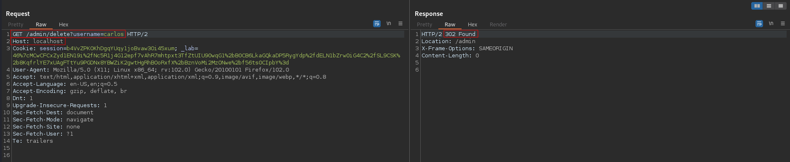

# Host header authentication bypass
# Objective
 This lab makes an assumption about the privilege level of the user based on the HTTP Host header.

To solve the lab, access the admin panel and delete the user carlos. 

# Solution
## Analysis
There is a admin panel at `/admin`. Access to it is restricted (only available for local users). This directory appears in `robots.txt`.
||
|:--:| 
| *Access to admin panel is restricted* |
||
| *Access to admin panel is restricted* |

## Exploitation
||
|:--:| 
| *Host header modification* |
||
| *URL to delete a user* |
||
| *Deletion of user carlos* |
