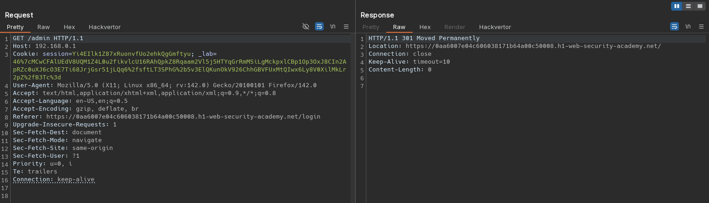

# Host validation bypass via connection state attack
# Objective
This lab is vulnerable to routing-based SSRF via the Host header. Although the front-end server may initially appear to perform robust validation of the Host header, it makes assumptions about all requests on a connection based on the first request it receives.

To solve the lab, exploit this behavior to access an internal admin panel located at `192.168.0.1/admin`, then delete the user `carlos`. 

# Solution
## Analysis
Access to admin panel is restricted (only available for local users).
||
|:--:| 
| *Access to admin panel is restricted* |

## Exploitation
### Verification of access to external and internal domains
Replacing original `Host` header value with Collabolator domain results in request to provided domain.

||
|:--:| 
| *Response from Collabolator* |

Replacing original `Host` header value with `192.168.0.1` results in `301 Moved Permanently`
||
|:--:| 
| *Modificattion of Host header value* |

### Sending 2 requests in single connection
Sending benign reqeust to `/` with `Connection: keep-alive` along with second request to `/admin` with header `Host: 192.168.0.1` allows attacker to access admin panel. Website performes thorough validation only on opening TCP connection request, therefore second request (reusing connection) gives attacker opportunity to access internal hosts.

||
|:--:| 
| *First request - standard requestt* |
||
| *Second requestt - request to admin panel - same connection* |
||
| *Second requestt - request to admin panel - same connection* |
||
| *Deletion of user carlos* |
