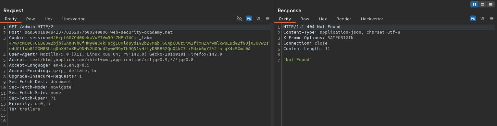
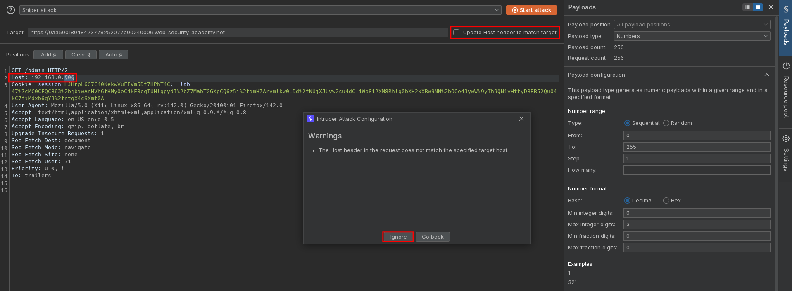
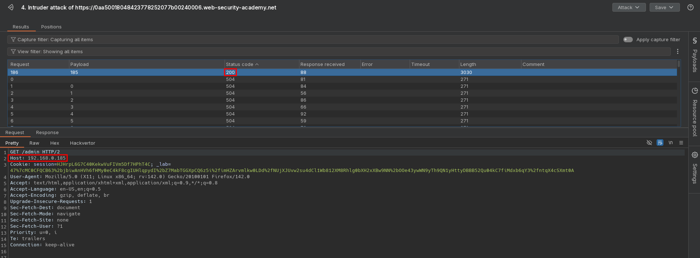
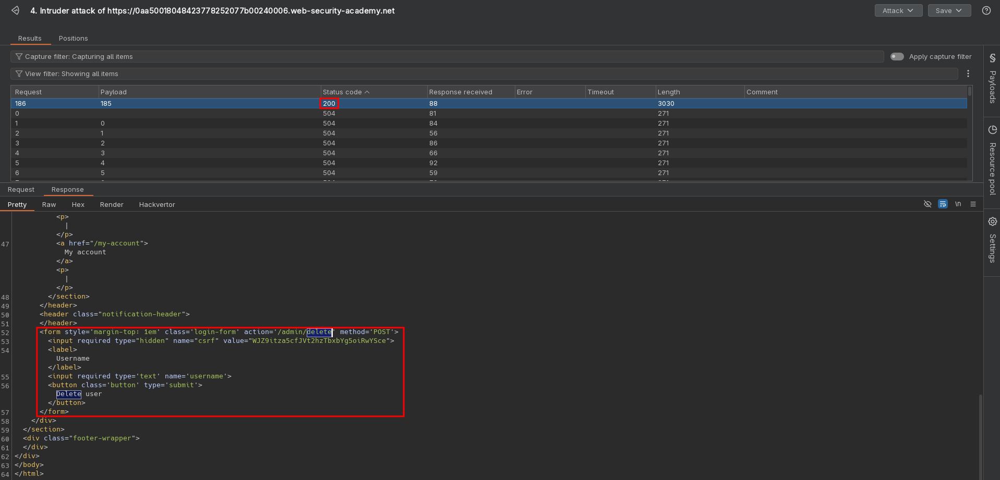
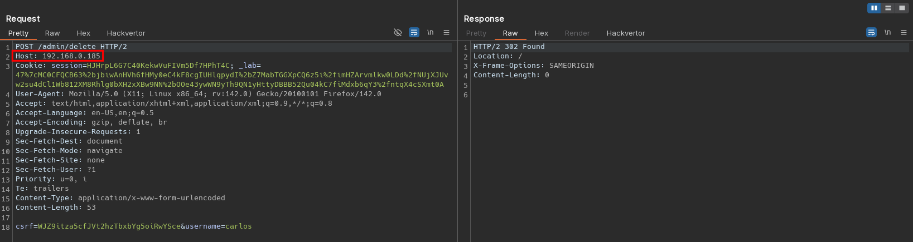

# Routing-based SSRF
# Objective
This lab is vulnerable to routing-based SSRF via the Host header. You can exploit this to access an insecure intranet admin panel located on an internal IP address.

To solve the lab, access the internal admin panel located in the `192.168.0.0/24` range, then delete the user `carlos`. 

# Solution
## Analysis
Access to admin panel is restricted (only available for local users).

||
|:--:| 
| *Access to admin panel is restricted* |

## Exploitation
### Verification of access to external domains
Replacing original `Host` header value with Collabolator domain result in request to provided domain.

### Enumerating internal IP address
Enumerating subnet `192.168.0.0/24` via `Host` header allows to reveal `/admin` panel.

||
|:--:| 
| *Intruder configuration* |
||
| *Intruder results* |
||
| *Intruder results* |
||
| *Deletion of user carlos* |
