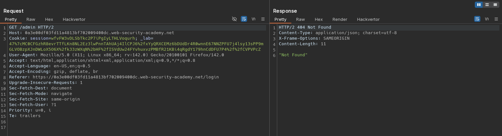
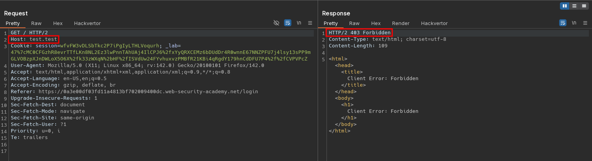
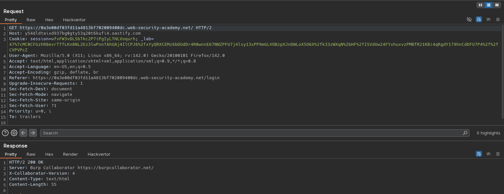
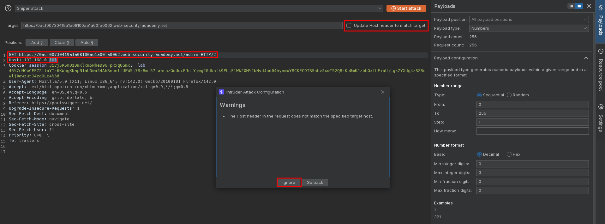
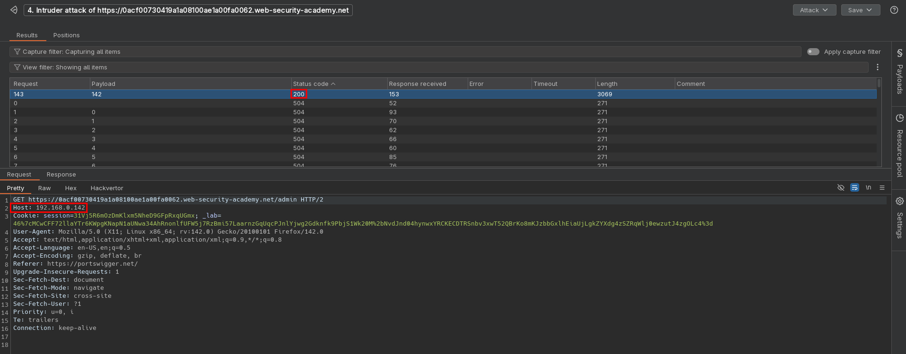
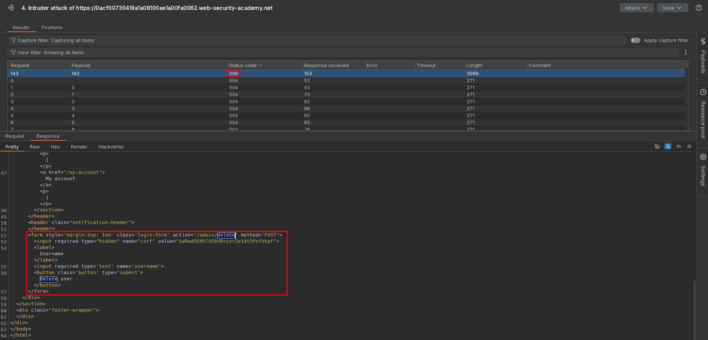
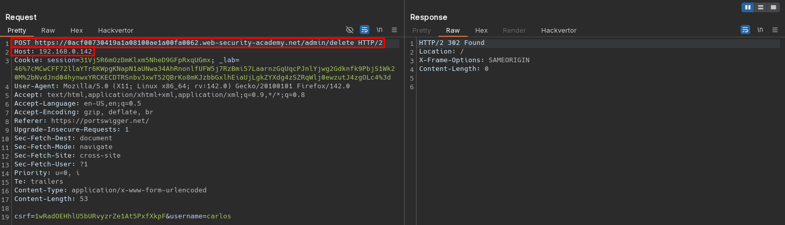

# SSRF via flawed request parsing
# Objective
This lab is vulnerable to routing-based SSRF due to its flawed parsing of the request's intended host. You can exploit this to access an insecure intranet admin panel located at an internal IP address.

To solve the lab, access the internal admin panel located in the `192.168.0.0/24` range, then delete the user `carlos`. 

# Solution
## Analysis
Access to admin panel is restricted (only available for local users).

||
|:--:| 
| *Access to admin panel is restricted* |

## Exploitation
### Verification of access to external domains
Replacing just original `Host` header value with Collabolator domain or othter domains result in `403 Forbidden` response.

||
|:--:| 
| *Access to external domais is restricted* |

This behavior can be bypassed by providing full URL in request and replacing `Host` header with other domain - requests to external domains (for example Collabolators' domains) is possible.

||
|:--:| 
| *Response from Collabolator* |

### Enumerating internal IP address
Enumerating subnet `192.168.0.0/24` via `Host` header allows to reveal `/admin` panel.

||
|:--:| 
| *Intruder cofiguration* |
||
| *Intruder results* |
||
| *Intruder results* |
||
| *Deletion of user carlos* |
