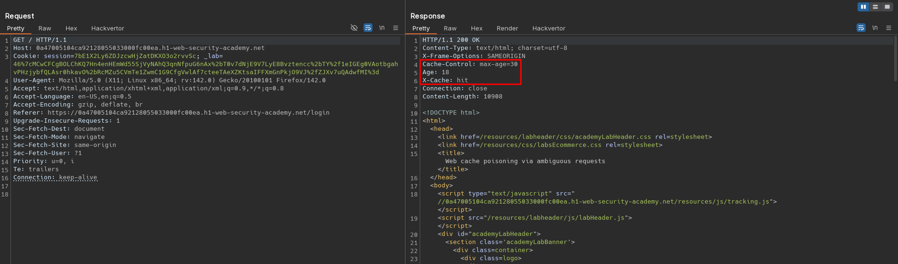
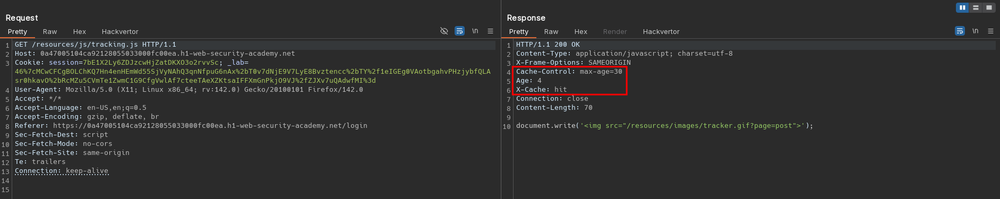
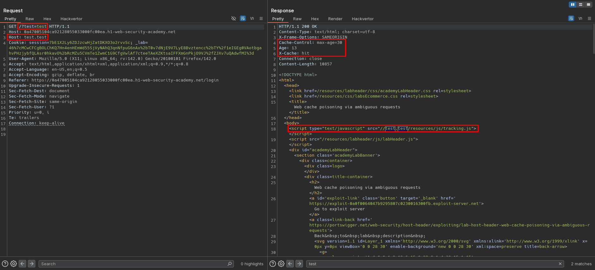
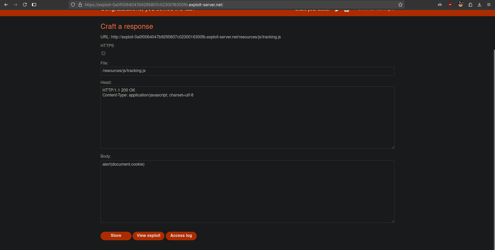
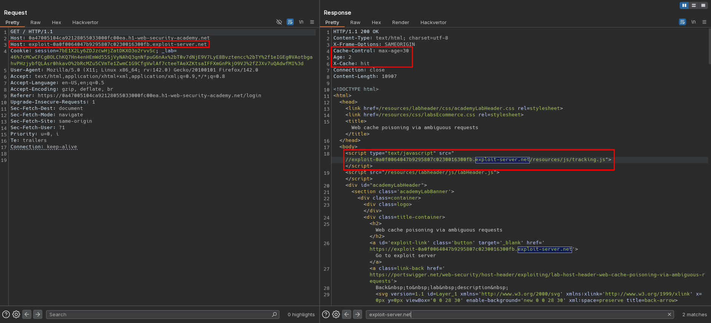

# Web cache poisoning via ambiguous requests
# Objective
This lab is vulnerable to web cache poisoning due to discrepancies in how the cache and the back-end application handle ambiguous requests. An unsuspecting user regularly visits the site's home page.

To solve the lab, poison the cache so the home page executes `alert(document.cookie)` in the victim's browser. 

# Solution
## Analysis
Requests by users to application (to for example `/` or `/resources/js/tracking.js`) are cached.

||
|:--:| 
| *Cached response* |
||
| *Cached response* |


## Exploitation
When second `Host` header is added to the request, website reflects the injected domain - it tries to source the javascript file from second `Host` header value.

Exploit server configuration:
```
alert(document.cookie)
```

||
|:--:| 
| *Cached response with second host header* |
||
| *Exploit server configuration* |
||
| *Cached response with malicious tracking.js file* |
