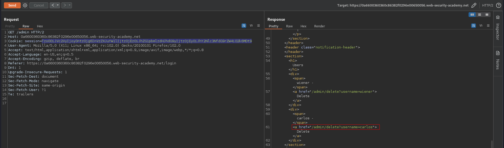

# Modifying serialized data types
# Objective
This lab uses a serialization-based session mechanism and is vulnerable to authentication bypass as a result. To solve the lab, edit the serialized object in the session cookie to access the `administrator` account. Then, delete the user `carlos`.
You can log in to your own account using the following credentials: `wiener:peter`

# Solution
## Analysis
The session cookie on this webiste holds serialized data:
||
|:--:| 
| *Session cookie* |

## Exploitation
PHP-based logic applications could be vulnerable to modification of data types. The data type madness examples:
```
7 == 7                              TRUE
7 == "7"                            TRUE
7 == "7 things"                     TRUE
0 == "Strings"                      TRUE
```
Instead of the user session token attacker could change the type of the `access_token` to integer and put there for example value `0`. Depending on the administrator's session cookie on the server (stored in the string format) the following values provided in serialized data by attacker may result in `TRUE`:
```
"administratorstoken" == 0          TRUE
"administrator0token" == 0          TRUE
```
[PHP Serialization Format](https://en.wikipedia.org/wiki/PHP_serialization_format)

||
|:--:| 
| *Modification of cookie* |
||
| *URL to delete carlos user* |
||
| *Deletion of user carlos* |