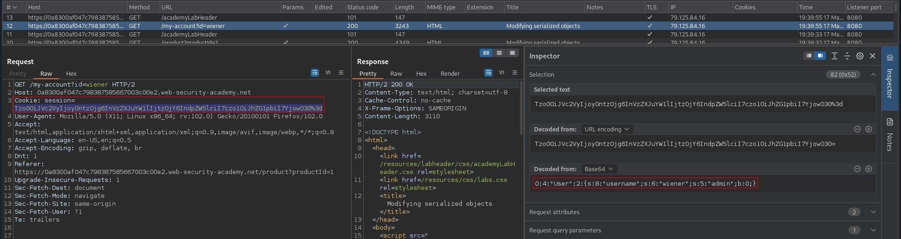
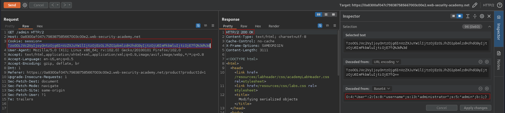
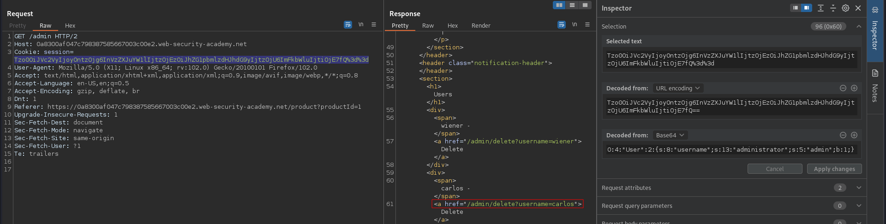
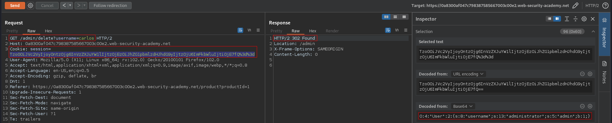

# Modifying serialized objects
# Objective
This lab uses a serialization-based session mechanism and is vulnerable to privilege escalation as a result. To solve the lab, edit the serialized object in the session cookie to exploit this vulnerability and gain administrative privileges. Then, delete the user `carlos`.
You can log in to your own account using the following credentials: `wiener:peter`

# Solution
## Analysis
The session cookie on this webiste holds serialized data:
||
|:--:| 
| *Session cookie* |

## Exploitation

||
|:--:| 
| *Modification of session cookie - 200 OK response* |
||
| *URL to delete carlos user* |
||
| *Deletion of user carlos* |