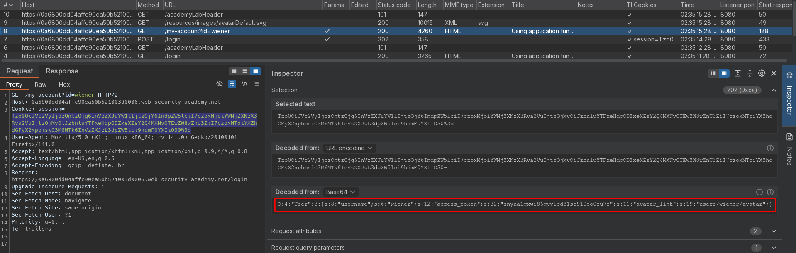
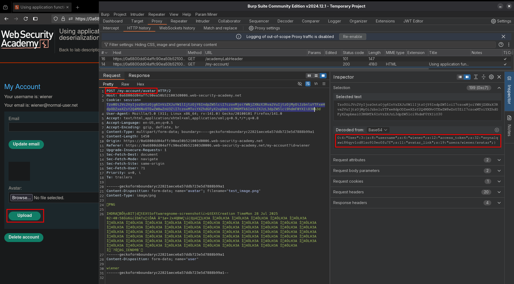
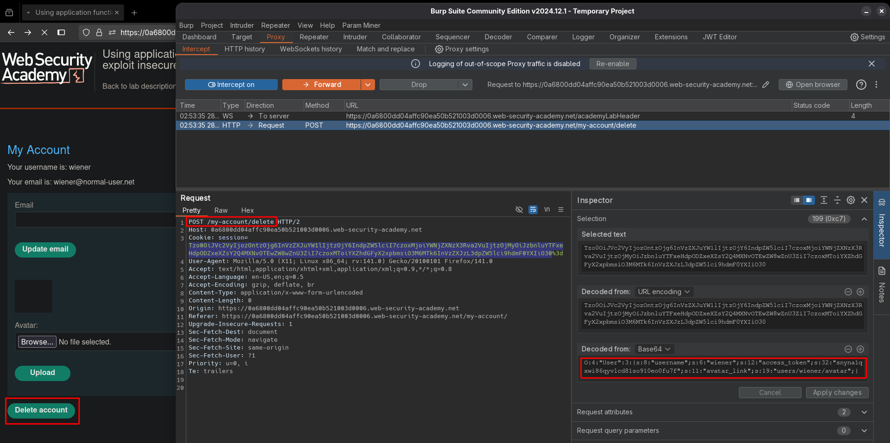
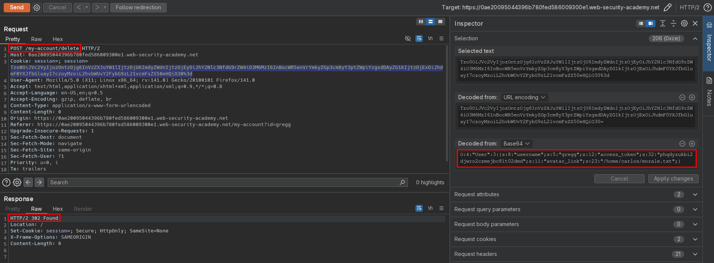

# Using application functionality to exploit insecure deserialization
# Objective
This lab uses a serialization-based session mechanism. A certain feature invokes a dangerous method on data provided in a serialized object. To solve the lab, edit the serialized object in the session cookie and use it to delete the `morale.txt` file from Carlos's home directory.

You can log in to your own account using the following credentials: `wiener:peter`

You also have access to a backup account: `gregg:rosebud` 

# Solution
## Analysis
The session cookie on this webiste holds serialized data.
||
|:--:| 
| *Session cookie* |
||
| *Change profile avatar functionality* |
||
| *Delete account functionality* |

## Exploitation
In order to delete `morale.txt` from `/home/carlos` directory attacker can create delete account request with `avatar_link` set to the `/home/carlos/morale.txt`. Delete request will want to delete the provided avatar image, which in reality will point to file chosen by attacker.

||
|:--:| 
| *Delete account request with modified cookie* |

Final payload:
```php
O:4:"User":3:{s:8:"username";s:5:"gregg";s:12:"access_token";s:32:"phqdyzukbi2djwro2czmejbc81t02dmd";s:11:"avatar_link";s:23:"/home/carlos/morale.txt";}
```

