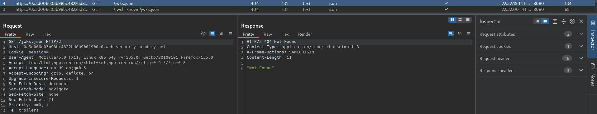
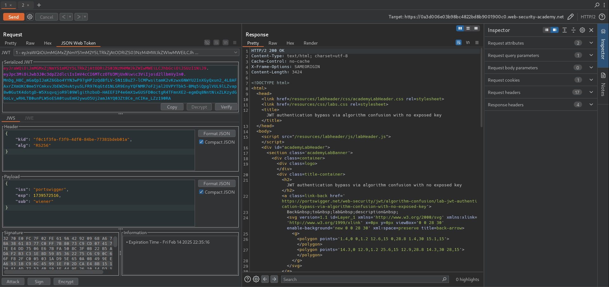
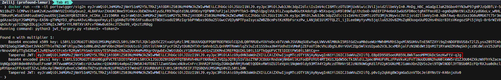
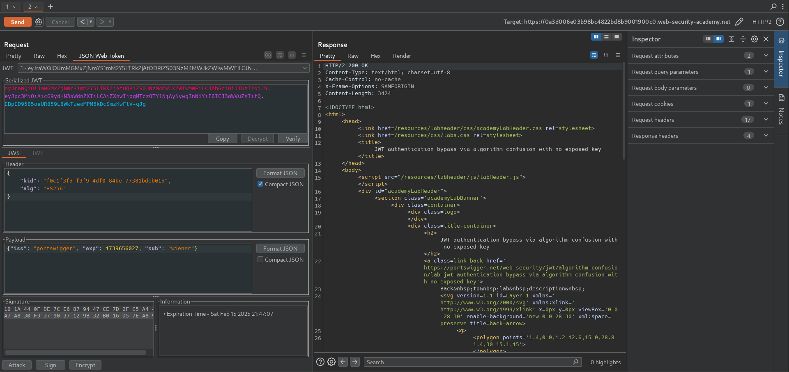
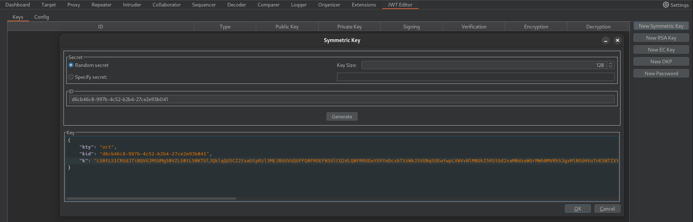
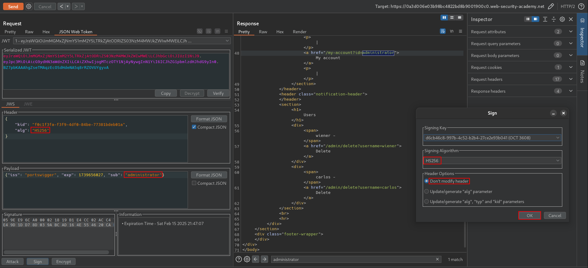
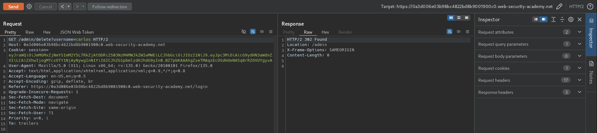

# JWT authentication bypass via algorithm confusion with no exposed key
# Objective
This lab uses a JWT-based mechanism for handling sessions. It uses a robust RSA key pair to sign and verify tokens. However, due to implementation flaws, this mechanism is vulnerable to algorithm confusion attacks.

To solve the lab, first obtain the server's public key. Use this key to sign a modified session token that gives you access to the admin panel at /admin, then delete the user carlos.

You can log in to your own account using the following credentials: `wiener:peter`

# Solution
## Analysis

On the website there no `/jwks.json` or `/.well-known/jwks.json` file accesible.

||
|:--:| 
| *No public key is accessible* |
||
| *Standard user request after login with JWT* |

## Exploitation
### Explaination of algorithm confusion attack
The idea behind of algorithm confusion is that in certain circumstances (bad implementan) public key may be treated by server as symmetric key. Attacker can bypass token validation by: modifying algorithm filed to symmetric algorithm, taking public key and using it to sign JWT token.

Full explaination - [PortSwigger](https://portswigger.net/web-security/jwt/algorithm-confusion).
```js
function verify(token, secretOrPublicKey){
    algorithm = token.getAlgHeader();
    if(algorithm == "RS256"){
        // Use the provided key as an RSA public key
    } else if (algorithm == "HS256"){
        // Use the provided key as an HMAC secret key
    }
}
```

```python
publicKey = <public-key-of-server>;
token = request.getCookie("session");

# Devolopers assumed that it will exclusively handle JWTs signed using an asymmetric algorithm
# In case of symmtric algorithm set in JWT, public key will be treated as symmetric key
verify(token, publicKey);
```

### Performing an algorithm confusion attack without public key
In order to exploit algorithm confusion attacker has to:
1. Derive public keys from existing 2 JWT tokens
2. Verify that one of tampered JWT works
3. Create a malicious JWT with a modified payload and the alg header set to HS256.
4. Sign the token with HS256, using the public key as the secret. 


||
|:--:| 
| *Deriving public keys from existing tokens* |
||
| *Testing tampered JWT - JWT passed successfuly* |

||
|:--:| 
| *Creating symmetric key from Base64 encoded x509 public key* |
||
| *Modification and signing JWT token using created symmetric key - request to /admin* |
||
| *Deletion of user carlos* |

