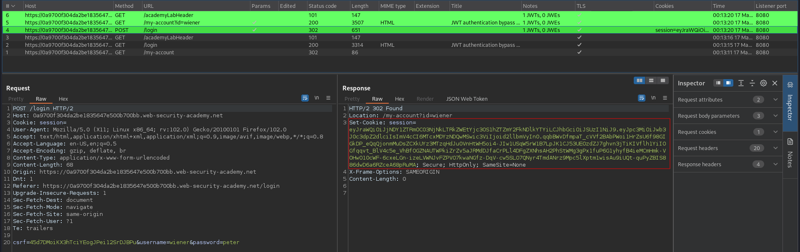

# JWT authentication bypass via flawed signature verification
# Objective
This lab uses a JWT-based mechanism for handling sessions. The server is insecurely configured to accept unsigned JWTs.\
To solve the lab, modify your session token to gain access to the admin panel at `/admin`, then delete the user `carlos`.\
You can log in to your own account using the following credentials: `wiener:peter`

# Solution
## Analysis
The website in this lab uses JWT to handle different users. If client (attacker) sets `alg` field to `none` and the JWT handling on the server is flawed, signature will be ignored.
||
|:--:| 
| *JWT* |
||
| *JWT contents* |

There is `/admin` endpoint that returns `HTTP 401 Unauthorized`.

## Exploitation

||
|:--:| 
| *Modification of JWT* |
||
| *Original request* |
||
| *Modified request - changed URL and JWT token. No JWT signature* |
||
| *URL to delete carlos user* |
||
| *Deletion of user carlos* |
