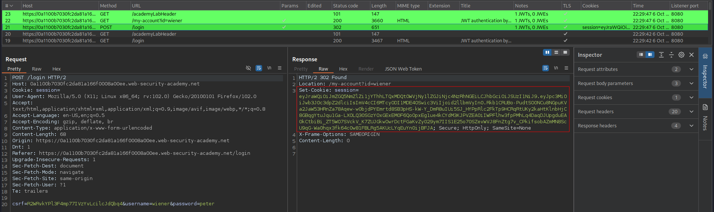
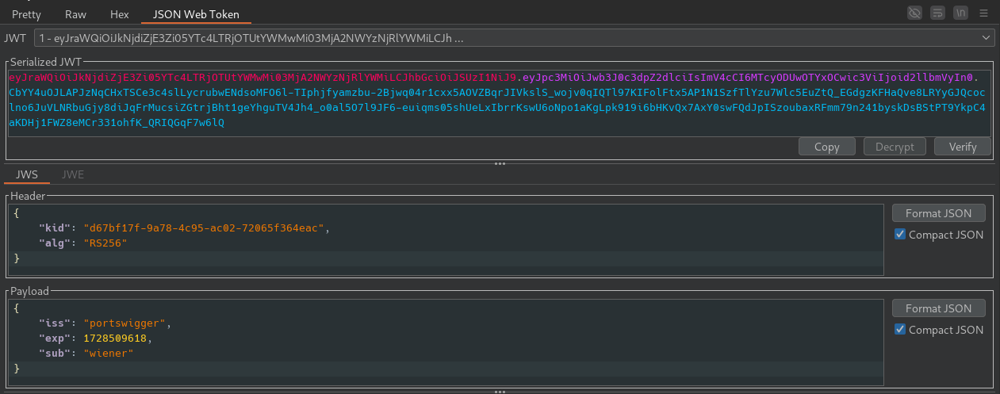
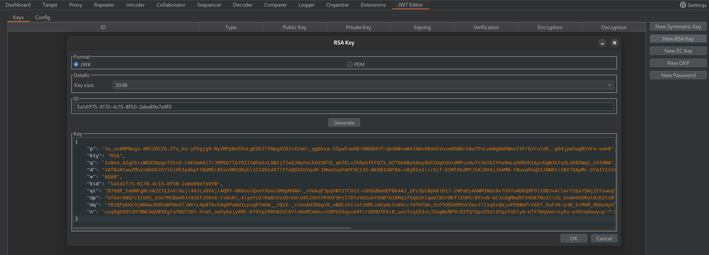
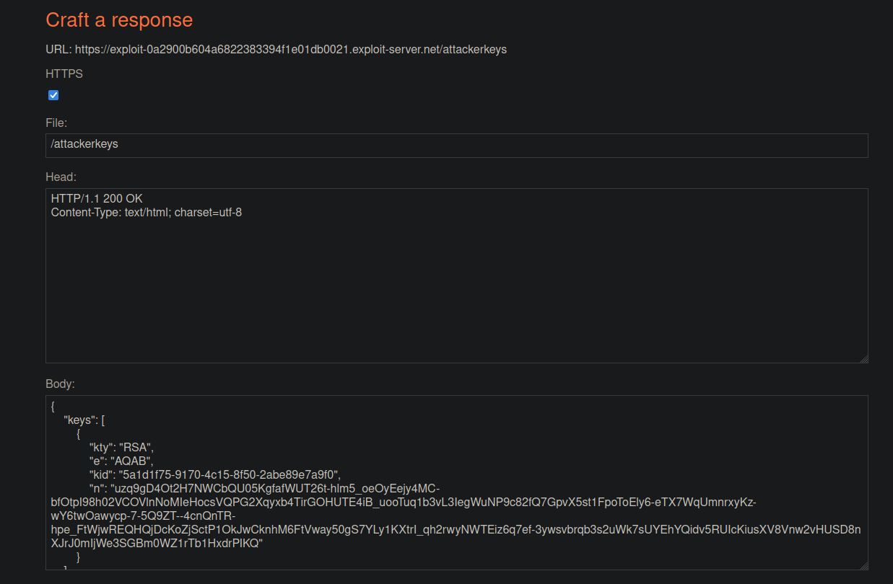
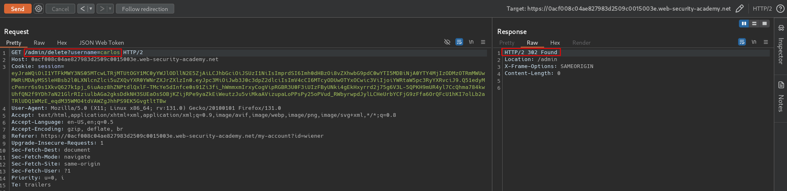

# JWT authentication bypass via jku header injection
# Objective
This lab uses a JWT-based mechanism for handling sessions. The server supports the jku parameter in the JWT header. However, it fails to check whether the provided URL belongs to a trusted domain before fetching the key. \
To solve the lab, forge a JWT that gives you access to the admin panel at `/admin`, then delete the user carlos.\
You can log in to your own account using the following credentials: `wiener:peter`
# Solution
## Analysis
The website in this lab uses JWT to handle different users.
||
|:--:| 
| *JWT detection* |
||
| *JWT contents* |

There is `/admin` endpoint that returns `HTTP 401 Unauthorized`.

## Exploitation
### Injecting JKU header
```
JKU (JWK Set URL) - Provides URI that refers to a resource for a set of JSON public keys, one of which corresponds to the key that was used to sign the JWS.
```

Using `jku` header attacker can force vulnerable server to use attacker controlled file with public keys to verify JWTs. In order to exploit this vulnerability attacker have to:
1. Create his own private and public key pair
2. Create file with public key and host it on his server
3. Add `jku` parameter to JWT pointing to his public key file
4. Modify JWT
5. Sign JWT using his private key

||
|:--:| 
| *Generation of new RSA key* |

Preparing attacker file with public keys that would be hosted on exploit server (usually it is named `/.well-known/jwks.json`):
```json
{
    "keys": [
        {
            "kty": "RSA",
            "e": "AQAB",
            "kid": "5a1d1f75-9170-4c15-8f50-2abe89e7a9f0",
            "n": "uzq9gD4Ot2H7NWCbQU05KgfafWUT26t-hlm5_oeOyEejy4MC-bfOtpI98h02VCOVlnNoMIeHocsVQPG2Xqyxb4TirGOHUTE4iB_uooTuq1b3vL3IegWuNP9c82fQ7GpvX5st1FpoToEly6-eTX7WqUmnrxyKz-wY6twOawycp-7-5Q9ZT--4cnQnTR-hpe_FtWjwREQHQjDcKoZjSctP1OkJwCknhM6FtVway50gS7YLy1KXtrI_qh2rwyNWTEiz6q7ef-3ywsvbrqb3s2uWk7sUYEhYQidv5RUIcKiusXV8Vnw2vHUSD8nXJrJ0mIjWe3SGBm0WZ1rTb1HxdrPIKQ"
        }
    ]
}
```

||
|:--:| 
| *Exploit server configuration* |
||
| *Modification of JWT and signing it with earlier created private key - access to admin panel* |
||
| *Deletion of user carlos* |