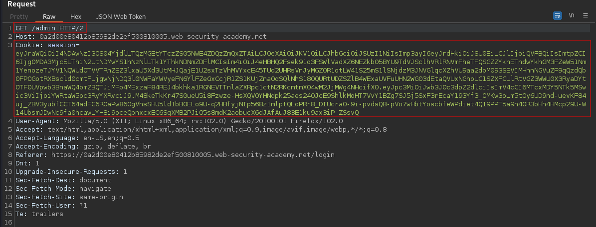
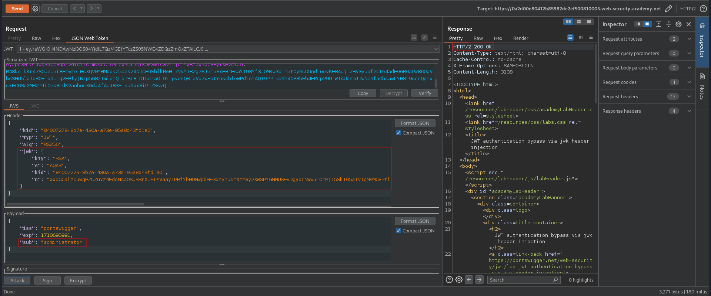

# JWT authentication bypass via jwk header injection
# Objective
This lab uses a JWT-based mechanism for handling sessions. The server supports the jwk parameter in the JWT header. This is sometimes used to embed the correct verification key directly in the token. However, it fails to check whether the provided key came from a trusted source.\
To solve the lab, modify and sign a JWT that gives you access to the admin panel at `/admi`n, then delete the user `carlos`.\
You can log in to your own account using the following credentials: `wiener:peter`

# Solution
## Analysis
The website in this lab uses JWT to handle different users.
||
|:--:| 
| *JWT* |

## Exploitation
### Injecting JWK header
```
JWK (JSON Web Key) - Provides an embedded JSON object representing the key. 
```
According to the JWS specification, only the `alg` header parameter is mandatory. By using extra field `jwk`, attacker can add his own public RSA key and sign message with his private RSA key. Misconfigured server might use key that's embedded in the jwk parameter to verify token.

||
|:--:| 
| *Generating JWK (RSA keys)* |
||
| *Modified request* |
||
| *Adding jwk field to the token* |
||
| *Modified JWT token and response from website* |
||
| *URL to delete carlos user and prepared request to delete him* |
||
| *Deletion of user carlos* |
