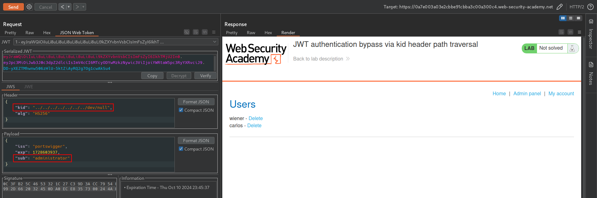

# JWT authentication bypass via kid header path traversal
# Objective
 This lab uses a JWT-based mechanism for handling sessions. In order to verify the signature, the server uses the kid parameter in JWT header to fetch the relevant key from its filesystem.\
To solve the lab, forge a JWT that gives you access to the admin panel at `/admin`, then delete the user carlos.\
You can log in to your own account using the following credentials: `wiener:peter` 

# Solution
## Analysis
The website in this lab uses JWT to handle different users. It uses `HS256` (symmetric algorithm) to verify JWT.
||
|:--:| 
| *JWT detection* |
||
| *JWT contents* |

There is `/admin` endpoint that returns `HTTP 401 Unauthorized`.

## Exploitation
### Injecting KID header
```
KID (Key ID)- 0ptional header claim which holds a key identifier, particularly useful when you have multiple keys to sign the tokens and you need to look up the right one to verify the signature
```

The JWS specification doesn't define a concrete `kid` structure, therefore developers can use it in different ways like providing key id or pointing to a particular file. The secend option might open `Path Traversal` vulnerability. In case of symmetric key algorithm, using `kid` header attacker can point to a known static file (`/dev/null`) and sign the algorithm using its contens (base64 encoded null byte `AA==` - bug in JWT Editor extension).

||
|:--:| 
| *Generating symmetric key* |
||
| *Modification of the generated symmetric key* |

Base64 encoded null byte - `AA==`

||
|:--:| 
| *Modification of JWT and signing it with earlier created symmetric key - access to admin panel* |
||
| *Deletion of user carlos* |
