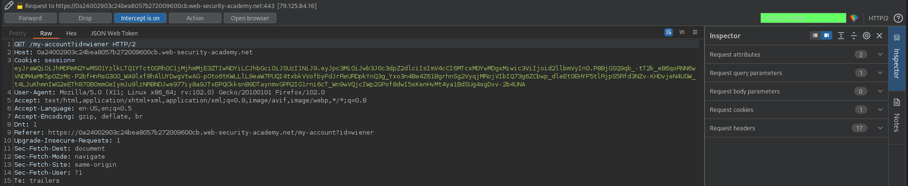

# JWT authentication bypass via unverified signature
# Objective
This lab uses a JWT-based mechanism for handling sessions. Due to implementation flaws, the server doesn't verify the signature of any JWTs that it receives.\
To solve the lab, modify your session token to gain access to the admin panel at `/admin`, then delete the user `carlos`.\
You can log in to your own account using the following credentials: `wiener:peter`

# Solution
## JWT Editor
Working with JWT can be easier thanks to extension called `JWT Editor`:

||
|:--:| 
| *Extension for working with JWT - JWT Editor* |
||
| *Packets with JWT tokens are marked green* |

## Analysis
The website in this lab uses JWT to handle different users. If JWT signature is not checked on the server, client (attacker) can modify base64 encoded JWT to impersonate administrator:

||
|:--:| 
| *Admin Panel* |
||
| *JWT contents* |

There is `/admin` endpoint that returns `HTTP 401 Unauthorized`.

## Exploitation

||
|:--:| 
| *Modification of JWT* |
||
| *Original request* |
||
| *Modified request - changed URL and JWT token* |
||
| *Access to admin panel - URL to delete carlos user* |
||
| *JWT substituion and deletion of user carlos* |