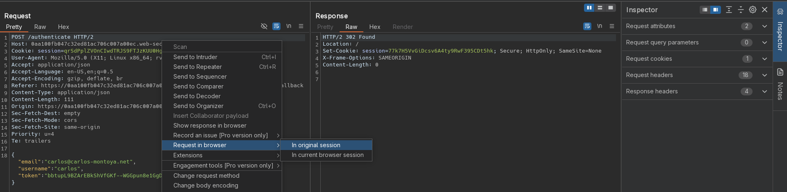

# Authentication bypass via OAuth implicit flow
# Objective
This lab uses an OAuth service to allow users to log in with their social media account. Flawed validation by the client application makes it possible for an attacker to log in to other users' accounts without knowing their password.

To solve the lab, log in to Carlos's account. His email address is `carlos@carlos-montoya.net`.

You can log in with your own social media account using the following credentials: `wiener:peter`.

# Solution

## Exploitation
Attacker can access different users by sending `/authenticate` request with victim's email address. The `token` is not tied to the authenticated user, therefore other users' accounts can be accesed.

Using Burp's `Reapeat request in Browser` feature attacker can open the request in browser to get easy access to compromised account.

||
|:--:| 
| *Standard /authenticate request* |
||
| *Modified request* |
||
| *Request with carlos's email and username* |
||
| *Request in browser* |
||
| *Open given link in browser* |