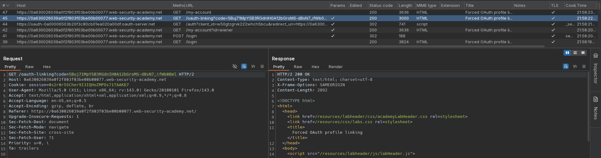
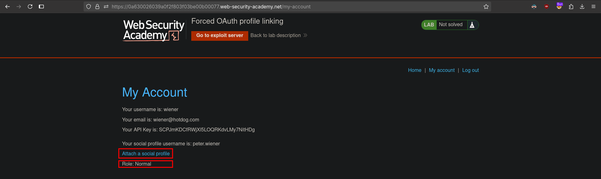
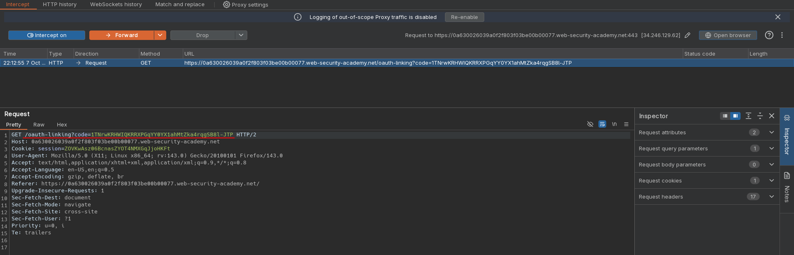
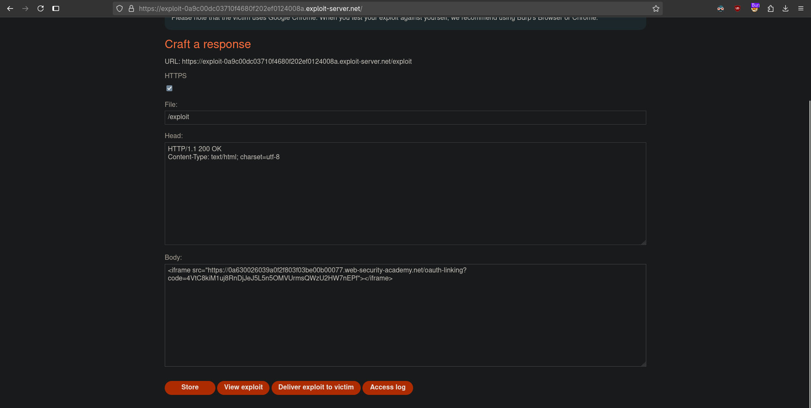
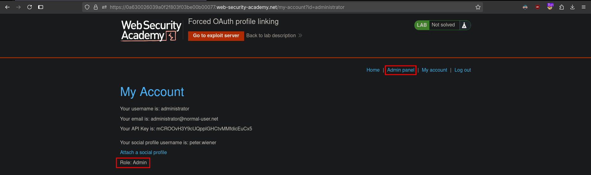

# Forced OAuth profile linking
# Objective
This lab gives you the option to attach a social media profile to your account so that you can log in via OAuth instead of using the normal username and password. Due to the insecure implementation of the OAuth flow by the client application, an attacker can manipulate this functionality to obtain access to other users' accounts.

To solve the lab, use a CSRF attack to attach your own social media profile to the admin user's account on the blog website, then access the admin panel and delete `carlos`.

The admin user will open anything you send from the exploit server and they always have an active session on the blog website.

You can log in to your own accounts using the following credentials:
- Blog website account: `wiener:peter`
- Social media profile: `peter.wiener:hotdog`

# Solution
## Analysis
Website allows user to attach a social profile. Request `GET /oauth-linking?code=...` does not have any CSRF protection like `state` parameter.

||
|:--:| 
| *Attach a social profile funcionality* |
||
| *Linking profile without CSRF protection* |

## Exploitation
Linking process does not use `state` parameter, thereofre its vulnerable to CSRF attack. If victim click on link with ouath linking code, he will complete the linking process with his own social profile. In this way attacker can gain higher privilieges.

||
|:--:| 
| *Dropping linking request - copying URL* |
||
| *Exploit server configuration - using copied URL with linking code* |
||
| *Admin access after relogging via social account* |
||
| *Deletion of user carlos* |

Exploit server configuration:
```html
<iframe src="https://0a630026039a0f2f803f03be00b00077.web-security-academy.net/oauth-linking?code=4VtC8kiM1uj8RnDjJeJ5L5n5OMVUrmsQWzU2HW7nEPf"></iframe>
```
